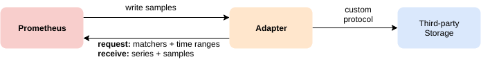

.. _scalable_prometheus_infra:

========================
扩展Prometheus架构
========================

Prometheus的局限
==================

Prometheus非常擅长监控微服务架构，特别是 :ref:`kubernetes` ，效率极高，所以通常只提供了单机运行模式。单机模式对于中小型系统来说足够稳健，但是对于大型互联网公司，特别是有数万服务器、上百万Kubernetes pods、上千万容器的多数据中心，不管Prometheus的单机性能如何强劲，显然也是无法完全满足要求的:

- 飞速增长的metrics数据占据了时序数据库的容量
- 网络、计算、存储都是需要面对的挑战

可扩展架构
============

对于大规模部署多地数据中心，需要改进分布式架构:

- 层次化部署，在多个数据中心部署本地Prometheus
- 采用 :ref:`prometheus_federation` 将多个数据中心监控数据汇总到Global Prometheus

  - 如果(数据中心)集群规模过大，可以采用将集群分片(shards)分别由不同的Prometheus服务器覆盖(单台Prometheus可以处理上千服务器): `Scaling and Federating Prometheus <https://www.robustperception.io/scaling-and-federating-prometheus/>`_

:ref:`prometheus_federation` 提供了拉取聚合的大规模扩展模式，不过对于上层聚合是一个巨大的挑战，需要非常仔细的部署

远程存储
==========

Prometheus可以读写远程存储，并且支持多种远程的存储集成，甚至包括了著名的 Google Bigtable (Google BigQuery 和 Google Cloud Spanner)。这种远程数据存储中的部分架构提供了几乎无限的容量，克服了Prometheus对本地存储的依赖所带来的限制。

需要注意，即使Prometheus将数据都存储到远程存储，并不能解决跨服务器的查询。但是远程存储可以解决Prometheus本地存储的容量限制(一些远程存储是分布式存储具有几乎无限的容量)。

.. note::

   实际上，云计算公司提供的Prometheus就是基于远程存储的架构，例如 :ref:`aliyun_prometheus` 配置就是将数据全部存储在阿里云提供的远程存储(底层是盘古?)

.. _cortex_vs_thanos:

Cortex vs. Thanos
--------------------

现在最流行的远程存储集成是: :ref:`cortex` 和 :ref:`thanos` (此外还可以考虑 :ref:`m3` 以及 :ref:`victoriametrics` )

:ref:`cortex` 和 :ref:`thanos` 提供了相似的功能:

- :ref:`prometheus` 兼容的全局查询试图，可以显示所有 Prometheus服务器上收集的所有时间序列数据
- 使用廉价的对象存储，可以支持长期存储，例如Amazon S3
- 高可用性和简单的水平扩展

``Cortex`` 和 ``Thanos`` 都是CNCF的项目，所以两者都可能得到长期改进和维护。

``Cortex`` 和 ``Thanos`` 差异:

- Cortex 采用推送模式，并且作为Prometheus服务器的远程写入目标: 所有时间序列数据从所有Prometheus服务器推送到Cortex，然后针对Cortex运行所有 :ref:`promql` 查询和 :ref:`grafana`
- Thanos 更为模块化: 使用与Prometheus服务器一起运行的 :ref:`sidecar` 进程，然后抓取数据并将其保存到长期存储对象中: 每个sidecar提供一个可以由 querier调用的存储API，这样querier可以将查询发送到多个存储(可以自由设置，例如一个querier查看所有数据，而其他几个querier只能读取其中的一个子集)

.. note::

   Thanos的querier设置很有用处，例如DevOps团队可以查询所有数据，而业务团队可以根据各自权限划分查询部分子集。

   Cortex也有一个对应的租户概念

.. note::

   ::ref:`cortex` , :ref:`thanos` , :ref:`m3` 和 :ref:`victoriametrics` 都提供了近乎无限的Prometheus存储以及高可用解决方案，都值得进行对比研究和实践尝试。需要注意的是，这些解决方案一方面带来了更强大的性能，另一方面也带来了复杂性开销，运维和监控都是巨大的挑战。

   第三方公司就是应这种需求而产生的，例如 `Logz.io <https://logz.io/>`_ 提供全托管可扩展的Prometheus存储后端，也是细分市场的服务商，值得借鉴。

参考
=======

- `How to Build a Scalable Prometheus Architecture <https://logz.io/blog/devops/prometheus-architecture-at-scale/>`_
- `Prometheus federation <https://prometheus.io/docs/prometheus/latest/federation/>`_
