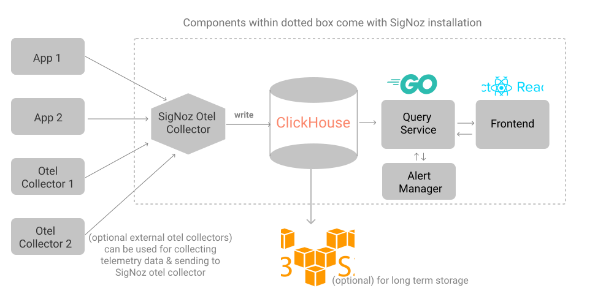

.. _intro_signoz:

=================
SigNoz简介
=================

`SigNoz.io <https://signoz.io>`_ 是一个综合了多种开源监控技术的应用性能监控可视化平台:

- 在一个统一的管理平台集成了可视化 :ref:`metrics` , Traces ( 原生 :ref:`opentelemetry` )，日志，力图在一个统一平台实现应用的全面深入分析
- 使用分布式跟踪技术来获取和可视化软件堆栈，能够监视应用以及排查问题

  - 监控应用的metrics，诸如延迟(latency)，qps (requests per second)，错误率(error rates)
  - 监控基础设施metrics，诸如CPU使用率以及内存使用率
  - 跨服务跟踪用户请求
  - 根据metrics设置告警
  - 通过应用的精确跟踪来发现故障根因
  - 为每个请求跟踪绘制详细的 :ref:`flame_graph`

.. note::

   ``SigNoz`` 是一个完整的基于 :ref:`oepntelemetry` 的综合性解决方案，也是一个提供云服务的商业产品。 ``SigNoz`` 可以说是一个开箱即用的 :ref:`oepntelemetry` 实现，从 ``Traces + Metrics + Logs`` 实现来看，也可以拆解成 :ref:`jaeger` + :ref:`prometheus` + :ref:`fluentd` ，或者其他相似开源软件组合。

   ``SigNoz`` 对标了闭源的 `DataDog <https://www.datadoghq.com>`_ 和 `New Relic <https://newrelic.com>`_

SigNoz工作原理
================

SigNoz通过 :ref:`opentelemetry` (开源可观测性解决方案)来采集数据。也就是说，SigNoz可以支持所有 `OpenTelemetry支持的语言 <https://opentelemetry.io/docs/instrumentation/>`_ 和框架。

SigNoz通过聚合所有的采集数据，可以在统一的dashboard来观察 :ref:`metrics` 和 traces 来洞察应用:

SigNoz组合了多个开源组件：

- :ref:`opentelemetry` Collector : 搜集服务和应用的telemetry数据
- :ref:`clickhouse` : 开源高性能列OLAP数据库管理系统
- Query服务: 前端和ClickHouse的中间接口
- 前端: 使用 :ref:`react` 和 :ref:`typescript` 开发的前端

参考
=====

- `SigNoz (GitHub) <https://github.com/signoz/signoz>`_
- `SigNoz Docs: Introduction <https://signoz.io/docs/>`_
