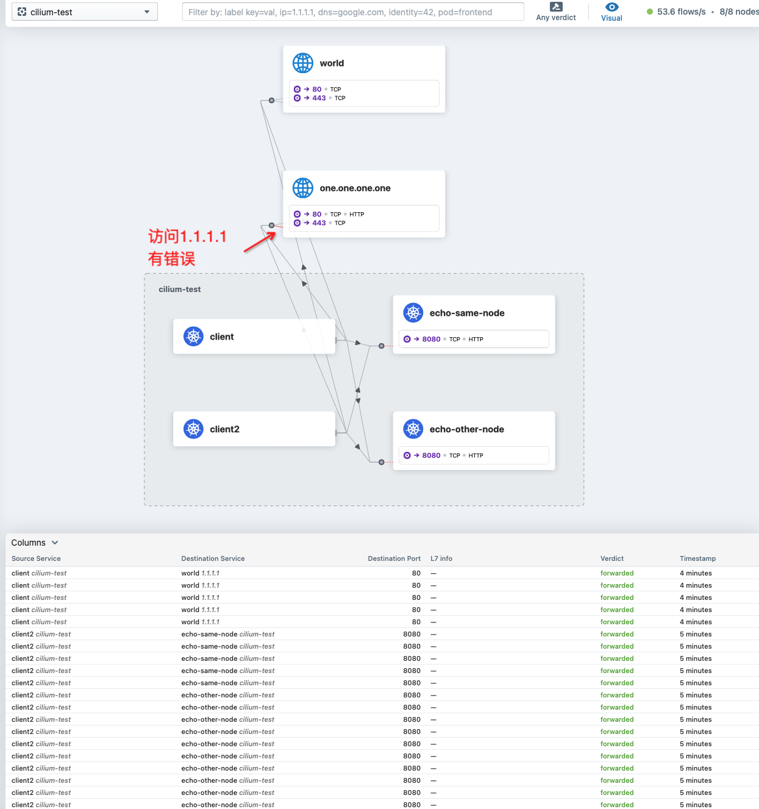
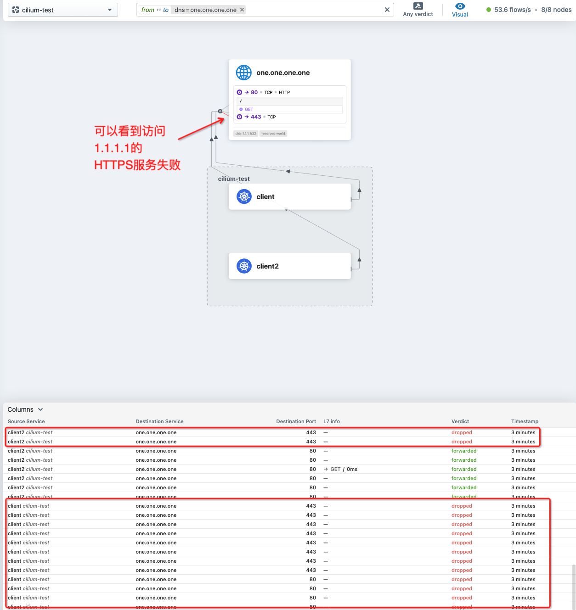
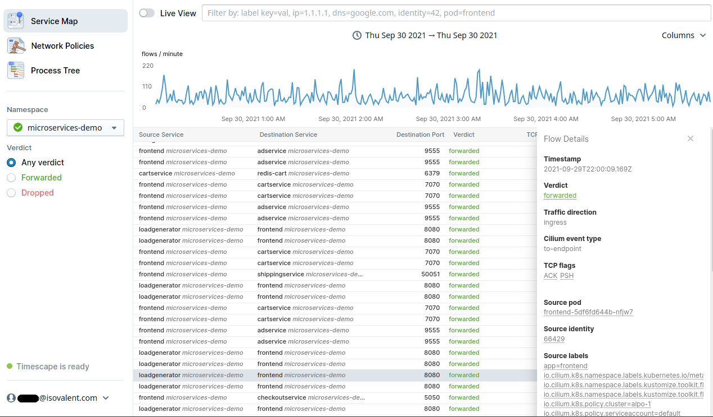
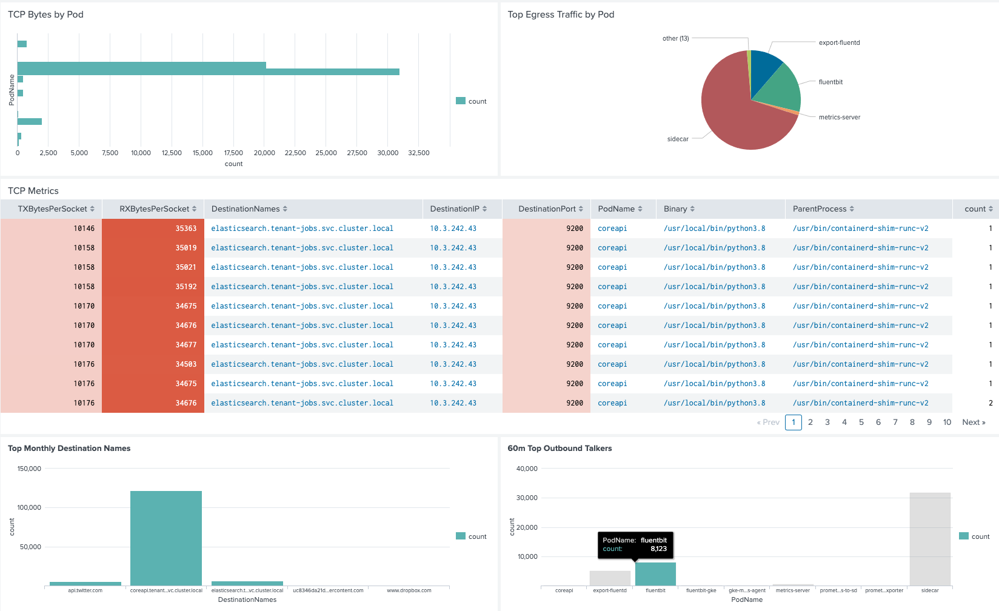

.. _cilium_service_map_hubble_ui:

============================
Cilium服务地图和Hubble UI
============================

:ref:`cilium_hubble` 部署之后，就可以借助Hubble UI，对Kubernetes的服务网络进行观察，帮助我们定位故障和异常。

激活 Hubble UI
================

- 激活 :ref:`cilium_hubble` 方法已如前描述过:

.. literalinclude:: cilium_hubble/helm_enable_hubble
   :language: bash
   :caption: 使用Helm激活Hubble

打开Hubble UI
=================

在我安装了 ``cilium hubble`` 的主机节点 ``z-k8s-m-1`` 上执行启动UI命令:

.. literalinclude:: cilium_service_map_hubble_ui/cilium_hubble_ui
   :language: bash
   :caption: 启动Hubble UI

此时终端显示提示::

   Opening "http://localhost:12000" in your browser...

注意，这个访问URL实际上是服务器上的桌面浏览器才能访问到的服务器本地地址端口，我在远程客户端是不能直接访问。这里需要使用 ssh 端口转发功能来实现访问远程服务器的本地回环地址上启动的服务。即在本地 ``~/.ssh/config`` 中添加如下配置:

.. literalinclude:: cilium_service_map_hubble_ui/ssh_config
   :language: bash
   :caption: SSH端口转发本地 ~/.ssh/config 配置内容

然后，就可以在本地桌面上使用 ``ssh z-k8s-m-1`` 登陆到服务器上，此时本地ssh链接会把本地12000端口映射到远程服务器的本地回环地址 ``127.0.0.1`` 的12000端口。所以，现在就可以在本地浏览器访问 http://127.0.0.1:12000 打开Cilium Hubble UI界面。

- 在操作界面中，Hubble提供了根据 ``namespace`` 来观察网络数据流的下拉选项，可以用来观察不同应用层(应用按照namespace组织):

.. figure:: ../../../../_static/kubernetes/network/cilium/observability/hubble_service_map_namespace_selector.png
   :scale: 50

如何观察(案例)
===================

你应该还记得 :ref:`cilium_install_with_external_etcd` 有一个cilium提供的检测工作节点间网络连通性的测试命令(实际就是构建2个pods，相互间互打流量，并测试到外网 ``1.1.1.1`` 的流量)::

   while true; do cilium connectivity test; done

然后我们就可以通过 ``cilium-test`` 这个namespace选择后观察，访问URL http://localhost:12000/cilium-test 就会看到如下测试情况(这里是截图，正在测试访问外网 1.1.1.1):

这里会观察到 ``1.1.1.1`` 访问链路上有一根红线，表示访问有错误。此时只要点击一下 ``one.one.one.one`` 这个图框，就可以看到进一步的子项目测试详情:

可以很清晰地看到访问 1.1.1.1 的HTTPS服务失败

这个图形化展示非常形象化帮助我们定位故障，其实也是和命令行 ``cilium connectivity test`` 终端输出信息相一致::

   Test Report
   ❌ 1/11 tests failed (4/128 actions), 0 tests skipped, 0 scenarios skipped:
   Test [no-policies]:
   ❌ no-policies/pod-to-world/https-to-one-one-one-one-0: cilium-test/client2-547996d7d8-qjgl6 (10.0.5.250) -> one-one-one-one-https (one.one.one.one:443)
   ❌ no-policies/pod-to-world/https-to-one-one-one-one-index-0: cilium-test/client2-547996d7d8-qjgl6 (10.0.5.250) -> one-one-one-one-https-index (one.one.one.one:443)
   ❌ no-policies/pod-to-world/https-to-one-one-one-one-1: cilium-test/client-7df6cfbf7b-gdzjs (10.0.5.91) -> one-one-one-one-https (one.one.one.one:443)
   ❌ no-policies/pod-to-world/https-to-one-one-one-one-index-1: cilium-test/client-7df6cfbf7b-gdzjs (10.0.5.91) -> one-one-one-one-https-index (one.one.one.one:443)
   connectivity test failed: 1 tests failed

Cilium企业版增强
===================

开源版本Hubble在跟踪展示上有比较大的限制(不过基本能力就绪)，在企业版上提供了更为清晰的跟踪能力以及从进程图形化展示网络流量的方法(我没有使用，但是根据文档截图可以感受和推测):

- 提供基于时间线的网络访问流量观察:

上述功能应该可以定制开发，主要是将时序数据查询

- Syscal变量的进程上下文:

.. figure:: ../../../../_static/kubernetes/network/cilium/observability/process_tree.png
   :scale: 25 

上述功能可以根据 ``systemd-cgls`` 命令分析进程树来对应查询网络流量

- 从 :ref:`ebpf` 的socket级别采集TCP和网络流量Metrics

总之，对于企业版功能，可以从开源社区版进行自开发定制，但是会比较复杂和消耗人力。

参考
=======

- `Cilium: Service Map & Hubble UI <https://docs.cilium.io/en/stable/gettingstarted/hubble/>`_
- `Isovalent Cilium Enterprise 1.10: Timescape, Runtime Observability & Enforcement, Hubble RBAC <https://isovalent.com/blog/post/2021-09-release/>`_
