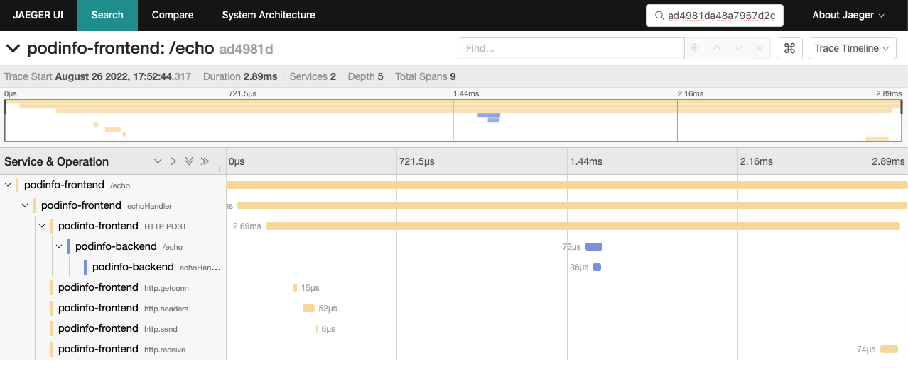

.. _hubble-otel:

=============================
Hubble集成OpenTelemetry
=============================

前置条件
=========

- 部署 :ref:`z-k8s` (你也可以 :ref:`install_run_minikube` )
- :ref:`cilium_install_with_external_etcd` (也可以简化为 :ref:`cilium_startup` )
- :ref:`cilium_hubble` 部署完成

部署说明
==========

本文实践在 Cilium 网络环境部署 :ref:`opentelemetry` 以及采用 :ref:`jaeger` 和 :ref:`cert-manager` ，同时采用 ``CiliumNetworkPolicy`` 和 ``CiliumClusterwideNetworkPolicy`` 来激活DNS和HTTP可视化的部署简单demo:

- 第一个 ``OpenTelemetryCollector`` 配置会部署Hubble adaptor和配置Hubble receiver来访问每个节点的L7流数据，然后将跟踪数据写入到 :ref:`jaeger`
- 第二个 ``OpenTelemetryCollector`` 将部署上游 :ref:`opentelemetry` 发行版来作为demo应用的sidecar

基本设置
==========

- 安装 :ref:`cert-manager` (OpenTelemetry operator依赖):

.. literalinclude:: hubble-otel/cilium_install_cert-manager
   :language: bash
   :caption: 在Cilium的K8s集群中安装cert-manager

- 执行以下命令确保 cert-manager 完全就绪:

.. literalinclude:: hubble-otel/wait_cert-manager_ready
   :language: bash
   :caption: 等待cert-manager就绪

输出显示:

.. literalinclude:: hubble-otel/cert-manager_ready
   :language: bash
   :caption: cert-manager就绪

- 部署 :ref:`jaeger` operator:

.. literalinclude:: hubble-otel/cilium_install_jaeger_operator
   :language: bash
   :caption: 在Cilium的K8s集群中安装Jaeger operator

输出显示:

.. literalinclude:: hubble-otel/cilium_install_jaeger_operator_output
   :language: bash
   :caption: 在Cilium的K8s集群中安装Jaeger operator输出信息

- 配置一个内存后端的 :ref:`jaeger` 实例:

.. literalinclude:: hubble-otel/config_memory-backed_jaeger_instance
   :language: bash
   :caption: 配置一个内存后端的 jaeger 实例

- 部署 :ref:`opentelemetry` operator:

.. literalinclude:: hubble-otel/cilium_install_opentelemetry_operator
   :language: bash
   :caption: 在Cilium的K8s集群中安装OpenTelemetry operator

- 配置Hubble receiver 和 Jaeger exporter:

.. literalinclude:: hubble-otel/config_hubble_receiver_jaeger_exporter
   :language: bash
   :caption: 在Cilium的K8s集群中配置Hubble receiver 和 Jaeger exporter

然后检查collector作为 :ref:`daemonset` 正确运行:

.. literalinclude:: hubble-otel/check_otelcol-hubble-collector
   :language: bash
   :caption: 在Cilium的K8s集群中检查otelcol-hubble-collector是否正常运行

如果正常，会看到每个worker节点正常运行了如下:

.. literalinclude:: hubble-otel/check_otelcol-hubble-collector_output
   :language: bash
   :caption: 在Cilium的K8s集群中检查otelcol-hubble-collector输出信息

- 现在可以检查日志:

.. literalinclude:: hubble-otel/check_otelcol-hubble-collector_logs
   :language: bash
   :caption: 在Cilium的K8s集群中检查otelcol-hubble-collector日志

- 现在就可以访问 :ref:`jaeger` 管理界面:

.. literalinclude:: hubble-otel/port-forward_jaeger
   :language: bash
   :caption: 通过kubectl port-forward访问jaeger的管理界面

部署podinfo demon应用
========================

以下部署案例是为了验证前面部署的trace系统，提供一个DNS和HTTP跟踪演示

- 创建一个 demo 应用的名字空间::

   kubectl create ns podinfo

- 激活 podinfo 应用的HTTP可视化以及所有DNS流量:

.. literalinclude:: hubble-otel/cilium_visibility-policies
   :language: bash
   :caption: 配置cilium可视化策略

提示信息::

   ciliumclusterwidenetworkpolicy.cilium.io/default-allow created
   ciliumclusterwidenetworkpolicy.cilium.io/dns-visibility created
   ciliumnetworkpolicy.cilium.io/http-visibility created

- podinfo应用是OpenTelemetry SDK检测，导出跟踪的一种方法是使用collector sidecar: 添加sidecar配置

.. literalinclude:: hubble-otel/otelcol-podinfo
   :language: bash
   :caption: 配置OpenTelemetry sidecar

- 现在部署podinfo应用:

.. literalinclude:: hubble-otel/deploy_podinfo
   :language: bash
   :caption: 部署podinfo示例应用

- 检查部署和服务:

.. literalinclude:: hubble-otel/get_podinfo_deployment_service
   :language: bash
   :caption: 部署podinfo的部署和服务检查

输出显示:

.. literalinclude:: hubble-otel/get_podinfo_deployment_service_output
   :language: bash
   :caption: 部署podinfo的部署和服务检查的信息

- 向应用发送压力

此时会看到终端输出一些trace信息，类似::

   traceparent: 00-ad4981da48a7957d2c3ec1f7f722ba87-964601c0a0298a04-01
   [
     "Hubble+OpenTelemetry=ROCKS"
   ]

这里 ``ad4981da48a7957d2c3ec1f7f722ba87``  就是 ``traceid``

在 :ref:`jaeger` 交互界面可以根据这个 ``traceid`` 搜索到会话的跟踪信息:

参考
======

- `Hubble adaptor for OpenTelemetry <https://github.com/cilium/hubble-otel>`_
