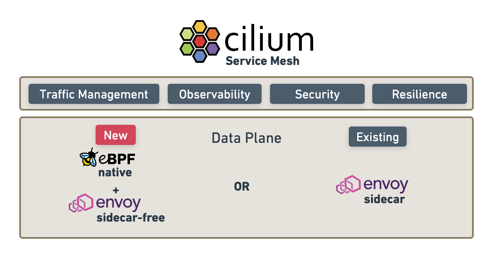

.. _cilium_service_mesh_arch:

=========================
Cilium Service Mesh架构
=========================

Cilium 1.12 于2022年7月20日发布，在 Service Mesh 上有很多增强，特别是提供了全新的 ``eBPF native + envoy sidecar-free`` 架构支持多种控制平面选项。Cilium 1.12对现有基于sidecar模式 :ref:`istio` 做出了补充，也深度集成到Cilium架构。

.. figure:: ../../../../_static/kubernetes/network/cilium/service_mesh/cilium_new_service_mesh.png
   :scale: 50

Cilium现在能够降低复杂性，并且在service mesh层允许用户基于需求来选择使用sidecar或者deamonset(sidecar-free)方式运行一个service mesh。

企业级Service Mesh
====================

随着企业级Service Mesh兴起，企业级网络需要服务网格(service mesh)不仅是WEB扩展应用，而是要求将Kubernetes网络/CNI层和Service Mesh层紧密结合，并且创造出新的结合两者的层次:

.. figure:: ../../../../_static/kubernetes/network/cilium/service_mesh/enterprise_grade_service_mesh.png
   :scale: 50

- **良好的集成到公有云和本地** : 与Kubernetes类似，service mesh主要专注在公有云中支持基础设施的部署。随着企业开始采用service mesh，对本地等效功能以及将云和本地结合在一起的能力的需求正在迅速上升。多云(multi-cloud)和多集群(multi-cluster)要求从底层架构供应商提供跨云的连接性、安全性和可观测性。

- **网络层操作** : 网络层的控制不仅是和本地现有企业网络组件结合，而且要求必须满足云中关于 分段(segmentation)，加密(encryption)和可视化(visibility)。这包括提供注入网络策略、出口网关，透明加密，BGP，SRv6以及传统的防火墙集成等功能。

- **应用程序协议层操作** : Service Mesh需要了解HTTP和gRPC等应用层协议，以通过实现流量管理、金丝雀发布、跟踪以及L7授权。这是通过实现Ingress和Gateway API来实现的。

Service Mesh定义
===================

随着分布式应用程序的引入，额外的可见性，连接性和安全性要求已经浮出水面:

- 应用程序组件通过不受信任的网络跨云和场所边界(premises boundaries)，负载均衡需要理解应用程序协议，弹性(resiliency)变得至关重要(crucial)
- 安全性必须发展成发送者和接受者可以互相验证身份的模型

在分布式应用程序的早期阶段，上述需求是通过将逻辑直接嵌入到应用程序来解决。而现在，service mesh从应用程序中提取这些特性并将上述特性作为基础架构提供给应用程序而不再需要一一改写程序。

.. note::

   简而言之，服务网格(service mesh)就是为应用程序提供 ``可见性`` / ``连接性`` / ``安全性`` 的基础设施，其实现的关键技术就是能够理解应用通讯协议的七层代理服务(提供加密卸载)。

现今service mesh提供了以下特性:

- ``弹性连接`` (Resilient Connectivity) : service mesh负责跨越云、集群、场所边界的通许，提供弹性和容错性(你可以理解成service mesh负责任意复杂的网络加密通讯)

- ``7层网络流量管理`` (L7 Traffic Management) : 支持7层网络(HTTP, REST, gRPC, WebSocket等)流量的负载均衡、速率限制和弹性(你可以理解成service mesh通过7层负载均衡实现网络全方面管理，因为7层解析已经到达应用层，所以应用通讯对于service mesh是没有秘密的)

  - 这个强大的功能让我有点疑惑，service mesh的7层代理已经完全剖析了应用层，虽然带来了强大的观察能力，但是对云计算的客户来说，这个基础设施如果掌握在云厂商手里是否存在泄密的可能？

- ``基于身份的安全性`` (Identity-based Security) : 依靠网络标识符来实现安全性已经不够了，发送和接收服务必须能够基于身份而不是网络标识符来相互验证(全面使用证书和签名来认证通讯双方身份)

- ``可观测性和跟踪`` (Observability & Tracing) : tracing和metrics的可观察性对于理解、监控和故障排查非常重要，也是确保应用程序的稳定性、性能和可用性的关键

- ``透明度`` (Transparency) : ``可见性`` / ``连接性`` / ``安全性`` 功能必须以透明的方式提供给应用程序，无需应用改造

Cilium Service Mesh
======================

Cilium Service Mesh的特点就是: 高效性和功能性的平衡。

简单来说就是:

- 对于Service Mesh的 4层协议 ，包括IP, TCP 和UDP 协议，Cilium使用 :ref:`ebpf` 作为高效的内核数据路径来高速处理
- 对于HTTP, Kafka, gRPC 和 DNS 等应用层协议，使用 :ref:`envoy` 等代理进行解析
- 对于超出Cilium功能的Service Mesh用例，则使用 :ref:`istio` 处理，通过全功能的Istio管理的sidecar实现7层策略
- Cilium提供了Istio自动优化，如缩短sidecar网络路径注入(shortening the sidecar network path injection)，并且避免应用程序和sidecar之间未加密数据暴露

Sidecar 和 Sidecar-free 的选择
================================

Sidecar的性能影响
-------------------

参考
======

- `Cilium Service Mesh – Everything You Need to Know <https://isovalent.com/blog/post/cilium-service-mesh/>`_
- `Cilium 1.12 – Ingress, Multi-Cluster, Service Mesh, External Workloads, and much more <https://isovalent.com/blog/post/cilium-release-112/>`_
