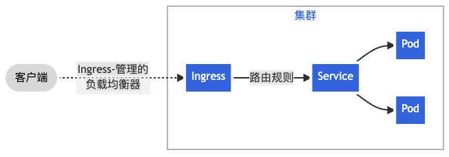

.. _ingress:

====================
Ingress
====================

Ingress实现通常由两个组件组成:

- Ingress Resource: Ingress Resource是配置路由规则
- Ingress Controller: Ingress Controller 是Ingress API对象的一个实例，负责监控Kubernetes Ingress Resource并根据所需行为提供一种或多种机制

Ingress是Kubernetes的API对象，用于管理外部访问集群中的某个服务，通常是HTTP服务。Ingress可以提供负载均衡，SSL卸载以及基于名字解析的虚拟主机。

Ingress将集群内部的 :ref:`k8s_services` 输出到外部的HTTP和HTTPS路由。流量路由是在Ingress资源(Ingress Resource)所定义的规则来控制的。

Ingress可以将给定的服务配置成外部可以访问的URLs，负载均衡流量，卸载SSL/TLS，以及提供基于名字的虚拟主机。而一个 :ref:`ingress_controller` 则负责管理Ingress，结合负载均衡，就可以通过Ingress Controller配置边界路由器或者增加前端来帮助处理流量。

Ingress不会输出随机端口或协议。对于需要输出HTTP和HTTPS以外的服务则通常使用 ``Service.Type=NodePort`` 或者 ``Service.Type=LoadBalancer`` (参考 :ref:`k8s_services` )。

.. note::

   有多种 :ref:`ingress_controller` 可以选择，即有多种负载均衡可以作为容器实例运行在边界，例如 NGINX, HAProxy, Istio, Gloo 等等。例如opensource.com上文章 `Try this Kubernetes HTTP router and reverse proxy <https://opensource.com/article/20/4/http-kubernetes-skipper>`_ 介绍了采用 `zalando开发的skipper <https://opensource.zalando.com/skipper/>`_ 实现Ingress(我准备后续实践)。

   为了有感性认识，请参考 :ref:`k8s_deploy_registry` ，其中采用了 NGINX Ingress 来实现。

.. note::

   - 在Kubernetes中，服务 :ref:`k8s_services`  指一组使用标签选择器( ``label selectors`` )标识的Pods

   
   流量发送给服务的简单Ingress示例

Ingress可以配置为 :ref:`k8s_services` 提供外部可访问的(externally-reachable) URLs，负载均衡流量，终结 SSL/TLS ，以及提供基于名字的虚拟主机(name-based virtual hosting)(这些都是传统的WEB服务器 :ref:`nginx` 的功能)。 :ref:`ingress_controller` 负责实现Ingress(fulfilling the Ingress，我理解就是负责控制类似 :ref:`nginx` 这样的ingress resources配置)，通常是通过负载均衡来实现Ingress(也就是类似NGIX内置的反向代理功能，转发流量给后端实际应用服务器)。不过
:ref:`ingress_controller` 也能够配置边缘路由器或者其他前端来帮助处理流量(这里 ``Ingress Controller`` 的功能边界有点模糊，可能有些厂商也增加了通过 ``Ingress Controller`` 来控制一些特定厂商的路由器)。

Ingress 一般仅负责 HTTP 和 HTTPS 服务的对外公开，其他端口和协议通常使用 :ref:`k8s_services_nodeport` 或 :ref:`k8s_services_loadbalancer` 来做对外公开。

.. note::

   不过， :ref:`ingress_nginx` 也支持 UCP/TCP 反向代理，所以实际上也可以用 :ref:`ingress_nginx` 来完成对外 :ref:`ssh` 输出(标准方法是使用 :ref:`k8s_services_loadbalancer` )

参考
======

- `Kubernetes 文档>>概念>>服务、负载均衡和联网>>Ingress <https://kubernetes.io/zh-cn/docs/concepts/services-networking/ingress/>`_
