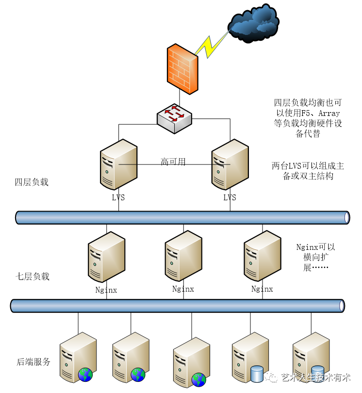

.. _k8s_loadbalancer_ingress:

===========================================
Kubernetes集群的Load Balancer和Ingress辨析
===========================================

作为大厂的螺丝钉，我们可能会把很多习以为常的部署看成理所当然，但是实际上部署一个独立的Kubernetes集群，你就会发现脱离了云计算厂商的基础设施，Kubernetes的容器部署并不仅仅是一个简单的 ``docker push`` 。

我在部署 :ref:`priv_cloud` 就遇到这样的迷惑，也促使我辨析和理解Kubernetes的这两种看来相似实则不同功能的网络组件

我的简化理解
================

.. note::

   这里我用自己的理解描述，不一定精确

**简而言之** (如果你在阿里这样的工厂待过，可能会理解我的产品对应解析)

现代 :ref:`web` 对外服务的网络部署实际上有两层(负载均衡):

- 最外面一层是4层负载均衡，也就是TCP负载均衡

  - 对应的开源软件就是著名的 ``LVS`` (Linux Virtual Server)，只根据TCP端口分发给后端的real server(也就是一层7层负载均衡):

    - 早期WEB网站非常简单，是单层负载均衡，也就是TCP分发直接访问 :ref:`nginx` 或者Apache这样的WEB服务器
    - 现代的WEB网站做了精细的功能划分，所以会采用第二层的7层负载均衡做进一步处理(第二层7层负载均衡其实就是Kubernetes的Ingress组件)

  - 对应于Kubernetes的组件，就是 ``Load Balance`` 术语:

    - 当我们自己部署Kubernetes集群的时候，按照Kubernetes架构就缺少了云计算厂商提供的 ``Load Balance`` ，我们必须自己部署一个最外层的负载均衡，例如开源的 :ref:`metallb` 才能实际把外部访问流量分发给 :ref:`k8s_ingress` (否则就要采用简陋呆板的 :ref:`port_forward_access_k8s_app` )

- 第二层是7层负载均衡，对应用协议进行分析

  - 常用的开源7层负载均衡: :ref:`nginx` 和 :ref:`haproxy`

    - 对URL进行解析，例如 ``/static/`` 和 ``/api/`` 会分别分发到负责静态资源(图片/css)等WEB服务器 和 负责应用服务的WEB服务器
    - 对HTTP的header进行解析，例如用户的 session 保持(大型网站会按照用户UID进行切分，以便实现业务分流)

  - 对应于Kubernetes的组件，就是 ``Ingress`` 术语

.. note::

   :ref:`nginx` 是一个非常全能的 :ref:`web` 服务器，即支持4层负载均衡又支持7层负载均衡。所以理论上它是可以部署在上述我描述的双层负载均衡网络的任意一层。

   但是，实际上出于 "术业有专攻" 的规划，我们往往只将 :ref:`nginx` 作为第二层7层负载均衡，而将第一层4层负载均衡采用比较简单的LVS来实现。 

参考
=======

- `Ingress vs. Load Balancer in Kubernetes <https://www.baeldung.com/ops/kubernetes-ingress-vs-load-balancer>`_
- `Kubernetes NodePort vs LoadBalancer vs Ingress? When should I use what? <https://medium.com/google-cloud/kubernetes-nodeport-vs-loadbalancer-vs-ingress-when-should-i-use-what-922f010849e0>`_
- `Ingress Load Balancer Kubernetes Definition <https://avinetworks.com/glossary/ingress-load-balancer-for-kubernetes/>`_
- `Ingress vs Load Balancer <https://stackoverflow.com/questions/45079988/ingress-vs-load-balancer>`_
- `lvs+nginx负载均衡 <https://www.modb.pro/db/441631>`_ 本文示意图
