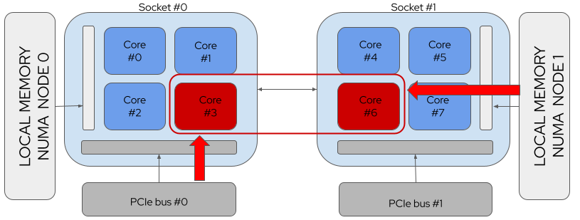
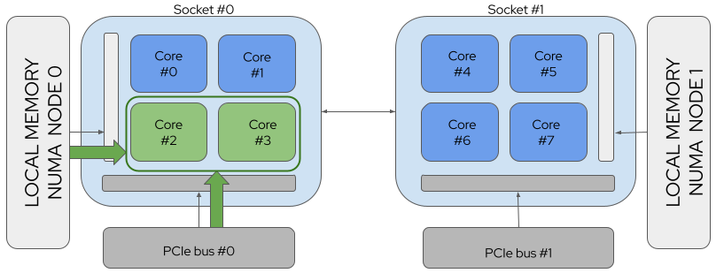
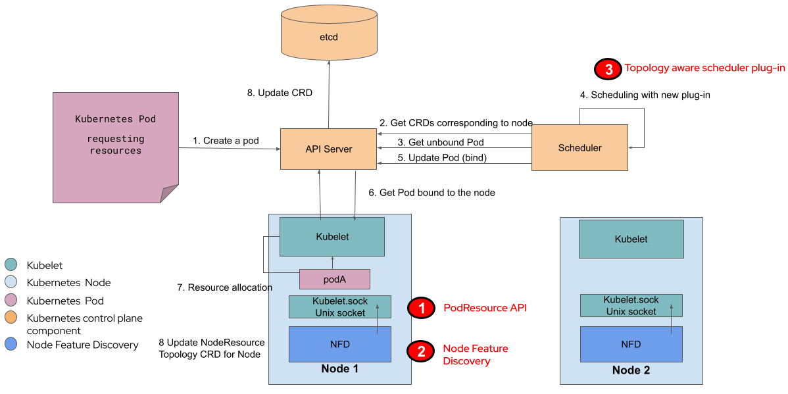
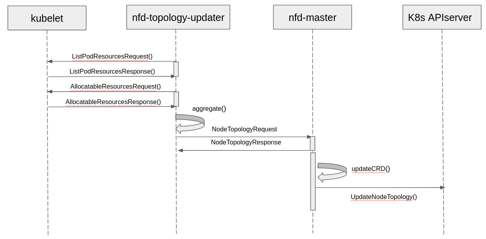

.. _k8s_numa_arch:

===========================
Kubernetes NUMA实现架构
===========================

当Kubernetes部署到裸金属服务器(直接物理主机，非 :ref:`kvm` 虚拟机环境) ，就会面对一个现状：服务器的负载锁使用的物理资源分布，从内存、CPU到存储和I/O，会戏剧性地影响性能。直到最近的Kubernetes用户还没有直接方式来影响这个硬件和软件的关键因素，也就是通常所说的资源拓扑(Resource Topology)。

2021年开始Kubernetes引入了 ``Topology Aware Scheduling`` (拓扑感知调度)功能，使得kubernel控制平面(control plane)可以在pod调度到节点到时候控制资源拓扑限制(keep to Resource Topology constraints)。这个技术实现是从Kubernetes 1.17引入到 ``Topology Manager`` ，在kuberlet中节点级别的资源拓扑实现强制限制。

资源拓扑的意义
===============

:ref:`numa` (Non-Uniform Mmeory Access，非一致性内存访问)是计算机平台中允许不同处理器以不同速度访问不同部分(regions)的内存的架构。这个CPU, 内存以及PCI设备的位置，也就是我们所说的资源拓扑 ``Resource Topology`` 。

虽然任何CPU核心都能访问系统中所有内存，但是存在一些性能影响，例如以下拓扑结构示意图中，CPU core 1 访问近端的内存就比其访问靠近CPU core 7的远端内存要快:

.. figure:: ../../_static/kubernetes/numa/k8s_numa_arch_1.png
   :scale: 60
   :alt: A Non-uniform Memory Access (NUMA) system

   FIGURE 1: A Non-uniform Memory Access (NUMA) system

简单来说，底层操作系统会管理大多数和numa相关工作，在Kubernetes集群中也是如此。但是，当你试图从裸金属服务器上压榨出低延迟性能，你就需要为特定应用分配隔离的资源。随着添加新型资源，这项工作会更复杂。

对于 I/O 关键的工作负载，位于远端NUMA zone的网卡会降低数据到达应用程序的速度。高性能负载，例如运行在5G网络，甚至不能在这种情况下运作。

资源对齐的NUMA系统
----------------------

以下案例是一个请求 2个 CPU 和 1个 PCI设备的 Pod，分别是:

   FIGURE 2: A NUMA System with no Resource Alignment

上图中，NUMA没有对齐资源，也就是 CPU 3 需要访问远端内存，而 CPU 6 需要访问远端PCI 设备，相应带来数据访问延迟

   FIGURE 3: A NUMA System with Resource Alignment

上图中，NUMA对齐资源，则CPU 2 和 CPU 3 都是访问近端内存和近端PCI设备，带来性能提升

如果不能处理资源拓扑，即使在Kubernetes 1.20集群，也不能处理这种对延迟敏感的高性能应用程序。一种退而求其次的方式是使用虚拟机，例如 :ref:`kvm` ，由底层操作系统自动对齐分配给VM虚拟机的资源。不过，这显然不能满足使用裸金属的Kubernetes集群需求。

Kubernetes默认的调度器不会选择基于本地物理主机的资源拓扑结构来分配资源给pod。性能关键型的工作负载需要拓扑信息才能使用协同定位(co-locate)的CPU核和设备，用于电信、高性能计算(HPC)和物理网(IoT)行业，但是当前的原生嗲赌气并没有基于节点拓扑进行调度，不能满足需求。

错误分配不匹配的资源请求甚至会导致高负载情况下调度的pod失败，以及进入一个失败循环(failure loop)。

Topology Manager和Topology Aware Scheduling
===============================================

   FIGURE 4: 拓扑感知的调度器系统级别示意图

- ``Kubelet`` 负责通过 ``PodResource API`` 获得现有资源拓扑信息，这个API是Topology Aware Scheduling的增强
- ``Node Feature Discovery`` 将从Kubelet endpoint读取并通过集群中节点的定制资源(Custom Resources, CRs)来生成资源拓扑信息
- ``Kubernetes Scheduler`` 读取通过 ``Node Featured Discovery`` 输出的信息并排除掉不能满足特定工作负载需求的节点

Topology Aware Scheduling 集成到现有的Kubernetes组件，包括社区捐赠的 ``Node Feature Discovery`` 来提供一个集群级别的拓扑管理解决方案。这个组件通过Kubernetes API和其他组件通讯。

   FIGURE 5: 拓扑感知的调度器时序图

参考
=====

- `Topology Aware Scheduling in Kubernetes Part 1: The High Level Business Case <https://cloud.redhat.com/blog/topology-aware-scheduling-in-kubernetes-part-1-the-high-level-business-case>`_
- `Topology Awareness in Kubernetes Part 2: Don’t we already have a Topology Manager? <https://cloud.redhat.com/blog/topology-awareness-in-kubernetes-part-2-dont-we-already-have-a-topology-manager>`_
- `Topology Management - Implementation in Kubernetes Technology Guide <https://builders.intel.com/docs/networkbuilders/topology-management-implementation-in-kubernetes-technology-guide.pdf>`_ Intel技术手册
- `Control Topology Management Policies on a node <https://kubernetes.io/zh/docs/tasks/administer-cluster/topology-manager/>`_ kubernetes官方文档，有中文版
- `Utilizing the NUMA-aware Memory Manager <https://kubernetes.io/docs/tasks/administer-cluster/memory-manager/>`_ kubernetes官方文档，有中文版
