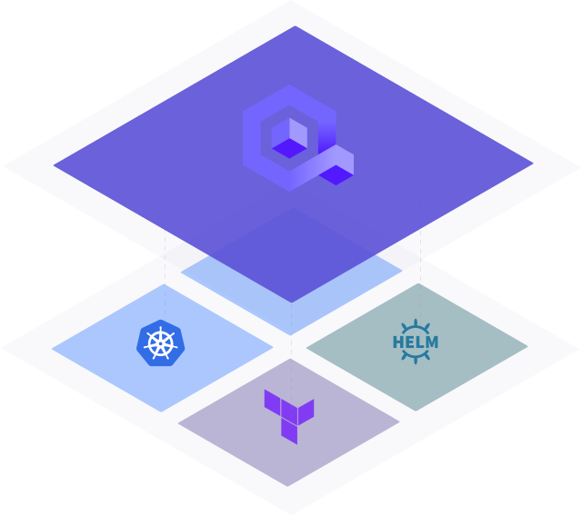
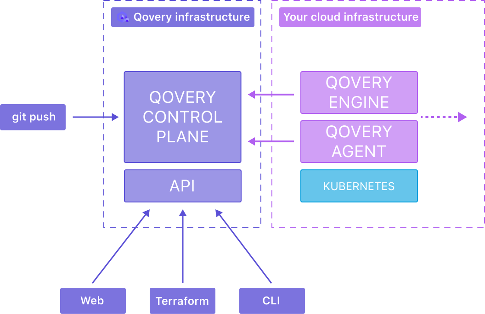

.. _intro_qovery:

=================
Qovery简介
=================

Qovery是一个非常 ``有意思的`` 所谓 **最先进的** (state-of-the-art) 部署平台:

- 有些类似PaaS平台(如 :ref:`openshift` )，但又不完全是PaaS
- 抽象包装了多种开源工具 ( :ref:`terraform` , :ref:`loki` , :ref:`grafana` ...)实现快速部署完整的持续集成系统，从 dev => staging => production
- 确保开发者产品化和自治化，以完整控制整个部署生命周期
- 提供一个产品化开箱即用的架构，可以大为节约部署工作投入

.. note::

   以下文档根据官方文档整理，其架构思路值得借鉴。虽然内核还是Kuberntes的不同软件堆栈，但是提供了一个快速部署持续集成的完整生态。后续我想做一些部署解析，来了解和借鉴这个开源项目。

   Qovery官方文档 `TUTORIL: Deploy Temporal on Kubernetes <https://hub.qovery.com/guides/tutorial/deploy-temporal-on-kubernetes/>`_ 提供了一个生动案例介绍如何在Qovery平台简便地部署 :ref:`temporal` 来实现 Kubernetes 工作流平台。由此可见 Qovery 的使用方法。

Qovery是基于很多成熟工具( :ref:`kubernetes` , :ref:`terraform` , :ref:`helm` )和云计算服务商(AWS, Digital Ocean, Scaleway ...)之上构建的一个抽象层。Qovery的目标是提供产品化的平台层：

Qovery的云基础架构
======================

Qovery是基于云厂商提供的云服务之上来构建平台，所以需要在云服务账号上安装一些服务才能工作：

所有应用和数据都是运行在云计算账号下。 ``Qovery Engine`` , ``Qovery Agent`` 以及 Kuberntes 是3个主要运行在该基础架构上的服务，用于运行你的应用程序。Qovery Engine和Qovery Agent从控制平面通过一个加密 gRPC/TLS 连接获取指令。 Qovery基础架构和你的应用基础架构和其他人是隔离的，这样Qovery设计成不影响你的基础架构。

Qovery基础架构的服务
=====================

.. csv-table:: Qovery基础架构服务
   :file: intro_qovery/qovery_infra_service.csv
   :widths: 20, 10, 10, 60
   :header-rows: 1

安装在基础架构上的服务
=======================

.. csv-table:: 安装在基础架构上的服务(Qovery依赖)
   :file: intro_qovery/query_depend_infra_service.csv
   :widths: 20, 10, 10, 60
   :header-rows: 1

Qovery应用和数据库部署案例
============================

典型的案例是采用Qovery在AWS生产环境部署使用 :ref:`pgsql` 数据库的  :ref:`nodejs` 应用程序:

.. figure:: ../../../_static/kubernetes/platform/qovery/from-build-to-scale-schema.png
   :scale: 30

.. csv-table:: Qovery部署Nodejs和PostgreSQL
   :file: intro_qovery/qovery_deploy_app_db.csv 
   :widths: 20, 10, 10, 60
   :header-rows: 1

参考
======

- `How Qovery Works <https://hub.qovery.com/docs/getting-started/how-qovery-works/>`_
