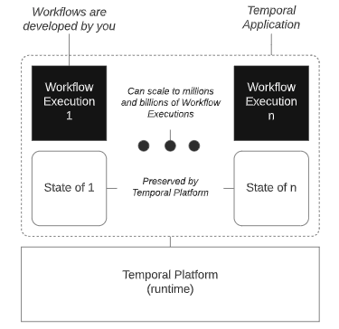

.. _intro_temporal:

==========================
Temporal工作流平台简介
==========================

工作流平台的需求
=================

在微软的 ``Azure`` 云计算产品中，有一个 `Azure Durable Functions <https://learn.microsoft.com/en-us/azure/azure-functions/durable/durable-functions-overview>`_ 提供了serverless计算环境(通常可以对标Kubernetes)中编写有状态函数(stateful functions)。作为Azure云的函数计算扩展， ``Durable Fuctions`` 可以实现函数编程模式来定义有状态工作流:

- 状态管理
- 自动检测点(Automatic checkpointing)
- 无人值守重启

实际上云计算的这类持久化函数(Durable Fuctions)是一种有状态服务的工作流，已经是商业应用的常见功能。不过，各个云厂商的serverless都是深度绑定平台，无法灵活跨云或者用于开源的Kubernetes。

`temporal.io <https://www.temporal.io/>`_ 推出了开源的工作流平台 :ref:`temporal` ，能够面向程序员开发出解决三大场景应用:

- 多重步骤: 多个相关动作朝向一个共同目标运行
- 分布式: 跨多个服务器和服务的操作，在分布式系统中协作
- 任意长度: 工作流的时间跨度可以秒级，也可以跨越数天或者数年

在现实中，众多的操作有人为触发也有定时任务触发，分散在不同的体系和平台中，需要精确编排才能协作完成工作流，所以需要一个可靠的、一致性的、正确的工作流来及解决不同数据结构的业务串联。 

:ref:`temporal` 作为开源工作流提供了通用编程SDK和负责状态管理、事件处理的后端服务。每个工作流都是一个内聚函数(cohesive function)，通过提供的构建块定义整个场景

定义
========

Temporal
----------

按照 `Temporal官方定义 <https://docs.temporal.io/temporal>`_ : Temporal 是一种可扩展、可信赖、可重入的流程运行时( ``a scalable and reliable runtime for Reentrant Processes`` )，称为 ``Temporal Workflow Executions`` :

Temporal Application
-------------------------

``Temporal Application`` 一组 ``Temporal　Workflow Executions`` ，每个 ``Temporal Workflow Executions`` 在本地状态独占访问，在分布式系统中所有 ``Temporal　Workflow Executions`` 并发执行，并通过消息传递(message passing)与其他 ``Workflow Executions`` 和环境进行通信。

Reentrant Process
~~~~~~~~~~~~~~~~~~

``Temporal Workflow Execution`` 是一个可重入流程(Reentrant Process): 可继续(resumable),可恢复(recoverable),可反应(Reactive)

- 可继续(resumable): 流程可以暂停执行直到可以运行时继续执行的能力
- 可恢复(recoverable): 流程因1故障暂停执行可以在故障消除后继续执行的能力
- 可反应(Reactive): 流程对外部事件做出相应反应的能力

总之: ``Temporal Workflow Execution`` 定义了工作流函数， **只需要执行一次** ，无论代码执行数秒还是数年，也无论负载大小或是否存在故障。

Temporal SDK
---------------

Temporal SDK是特定开发语言的API库，支持:

- Go SDK
- Java SDK
- PHP SDK
- Python SDK
- TypeScript SDK

正在开发的SDK:

- .NET
- Rust
- Ruby

第三方SDK:

- Clojure
- Scala
- Ruby

Temporal Client
------------------

Temporal客户端可以执行:

- 获取工作流执行的结果
- 列出工作流执行
- 查询工作流执行
- 发出工作流执行信号
- 启动工作流执行

参考
========

- `一种实用的 Temporal 架构方法 <https://www.infoq.cn/article/rhm7korkk4fxcjdgfdvq>`_
- `Temporal: Open Source Workflows as Code <https://mikhail.io/2020/10/temporal-open-source-workflows-as-code/>`_
