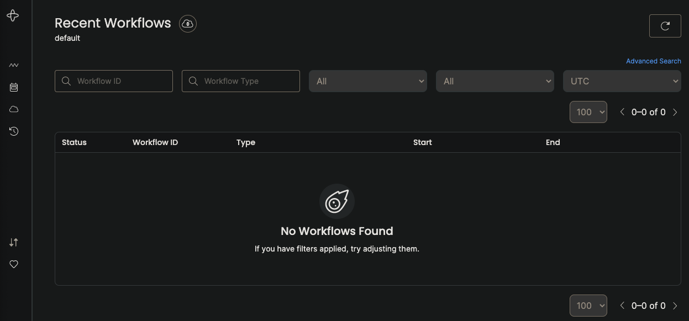

.. _temporal_startup:

==================
Temporal快速起步
==================

设置开发环境
================

Go开发
---------

- 在本地安装 :ref:`go_on_arch_linux` 或 :ref:`go_on_fedora`

TypeScript开发
---------------

- 在本地安装 :ref:`nodejs_dev_env`

- 可以使用Temporal SDK创建一个新项目::

   npx @temporalio/create@latest ./my-app

也可以使用以下命令在现有项目中加入Temporal TypeScript SDK::

   npm install @temporalio/client @temporalio/worker @temporalio/workflow @temporalio/activity

.. note::

   目前专注于Go开发Temproal，后续再尝试TypeScript

设置一个Temporal开发集群
------------------------

Temporal官方采用 :ref:`docker` 和 :ref:`docker_compose` ，请按照发行版进行安装

- clone出 `temporalio/docker-compose <https://github.com/temporalio/docker-compose>`_ 仓库，然后运行 ``docker-compose`` 启动环境::

   git clone https://github.com/temporalio/docker-compose.git
   cd  docker-compose
   docker-compose up

当 Temporal 集群运行后，在浏览器中访问 http://127.0.0.1:8080/ 就会看到如下管理界面:

运行第一个Temproal程序(Go)
============================

Temporal提供了一个案例程序，模拟发起一个money transfer

- 首先clone出案例程序的仓库::

   git clone https://github.com/temporalio/money-transfer-project-template-go

进入 ``money-transfer-project-template-go`` 目录可以浏览代码，解析如下:

- 如 :ref:`intro_temporal` 所说， ``Temporal application`` 是一组 ``Temporal Workflow Executions`` ，也就是可靠和持久的函数执行。这些Workflow Executions编排Activities的执行，每个Activity执行单个明确定义的操作，如调用某个服务，转码媒体文件或者发送电子邮件消息等
- Go中的工作流定义是一个常规的Go函数，接受工作流上下文和一些输入值

参考
=======

- `Get started with Temporal <https://learn.temporal.io/getting_started>`_
