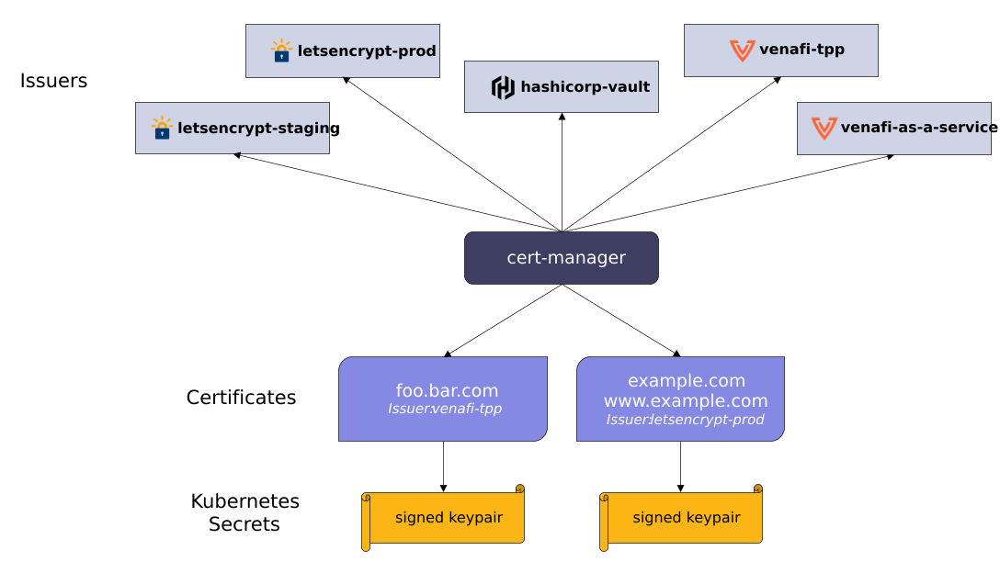

.. _intro_cert-manager:

==================
cert-manager简介
==================

cert-manager 将证书和证书颁发者(certificate issuers)作为资源类型添加到Kubernetes集群，并且简化了获取，更新和使用这些证书的过程。

cert-manager可以接受各种来源所颁发的证书，包括 `Let's Encrypt <https://letsencrypt.org/>`_ , `HashiCorp Vault <https://www.vaultproject.io/>`_ 和 `Venafi <https://www.venafi.com/>`_ 作为私有PKI。

cert-manager将确保证书有效且是最新的，并且在证书到期前尝试更新证书。

参考
=======

- `cert-manager Introduction <https://cert-manager.io/docs/>`_
