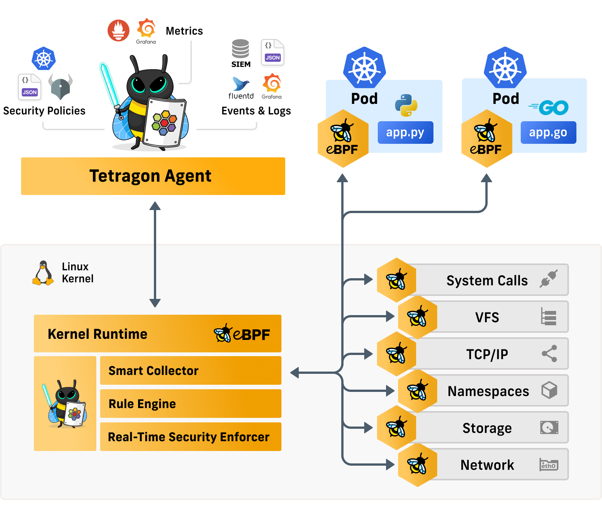
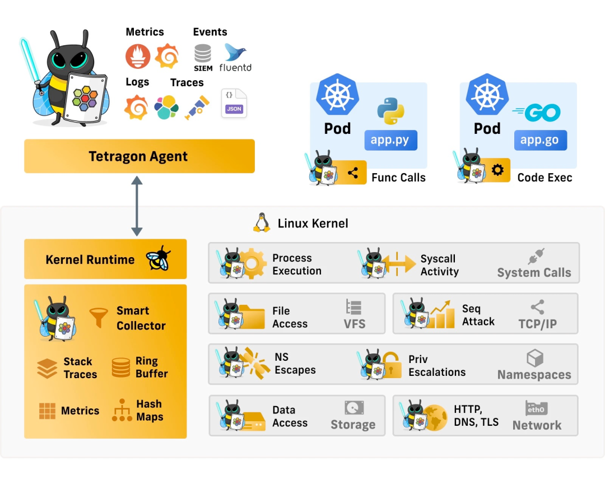
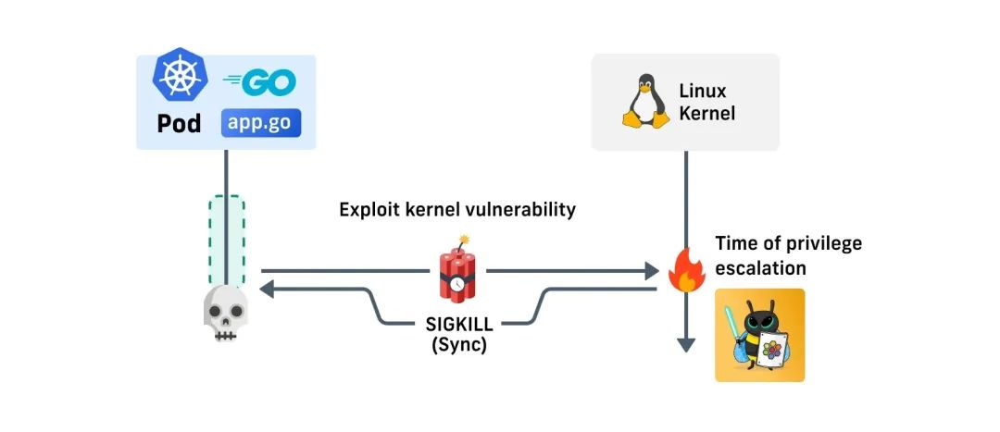

.. _intro_tetragon:

===============================
Tetragon:基于ebpf的安全架构简介
===============================

.. note::

   本文为 `Tetragon: Cilium 开源基于 eBPF 的安全可观测性 & 运行时增强平台 <https://www.modb.pro/db/409929>`_ 摘抄，详细实践后续完善

Isovalent :ref:`cilium` 企业版包含一个基于 :ref:`ebpf` 的实时安全可观测行和运行时增强平台。2022年5月16日，Isovalent开源了该平台的核型功能，命名为 ``Tetragon`` (四边形) ( `GitHub仓库: cilium/tetragon <https://github.com/cilium/tetragon>`_ ) 

Tetragon功能
================

``Tetragon`` 提供基于 :ref:`ebpf` 的完全透明的安全可观测行能力以及实时的运行时增强能力:

- 基于 eBPF 的内核级收集器中直接内置了智能内核过滤能力和聚合逻辑
- 无需修改程序就可以用非常低的开销实现深度的可观测行
- 内嵌的运行时执行层不仅可以在系统调用层面进行访问控制，而且能够检测到特权、能力和命名空间的提权逃逸，并实时自动阻止受影响的进程继续运行

智能可观测性
=============

Tetragon 通过 :ref:`ebpf` 可以观测整个系统(内核级别可观测性):

- 跟踪文件访问
- 网络活动
- 能力(capability)变化
- 应用层调用: 共享库的函数调用、跟踪进程执行、解析发出的HTTP请求

Tetragon可以提供各种内核子系统的可观测行:

- 命名空间逃逸
- 能力(capability)和特权提升
- 文件系统和数据访问
- HTTP/DNS/TLS和TCP等协议的网络活动
- 系统调用层事件
- 审计系统调用
- 跟踪进程执行

Tetragon的特点
---------------

- 深度可观测性: 可观测整个系统和应用程序的几乎所有调用环节
- 完全透明：Tetragon 所有的可观察性数据都是从内核中透明地收集的，无需更改应用程序代码，应用也无法检测到自己何时被监控，这是安全用例的理想选择
- 低开销: 

  - Tetragon 直接在内核中使用 eBPF 执行过滤、聚合、度量统计和直方图收集，大大减少了系统的开销
  - Tetragon 使用高效的数据结构，如每个 CPU 的哈希表、环形缓冲区和 LRU 地图，以提供高效和快速的数据收集手段，并避免向用户空间 agent 发送大量的低信号事件

运行时增强（runtime enforcement）
=================================

Tetragon 提供了实时的运行时增强（runtime enforcement）能力:

- 以预防的方式在整个操作系统中执行安全策略
- 为多个层级的访问控制指定允许列表
- 自动检测特权和 Capabilities 升级或命名空间提权（容器逃逸），并自动终止受影响的进程
- 安全策略可以通过 Kubernetes（CRD）、JSON API 或 Open Policy Agent（OPA）等系统注入

.. figure:: ../../../_static/kubernetes/security/tetragon/enforcement.png
   :scale: 60

实时的运行时增强
-----------------

- eBPF 使得我们在遭受漏洞攻击时马上作出反应，实时、同步地执行策略
- 杀手锏是一旦观察到特权/功能升级或命名空间提权，便立即阻止进程继续运行

Tetragon 不需要了解特定的漏洞或攻击载体，而是直接定义执行策略，指定哪些应用程序应在运行时可以提升特权、附加额外的 Capabilities、跨越内核命名空间的边界，而后便监视内核的提权和逃逸，并自动终止违反定义策略的进程。

Tetragon 还提供了一个 agent，可以原生集成各种现代化的可观测性系统和策略标准（例如 Kubernetes、Prometheus、fluentd、Open Telemetry、Open Policy Agent 以及传统的 SIEM 平台）。

Tetragon使用场景
===================

- 网络攻击可观测到
- 监控对敏感文件的访问
- 检测 TLS 弱密钥和版本
- 运行时感知的网络策略(控制pod的访问)

参考
========

- `Tetragon: Cilium 开源基于 eBPF 的安全可观测性 & 运行时增强平台 <https://www.modb.pro/db/409929>`_
- `GitHub仓库: cilium/tetragon <https://github.com/cilium/tetragon>`_
