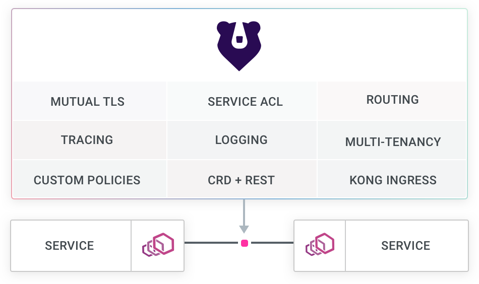
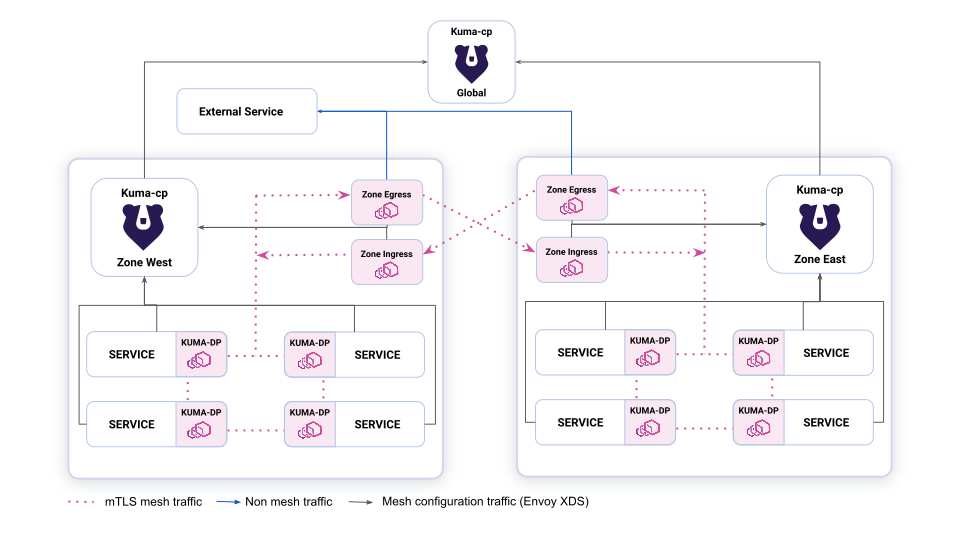

.. _kuma_arch:

================
Kuma架构
================

Kuma是基于 :ref:`envoy` 的Service Mesh，由著名的 ``Kong`` 网关(企业级API网关)开发的服务网格。

.. note::

   我理解的开源对标:

   - Kuma(社区版) / Kong Mesh(企业版) vs. Istio
   - Kong Gateway vs. Envoy

   Kong公司将自己定位成 ``Cloud Connectivity Company`` ，也就是提供企业级服务网格，和Istio竞争企业市场。

   从 `kuma官方网站 <https://kuma.io>`_ 来看，Kuma作为 通用Envoy服务网格 ，其特点是易于使用，官方宣传简化部署屏蔽了service mesh的复杂性。(待验证)

.. note::

   我发现不论是 :ref:`cilium` 还是 ``Kuma`` ，都是从不同方向殊途同归(cilium从底层网络向上，kuma从上层7L应用代理向下)，最终都采用了相似的开源软件堆栈，加上自己优化和开发，打包成全面的Service Mesh解决方案。

Kuma概览
==========

Kuma是一个平台无关(platform agnostic)开源服务网格控制平面(control plane for service mesh)和微服务管理(microservices management)，支持Kubernetes，VM以及裸金属环境。

作为单体架构(monolithic architectures)向微服务(microservices)转变的一部分，Kuma帮助实现了分布式部署的服务网格(service mesh):

- **通用和Kubernetes-native** : 与平台无关(Platform-agnostic)，可以在任何地方运行和操作

- **独立或多区域(multi-zone)** : 支持多云，多区域和提供原生DNS服务发现以及ingress能力的Kubernetes集群

.. note::

   这个多云、多集群支持可能类似于 :ref:`cilium_cluster_mesh` ，我感觉不同的开源解决方案具备了相似的功能实现，可以相互印证和借鉴

- **多网格(multi-mesh)** 可以使用一个控制平面支持多个独立的网络，从而降低整个组织的运营成本 (federation?)

- **基于属性的策略(attribute-based policies)** : 允许使用任意标签选择器(any arbitrary tag selector)作为源和目标应用细粒度的服务和流量策略

- **基于Envoy** : 由 Envoy sidecar 代理提供支持，而不暴露 Envoy 本身的复杂性

- **水平可扩展**

- **企业就绪** 支持需要正常运行时间和稳定性的关键任务企业用例

将 :ref:`envoy` 绑定为数据平面，Kuma可以检测任何 L4/L7 流量，以保护、观察、路由和增强任何服务或数据库之间的连接。Kuma可以通过CRD在Kubernetes中本地使用，也可以通过其他环境的RESTful API使用。

.. note::

   通过Kuma概览可以看到，Kuma主要实现基于Envoy的L4/L7代理实现Service Mesh对流量的分析和监控，以及流量和连接控制。这个功能实现和 :ref:`istio` 是相似的。不过， :ref:`cilium_service_mesh` 由于基于 :ref:`ebpf` 核心实现L4的流量/连接分析、监控和管理，更为灵活和高效，更为具有技术优势。

   我比较看好 :ref:`cilium` 技术堆栈，主要是Cilium有自己核心的 :ref:`ebpf` 技术，同时又把自己不擅长的L7管控功能分给 :ref:`istio` 承担，这样取长补短，实现了高性能和高安全/高管控的平衡。

   后续我将继续实践和对比不同的Service Mesh技术，包括功能、性能和管理性。

Kuma Multi-zone
==================

Kuma官方对自己的 ``multi-zone`` 技术比较推崇，提供了一个功能示意图，后续可以进一步研究实践:

参考
=====

- `Introducton to Kuma <https://kuma.io/docs/1.8.x/introduction/what-is-kuma/>`_
