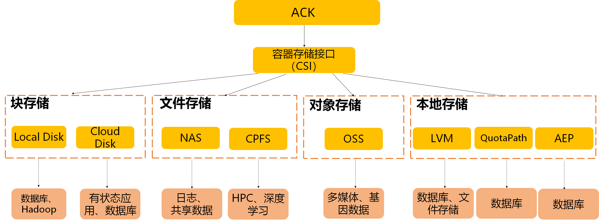
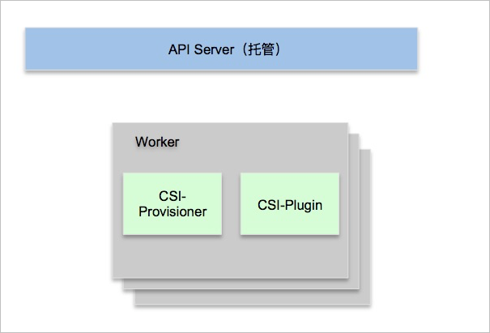
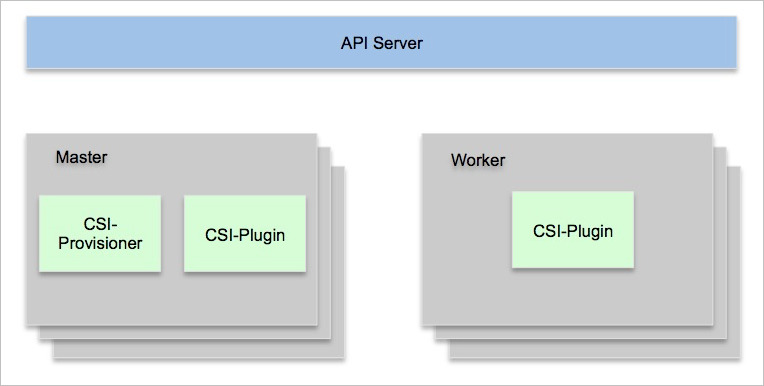

.. _alicloud_csi_arch:

======================
阿里云CSI架构
======================

阿里云ACK(定制Kubernetes)容器存储，是通过CSI(容器存储接口)访问:

- 块存储: Local Disk(数据库,Hadoop) / Cloud Disk(有状态应用,数据库)
- 文件存储: NAS(日志,共享数据) / CPFS(HPC, :ref:`deep_learning` )
- 对象存储: OSS(多媒体,基因数据)
- 本地存储: LVM(数据库,文件存储) / QuotaPath (数据库) / AEP(数据库)

   阿里云ACK容器存储概览

阿里云的ACK集群分为托管集群(管控节点由阿里云维护) 和 自建集群(独立部署管控节点)，在部署CSI存储方式有所区别:

- 托管集群 CSI插件 ``CSI-Provisioner`` 和 ``CSI-Plugin`` 都运行在用户的Worker节点

   阿里云托管ACK集群 CSI插件

- 自建集群 ``CSI-Provisioner`` 运行在Master节点，而 ``CSI-Plugin`` 则作为 :ref:`daemonset` 同时运行在 Master 和 Worker 节点

   阿里云自建ACK集群 CSI插件

CSI使用授权
================

CSI插件在数据卷挂载、卸载、创建和删除等操作上需要使用AccessKey授权，也支持RAM角色授权(默认)

部署安装CSI-Plugin和CSI-Provisioner
======================================

阿里云在ACK的托管或自建集群，控制台默认安装 ``CSI-Plugin`` 和 ``CSI-Provisioner`` 组件:

.. literalinclude:: alicloud_csi_arch/ack_csi
   :caption: 检查ACK集群是否安装好 ``csi-plugin`` 和 ``csi-provisioner``

CSI插件安装
==============

``kubelet`` 运行参数 ``--enable-controller-attach-detach=true`` 表示集群使用了CSI存储插件，如果这个参数值是 ``false`` 则表明存储插件是 ``Flexvolume``

参考
=====

- `阿里云容器服务Kubernetes版ACK > 存储CSI概述 <https://help.aliyun.com/zh/ack/ack-managed-and-ack-dedicated/user-guide/csi-overview-1>`_
