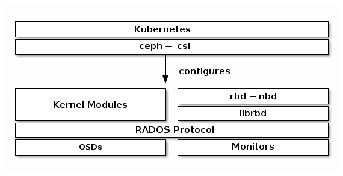

.. _ceph_csi_arch:

=====================
Ceph CSI架构
=====================

从Kubernetes v1.13开始支持通过 ``ceph-csi`` 使用 :ref:`ceph_rbd` ，提供了动态提供RBD镜像作为Kubernetes的卷，并且在运行pod的worker节点上映射(map)这些RBD作为块设备(可以选择在镜像中包含一个挂载的文件系统)。Ceph在集群范围提供块设备对象，也就是说这种大型Ceph块设备镜像可以提供比独立服务器更好的性能。

要使用Ceph块设备，你需要部署Kubernetes v1.13或更高版本，并且需要在Kubernetes环境中安装和配置 ``ceph-csi`` :

   Kubernetes/Ceph技术堆栈

`CSI driver for Ceph <https://github.com/ceph/ceph-csi>`_ 提供了 :ref:`ceph_rbd` , :ref:`cephfs` 的驱动，以及Kubernetes :ref:`sidecar` 部署YAML来支持CSI功能:

- provisioner
- attacher
- resizer
- driver-register
- snapshotter

概览
=======

Ceph CSI plugins 实现了一个 CSI-enabled 容器编排(Container Orchestrator, CO) 和 Ceph 集群之间的接口，可以动态提供Ceph 卷并将卷添加到 :ref:`k8s_workloads` :

- 支持 :ref:`ceph_rbd` 和 :ref:`cephfs` 后端卷:

  - :ref:`ceph_csi_rbd`
  - :ref:`ceph_csi_cephfs`

参考
==========

- `CSI driver for Ceph <https://github.com/ceph/ceph-csi>`_
- `BLOCK DEVICES AND KUBERNETES <https://docs.ceph.com/en/latest/rbd/rbd-kubernetes/>`_
