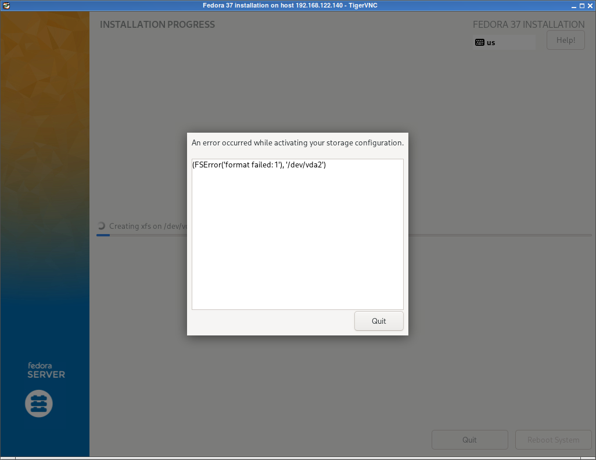

.. _debug_arm_vm_disk_fail:

==========================
排查ARM虚拟机磁盘异常
==========================

我在 :ref:`archlinux_arm_kvm` 解决了虚拟机运行问题之后，终于可以进行 :ref:`fedora37_installation` 。但是，看似顺利的步骤，在安装过程中，却出现磁盘格式化报错(连续尝试了2个虚拟机):

排查
=======

在虚拟机的终端界面，按下 ``ctrl-b`` ``2`` 可以进入 ``shell`` 界面(按 ``3`` 则是log)

- 检查磁盘::

   fdisk -l

可以看到分区已经如安装过程配置::

   Device      Start      End  Sectors  Size Type
   /dev/vda1    2048   526335   524288  256M EFI System
   /dev/vda2  526336 25163775 24637440 11.7G Linux filesystem

   Disk /dev/vdb: 55 GiB, 59055800320 bytes, 115343360 sectors
   Units: sectors of 1 * 512 = 512 bytes
   Sector size (logical/physical): 512 bytes / 512 bytes
   I/O size (minimum/optimal): 512 bytes / 512 bytes

这说明分区完成

- 文件系统写入报错，我尝试 ``mkfs.xfs /dev/sda2`` 出现如下报错::

   mkfs.xfs: pwrite failed: Input/output error
   libxfs_bwrite: write failed on (unknown) bno 0x177ef00/0x100, err=5
   mkfs.xfs: Releasing dirty buffer to free list!
   found dirty buffer (bulk) on free list!
   mkfs.xfs: pwrite failed: Input/output error
   libxfs_bwrite: write failed on (unknown) bno 0x0/0x100, err=5
   mkfs.xfs: Releasing dirty buffer to free list!
   found dirty buffer (bulk) on free list!
   mkfs.xfs: pwrite failed: Input/output error
   libxfs_bwrite: write failed on xfs_sb bno 0x0/0x1, err=5
   mkfs.xfs: Releasing dirty buffer to free list!
   found dirty buffer (bulk) on free list!
   mkfs.xfs: pwrite failed: Input/output error
   libxfs_bwrite: write failed on (unknown) bno 0xbbf830/0x2, err=5
   mkfs.xfs: Releasing dirty buffer to free list!
   found dirty buffer (bulk) on free list!
   mkfs.xfs: read failed: Input/output error
   mkfs.xfs: data size check failed
   mkfs.xfs: filesystem failed to initialize

- 检查虚拟机XML配置:

.. literalinclude:: debug_arm_vm_disk_fail/a-b-data-2.xml
   :language: xml
   :caption: 虚拟机a-b-data-2的配置XML
   :emphasize-lines: 33-40

从 :ref:`libvirt_lvm_pool` 看不出异常，但是考虑到之前在 :ref:`virt-builder` 验证过使用官方下载的 Fedora Server ARM64虚拟机镜像是可以正常运行的。所以，尝试先 :ref:`convert_vm_disk_image_to_lvm` :

.. literalinclude:: ../libvirt/storage/convert_vm_disk_image_to_lvm/dd_raw_lvm
   :language: bash
   :caption: 使用dd命令将raw格式虚拟磁盘复制到LVM卷

- 执行 ``virsh dumpxml a-b-data-2 > a-b-data-2.xml`` 备份虚拟机配置

- 启动虚拟机 ``virsh start a-b-data-2`` 

- 通过 ``virsh console a-b-data-2`` 观察控制台输出，发现进入了 UEFI shell

难道是 :ref:`libvirt_lvm_pool` 存在问题

- 将 ``a-b-data-2`` 虚拟机的配置中磁盘 ``/dev/vg-libvirt/a-b-data-2`` ，导入到能够正常运行的虚拟机 ``fedora37`` :

.. literalinclude:: debug_arm_vm_disk_fail/attach_lvm_disk
   :language: bash
   :caption: 将怀疑存在问题的LVM卷 /dev/vg-libvirt/a-b-data-2 添加到可以正常运行的虚拟机 fedora37

然后启动 ``fedora37`` ::

   virsh start fedora37

在虚拟机中，我发现完全可以对 ``/dev/vg-libvirt/a-b-data-2`` 对应的 ``/dev/vdb`` 进行分区和格式化，复制文件也没有问题。

这说明我在 :ref:`archlinux_arm_kvm` 创建虚拟机针对磁盘挂载参数(参数在 x86 虚拟机环境运行没有问题)在ARM64平台存在不兼容的问题:

对比我在 :ref:`archlinux_arm_kvm` 创建虚拟机 ``virt-install`` 生成的虚拟机配置磁盘部分，可以看出差异:

- 存在异常的磁盘配置:

.. literalinclude:: debug_arm_vm_disk_fail/lvm_disk_err.xml
   :language: xml
   :caption: 使用virt-install指定磁盘参数后生成的虚拟机磁盘配置，存在无法写入异常

- 正常的磁盘配置

.. literalinclude:: debug_arm_vm_disk_fail/lvm_disk_ok.xml
   :language: xml
   :caption: 使用virsh attach-disk命令插入虚拟磁盘，自动生成的虚拟机磁盘配置，可以正常读写

可以看出差异部分是磁盘驱动的参数 ``cache='none' io='native' discard='unmap'`` ，这些参数是我在 :ref:`archlinux_arm_kvm` 创建虚拟机命令 ``virt-install`` 传递的命令:

.. literalinclude:: debug_arm_vm_disk_fail/virsh_create_ovmf_vm_iso_io_native
   :language: bash
   :caption: virt-install安装指定虚拟磁盘参数 cache=none,io=native 会导致ARM64虚拟机无法写入磁盘
   :emphasize-lines: 10,11

带入的参数 ``cache=none,io=native``

看起来在 ``ARM64`` 架构下使用 :ref:`libvirt_lvm_pool` ，支持 ``io=native`` 可能存在异常( 一些资料显示 ``io=native`` 可以获得姣好性能 )。并且， **如果不指定任何参数** ，则默认还是 ``cache=none,io=native`` ，依然无法写磁盘。

我经过对比尝试另一个常用的优化参数 ``io=threads`` 可以解决这个异常:

.. literalinclude:: debug_arm_vm_disk_fail/virsh_create_ovmf_vm_iso_io_threads
   :language: bash
   :caption: virt-install安装指定虚拟磁盘参数 cache=writeback,io=threads 可以解决ARM64虚拟机磁盘写入问题
   :emphasize-lines: 11,12

详情可以参考 `arch linux: PCI passthrough via OVMF > Virtio disk > Considerations <https://wiki.archlinux.org/title/PCI_passthrough_via_OVMF#Considerations>`_
