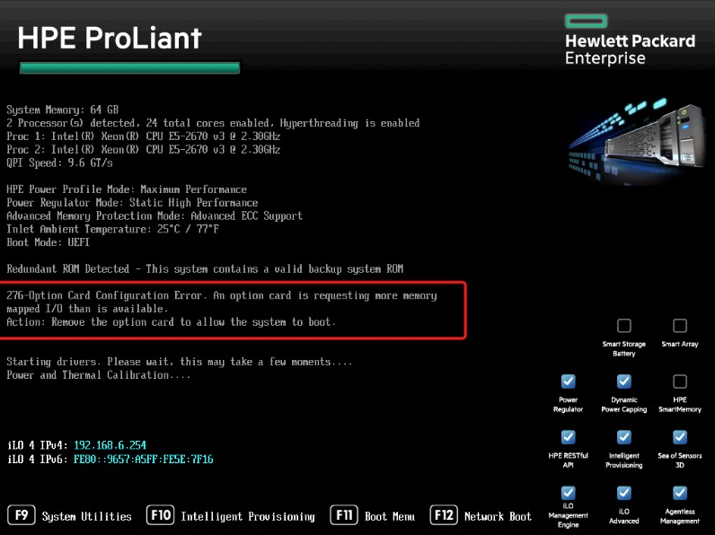

.. _enable_gpu_iommu:

======================================
激活GPU Passthrough模式(Tesla P10)
======================================

GPU卡请求内存映射I/O超过限制
===============================

当我第一次在 :ref:`hpe_dl360_gen9` 上安装 :ref:`tesla_p10` ，启动时候BIOS自检会提示错误:

::

   276 Option Card Configuration Error. An option card is requesting more memory
   mapped I/O than is available.
   Action: Remove the option card to allow the system to boot.

原因
=======

NVIDIA的计算加速卡

.. note::

   `NVIDIA GPGPU Adapters system memory addressing limitations - IBM Systems <https://www.ibm.com/support/pages/nvidia-gpgpu-adapters-system-memory-addressing-limitations-ibm-systems>`_ 还指出了 NVIDIA Grid, NVIDIA Tesla, or NVIDIA Quadro 受到产品设计影响，内存地址限制导致不能用于内存大于 1TB 的系统。

   `Advisory: HPE ProLiant Servers - On Systems Configured with an NVIDIA GPU With More Than 1 TB of Server Host Memory, GPU Options Will Not Function Properly <https://support.hpe.com/hpesc/public/docDisplay?docId=a00104867en_us&docLocale=en_US>`_ 也是同样建议

VMware ESX配置建议
=====================

- 虚拟机系统为64-bit操作系统
- 物理机和虚拟机都使用EFI引导模式
- 若GPU 需要 16 GB 或更多的内存映射（BAR1 Memory），需要在物理机bios中启用GPU直通，设置项名称通常为:

  - Above 4G decoding
  - Memory mapped I/O above 4GB
  - PCI 64-bit resource handing above 4G

- 在虚拟机的 ``vmx`` 文件配置中激活 64 位 Memory Mapped I/O (MMIO) ::

   pciPassthru.use64bitMMIO="TRUE"

- Memory Mapped I/O (MMIO)大小调整：建议调整为（n*GPU显存）向上舍入到下一个2次幂:

  - 两个16G显存GPU，2 x 16 GB = 32，将 32 GB 向上舍入到下一个 2 次幂，所需的内存量为 64 GB
  - 三个16G显存GPU，3 x 16 GB = 48，将 48 GB 向上舍入到下一个 2 次幂，所需的内存量为 64 GB
  - 或者直接设置为虚拟机分配的所有GPU显存大小的两倍，2*n*GPU显存（单位为GB）
  - 设置举例::

     pciPassthru.64bitMMIOSizeGB ="64"

- 虚拟机内存最小值建议为分配的所有GPU显存总大小的1.5倍

HP DL360 Gen9 BIOS设置
========================

虽然VMware文档提示::

   Your host BIOS must be configured to support the large memory regions needed by these high-end PCI devices. 
   To enable this, find the host BIOS setting for “above 4G decoding” or “memory mapped I/O above 4GB” or “PCI 64 bit resource handing above 4G” and enable it. 
   The exact wording of this option varies by system vendor, though the option is often found in the PCI section of the BIOS menu. 
   Consult your system provider if necessary to enable this option.

但是我反复查看BIOS配置，都没有找到 PCI 配置部分

不过， `enable large BAR support <https://community.hpe.com/t5/ProLiant-Servers-ML-DL-SL/enable-large-BAR-support/td-p/7142448#.YYIDSL1Bxqs>`_ 有人也问了相似的查找 BIOS 配置支持 '64-bit IO' ，提到了术语 ``Large BAR`` 。果然，在 HPE 文档中，使用了术语 ``Support 64-Bit Addressing`` 和 ``Large BAR`` 。根据 ``hpe dl360 gen9 enable large BAR support`` 搜索能够找到支持文档 `Advisory: (Revision) HP ProLiant SL250s Gen8 and ProLiant SL270s Gen8 Servers - Servers Configured with a Large Number Of NVIDIA Tesla or Intel Xeon GPU Computing Modules Require the System ROM to Support 64-Bit Addressing (Large BAR) Support <https://support.hpe.com/hpesc/public/docDisplay?docId=emr_na-c03745865-5>`_ :

- 启动服务器，在BIOS提示时，按下 ``F9`` 进入 ``ROM-Based Setup Utility (RBSU)``
- 在RBSU中，按下 ``Ctrl + A`` ，此时会进入一个 ``Service Options`` -- WOW，打开了一个新世界，原来很多选项都在这里

.. figure:: ../../_static/kvm/iommu/rbsu_service_options.png
   :scale: 85

- 在 ``Service Options`` 中，通过上下键移动菜单高亮，选择 ``PCI Express 64-Bit BAR Support`` ，默认这个选项是 ``Disabled`` ，按下回车键进入修改选项，将这个参数修改成 ``Enabled``

.. figure:: ../../_static/kvm/iommu/rbsu_service_options.png
   :scale: 85

- 退出保存，然后重启服务器，此时 ``Large BAR`` 就已经激活

.. note::

   根据HPE文档，当 ``System Maintenance Switch 9`` 设置为 ``ON`` 的时候将始终激活 ``Large BAR`` 功能，所以如果要在 RBSU 中关闭 ``Large BAR`` 需要将 ``System Maintenance Switch 9`` 设置为 ``OFF`` 位置。

- 进入 :ref:`ubuntu_linux` 操作系统(我在 :ref:`priv_cloud_infra` 采用Ubuntu作为物理主机操作系统 )，执行::

   lspci -vvv

可以看到新增加的NVIDIA设备:

.. literalinclude:: enable_gpu_iommu/lspci_tesla_p10.txt
   :language: bash
   :linenos:
   :caption:

.. note::

   NVIDIA设备需要安装官方提供的私有驱动，默认Ubuntu软件仓库没有提供。 `Linux view GPU information display? What kind of video card is this? <https://forums.developer.nvidia.com/t/linux-view-gpu-information-display-what-kind-of-video-card-is-this/79311>`_ 提供了常规安装显卡驱动的方法:

   - 添加 Ubuntu 图形驱动 ppa: `Proprietary GPU Drivers <https://launchpad.net/~graphics-drivers/+archive/ubuntu/ppa>`_ ::

      sudo add-apt-repository ppa:graphics-drivers/ppa
      sudo apt-get update

   - 安装驱动::

      sudo apt install nvidia-driver-XXX

   - 下载安装CUDA

参考
========

- `How to Enable Nvidia V100 GPU in Passthrough mode on vSphere for Machine Learning and Other HPC Workloads <https://blogs.vmware.com/apps/2018/10/how-to-enable-nvidia-v100-gpu-in-passthrough-mode-on-vsphere-for-machine-learning-and-other-hpc-workloads.html>`_
- `ESXi GPU 直通 <https://blog.51cto.com/zaa47/2596875>`_
- `Setting up Discrete Device Assignment with a GPU <https://blog.workinghardinit.work/2016/04/11/discrete-device-assignment-in-windows-server-2016-hyper-v/>`_
- `Minimizing NUMA Effects on Machine Learning Workloads in Virtualized Environments <https://dash.harvard.edu/bitstream/handle/1/37367717/BROESTL-DOCUMENT-2021.pdf?sequence=1&isAllowed=y>`_
- `HPE ProLiant DL360 Gen9 Server User Guide <https://support.hpe.com/hpesc/public/docDisplay?docLocale=en_US&docId=c04441974>`_
