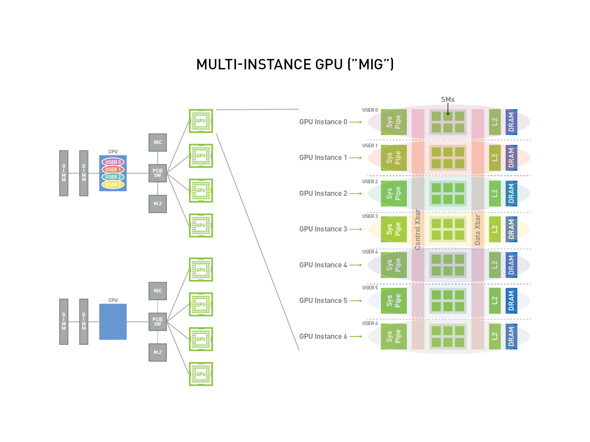

.. _intro_mig:

========================================
NVIDIA Multi-Instance GPU(MIG) 技术简介
========================================

.. note::

   由于我学习了NVIDIA文档后知晓了MIG硬件分区技术并非虚拟化技术，所以我后续将相关文档(包括实践)搬迁到 :ref:`nvidia_mig` ，本文为归档文章。

从 NVIDIA Ampere架构开始，NVIDIA终于开始采用 :ref:`sr-iov` 来实现类似 :ref:`vgpu` 的GPU虚拟化，可以将一块物理GPU划分为 **最多7个** 用于CUDA应用程序的独立GPU示例。这样在云计算环境，能够优化GPU利用率: 对于未完全饱和的GPU计算的工作负载特别有用，可以并行运行不同的工作负载以便最大限度提高利用率。此外，对于多租户的云计算，MIG不仅提供了增强的隔离，还确保一个用户的负载不会影响其他客户。

通过MIG，每个示例的处理器:

- 在整个内存系统中具有独立和隔离的路径: 无干扰的通道和延迟，使用相同的L2缓存分配以及DRAM带宽；即使其他用户的任务破坏了它自己的缓存或导致DRAM接口饱和，也不会影响到你的GPU使用
- MIG可以对可用的GPU计算资源(包括流式多处理器或 SM，以及 GPU 引擎，例如复制引擎或解码器)进行分区，以提供定义的服务质量 (QoS)
- 为不同的客户端(例如VM,容器或进程)提供故障隔离

.. note::

   我发现NVIDIA的MIG技术中缓存隔离和Intel主推的 :ref:`intel_rdt` 有相似之处

NVIDIA的 MIG 适用于Linux操作系统，支持使用 :ref:`docker` 引擎的容器，以及支持Red Hat Virtualization (也就是 :ref:`kvm` )和 VMware vSphere 等管理程序的Kubernetes和虚拟机。

MIG支持以下部署配置:

- 裸机(Bare-metal)，包括容器
- 在支持的 hypervisor上管理GPU Pass-Through 到Linux guest操作系统
- 在支持的 hypervisor上实现 :ref:`vgpu`

.. note::

   这里提到的 ``裸机(Bare-metal)，包括容器`` 让我心里一动:

   - 有没有可能不使用 :ref:`kvm` 虚拟化，而 :strike:`直接在物理主机上运行容器来使用 MIG 虚拟出来的 VF` : 这个想法是错误的，MIG不是虚拟化技术，当输出给虚拟机使用时只能通过 ``GPU Pass-Through`` 将整个GPU给一个虚拟使用 
   - :ref:`sr-iov` 是一种软件定义分区技术，提供了和 :ref:`vgpu` 类似的功能，能够灵活地提供很多VF给不同的虚拟机使用
   - 既然 :ref:`kvm_nested_virtual` 能够在第二层实现虚拟化，那么是不是可以将一块物理网卡 Pass-Through 进第一层KVM虚拟化(第一层虚拟机运行 :ref:`ubuntu_linux` )，然后再在第二层KVM虚拟化(第二层虚拟机也运行 :ref:`ubuntu_linux` )采用 :ref:`vgpu` 。这种方式物理主机上使用什么发行版操作系统(即使是 :ref:`gentoo_linux` )都没有关系: **这个思路应该可行** 

总之，NVIDIA MIG实现硬件化的分区，能够给物理主机或GPU Pass-Through到 **一台VM** 中结合 :ref:`docker` 这样的容器化技术，提供了更好的硬件级资源隔离。

但是，MIG不是虚拟化技术，如果要分配给多个虚拟机私用，必须借助 :ref:`vgpu` 这样复杂的虚拟化(还需要 :ref:`install_vgpu_license_server` )。即使高端GPU能够使用Intel主推的业界标准 :ref:`sr-iov` ，依然需要vGPU License才能充分和正确驱动。

高端的GPU卡(目前只有Ampere以上架构的A30, A100, H100)提供了 :ref:`sr-iov` 支持，可能会有更好的性能(待实践验证)

   NVIDIA Multi-Instance GPU(MIG)

参考
=======

- `NVIDIA Multi-Instance GPU官网 <https://www.nvidia.com/en-us/technologies/multi-instance-gpu/>`_
