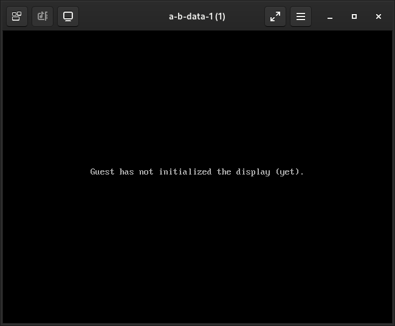

.. _virt-install_location_iso_image:

====================================================
iso镜像使用location参数进行virt-install安装虚拟机
====================================================

无法在 ``--cdrom`` 参数同时传递内核参数
==========================================

我在 :ref:`archlinux_arm_kvm` 遇到了一个困境:

Ubuntu的WEB下载网站只提供 amd64 和 i386 安装路径，也就是以往 ``--location`` 参数无法使用，所以我下载了 ``ubuntu-22.04.1-live-server-arm64.iso`` 尝试使用 ``--cdrom`` 安装参数:

.. literalinclude:: virt-install_location_iso_image/virt-install_ubuntu_arm_cdrom_fail1
   :language: bash
   :caption: 尝试--cdrom参数安装(传递内核参数)失败

此时会提示错误::

   WARNING  --os-type is deprecated and does nothing. Please stop using it.
   ERROR    Kernel arguments are only supported with location or kernel installs. 

这里可以看到 ``只有 location 或者 kernel 安装才能使用内核参数``

但是，如果不传递内核参数 ``--extra-args="console=tty0 console=ttyS0,115200"`` ，单纯使用 ``--cdrom`` :

.. literalinclude:: virt-install_location_iso_image/virt-install_ubuntu_arm_cdrom_fail2
   :language: bash
   :caption: 不传递console=tty0内核参数，使用--cdrom安装无法获得字符终端

并没有像amd64版本那样自动提供字符终端，此时提示::

   WARNING  Unable to connect to graphical console: virt-viewer not installed. Please install the 'virt-viewer' package.

我调整成 ``--graphics vnc`` 并安装了 :ref:`virt-viewer` 连接到VNC终端，发现并没有进入安装过程，而是提示 ``Guest has not initialized the display (yet).`` :

这使得我进退两难...

在 ``--location`` 参数中指定initrd和kernel
===============================================

感谢 **ADoyle** (居然和我同时在阿里云工作过，可惜未曾认识) 提供的方法 `virt-install Couldn’t find kernel for install tree <https://adoyle.me/Today-I-Learned/vm/virt-install-cannot-find-kernel.html>`_ :

- 安装 ``cdrtools`` 获得 ``isoinfo`` 工具::

   pacman -S cdrtools

- 执行以下命令从iso文件中找到 ``initrd/vmlinuz`` :

.. literalinclude:: virt-install_location_iso_image/isoinfo_search_vmlinuz_initrd
   :language: bash
   :caption: 使用isoinfo工具在ISO镜像中找出内核启动文件(vmlinuz和initrd)

此时可以看到::

   -r-xr-xr-x   1    0    0  105906566 Aug  9 2022 [   2997 00] initrd 
   -r-xr-xr-x   1    0    0   15052925 Aug  9 2022 [ 506636 00] vmlinuz

其实不使用 ``isoinfo`` 工具也能找到启动内核，方法是将 iso 文件挂载到本地文件系统进行查找:

.. literalinclude:: virt-install_location_iso_image/mount_iso_find_vmlinuz_initrd
   :language: bash
   :caption: 将ISO镜像挂载后中找出内核启动文件(vmlinuz和initrd)

可以看到::

   ./casper/initrd
   ./casper/vmlinuz

一些发行版的惯例::

   Distro         Kernel path                   RAM disk path
   Fedora         /isolinux/vmlinuz             /isolinux/initrd.img
   RHEL5/CentOS5  /isolinux/vmlinuz             /isolinux/initrd.img
   openSUSE       /boot/i386/loader/linux       /boot/i386/loader/initrd
   Mandriva       /i586/isolinux/alt0/vmlinuz   /i586/isolinux/alt0/all.rdz
   Ubuntu(已验证) /casper/vmlinuz               /casper/initrd
   Debian         /install/vmlinuz              /isolinux/initrd.img

所以将安装命令修订成:

.. literalinclude:: virt-install_location_iso_image/virt-install_ubuntu_arm_location_iso
   :language: bash
   :caption: --location参数使用iso文件并传递内核文件位置及内核参数安装ARM版本Ubuntu

现在安装终端输出提示::

   Starting install...
   Retrieving 'vmlinuz'                                                             |    0 B  00:00:00 ...
   Retrieving 'initrd'                                                              |    0 B  00:00:00 ...
   Creating domain...                                                               |    0 B  00:00:00
   Running text console command: virsh --connect qemu:///system console a-b-data-1
   Connected to domain 'a-b-data-1'
   Escape character is ^] (Ctrl + ])

QEMU ARM CPU功能
===================

很不幸，虽然方法应该没有错误，并且观察 ``/var/log/libvirt/qemu/a-b-data-1.log`` 没有报错，但是安装的终端交互界面始终没有出现。:strike:`我推断是 Ubuntu LTS 22.04 采用的内核比较保守，尚无法支持 apple silicon M1 的MacBook Pro。`  在 :ref:`archlinux_arm_kvm` 我选择内核更为领先的 :ref:`fedora` 来实践 :ref:`mobile_cloud_infra` 但是依然没有解决启动问题，不论是 ``--graphics none`` 还是 ``--graphics vnc`` 都不能运行起来。

`QEMU Arm CPU Features <https://qemu-project.gitlab.io/qemu/system/arm/cpu-features.html>`_ 提供了支持ARM处理器的功能，看起来不能像 x86 一样直接使用 ``--cpu host-passthrough``

参考
========

- `virt-install Couldn’t find kernel for install tree <https://adoyle.me/Today-I-Learned/vm/virt-install-cannot-find-kernel.html>`_
- `virt-install using location with iso image no longer working <https://askubuntu.com/questions/789358/virt-install-using-location-with-iso-image-no-longer-working>`_
