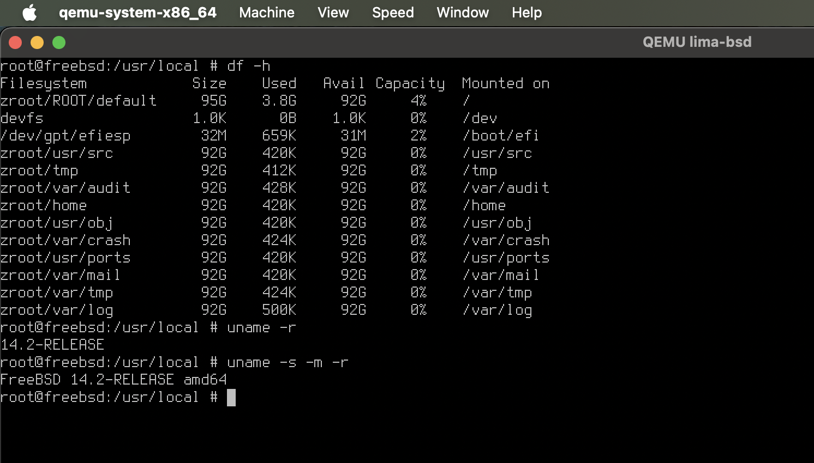

.. _lima_run_freebsd:

=======================
Lima运行FreeBSD虚拟机
=======================

为了方便兼顾 :ref:`swift` 开发，同时降低每次反复折腾 :ref:`linux_desktop` (特别是 :ref:`gentoo_sway_fcitx` 非常折腾)，我现在重新把桌面回归到 :ref:`macos` 。为了能够继续学习实践 :ref:`freebsd` 技术，改为采用 :ref:`lima` 虚拟机运行。不过，我也同时 :ref:`freebsd_on_intel_mac` ，确保能够在实际硬件和虚拟环境都能不断磨练FreeBSD相关技能。

.. note::

   由于Lima目前不支持USB设备支持，而我近期考虑在USB设备上构建 :ref:`lfs` ；并且，Lima实际上也是通过 :ref:`qemu` 来运行FreeBSD。我最终决定改为采用 :ref:`utm` 来统一运行虚拟化。

   后续可能会继续在 :ref:`colima` 中使用Lima，原因主要考虑磁盘映射便捷。但也可能会继续使用 :ref:`utm`

.. note::

   本文记录我在 :ref:`lima` 尝试运行FreeBSD虚拟机的两种后端: :ref:`qemu` 和 :ref:`apple_virtualization` (VZ)。目前实践验证，FreeBSD 14.2 需要在 :ref:`qemu` 环境运行。

   完成运行FreeBSD之后，则进行 :ref:`freebsd_vm_init` (相对 :ref:`freebsd_init` 会多一些环境设置步骤)

lima的FreeBSD模版
===================

- 准备模版文件 ``/usr/local/share/lima/templates/freebsd.yaml`` (具体模版目录可能根据lima安装发布，如果配置文件没有放到正确位置 ``lima start`` 会提示找不到 ``.../freebsd.yaml`` ，则根据提示将配置文件复制到对应位置即可) :

.. literalinclude:: lima_run_freebsd/freebsd.yaml
   :caption: 准备模版

.. note::

   这里我使用了国内163的镜像网站

- 启动:

.. literalinclude:: lima_run_freebsd/start_freebsd
   :caption: 启动(失败)

这里提示错误

.. literalinclude:: lima_run_freebsd/start_freebsd_output
   :caption: 运行提示
   :emphasize-lines: 39

可以看到启动的界面，但是运行时crash(虚拟机屏幕开始滚动输出时) 

- 修订启动，去掉VZ配置

.. literalinclude:: lima_run_freebsd/start_freebsd_no_vm-type
   :caption: 不指定vm-type启动freebsd

依然没有解决，看起来默认运行VZ了:

.. literalinclude:: lima_run_freebsd/start_freebsd_no_vm-type_output
   :caption: 不指定VZ启动freebsd

.. note::

   lima 1.0 开始，如果macOS >= 13.5 ，则新建实例默认使用 ``VZ`` ( :ref:`apple_virtualization` 后端)。见 `Lima Documentatation / Configuration guide / VM types <https://lima-vm.io/docs/config/vmtype/>`_

- 修订启动，指定qemu

.. literalinclude:: lima_run_freebsd/start_freebsd_qemu
   :caption: 指定vm-type为qemu启动freebsd

报错显示系统没有qemu安装

.. literalinclude:: lima_run_freebsd/start_freebsd_qemu_output
   :caption: 指定vm-type为qemu启动freebsd，发现没有qemu

- 补充安装 :ref:`qemu`

.. literalinclude:: lima_run_freebsd/install_qemu
   :caption: 安装 qemu

解决了，果然在 :ref:`macos` 环境下，使用 :ref:`qemu` 运行 :ref:`freebsd` 是成功的:

   通过 :ref:`qemu` 虚拟化，lima可以运行FreeBSD虚拟机

小结
=======

我的实践显示在 lima 中使用 ``VZ`` 虚拟化不能运行FreeBSD，但是我也有点疑惑，从之前查询到信息 `Running GUI FreeBSD in a virtual machine on a Mac <https://github.com/jlduran/RunningGUIFreeBSDInAVirtualMachineOnAMac>`_ (我准备尝试一下 :ref:`run_freebsd_in_apple_virtualization` )，使用 :ref:`apple_virtualization` 框架应该能够运行FreeBSD。具体是哪里出错，我还得再研究一下。

参考
=====

- `Lima Issues: Support for FreeBSD guests ? #1508 <https://github.com/lima-vm/lima/issues/1508>`_
- `Lima Documentation/Examples <https://lima-vm.io/docs/examples/>`_
