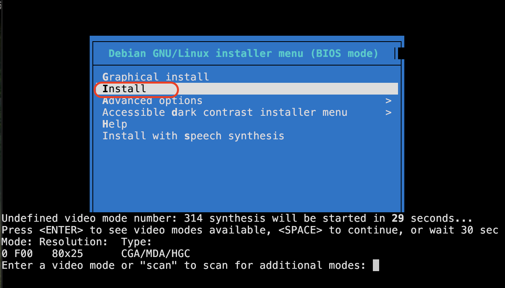

.. _run_debian_in_qemu:

==========================
在QEMU中运行debian
==========================

我在 :ref:`lfs` 的构建目标之一就是 :ref:`blfs_virtualization` ，目标是用最精简的系统来运行虚拟化集群。不借助复杂的包装工具(例如 :ref:`libvirt` )，仅使用 QEMU 来实现虚拟化:

- 更为深入理解Linux虚拟化的底层技术
- 使用有限的组件运行起全功能的Linux虚拟化
- 为后续构建更为复杂的 :ref:`blfs_k8s` 提供基础

.. note::

   本文qemu运行没有支持uefi，所以磁盘分区是传统方式。要支持 :ref:`iommu` 之后才能支持GPU passthrough，也就是需要实现 :ref:`run_debian_gpu_passthrough_in_qemu`

准备
======

- 创建镜像虚拟磁盘:

.. literalinclude:: run_debian_in_qemu/qemu-img_qcow2
   :caption: 创建 ``qcow2`` 格式磁盘镜像

启动虚拟机
===========

- qemu运行参数 ``-vga std`` ，则启动 VNC :

.. literalinclude:: run_debian_in_qemu/qemu_install_debian_vnc
   :caption: 执行标准vga安装，显示VNC
   :emphasize-lines: 11

我的 :ref:`blfs_qemu` 编译只采用最基本库完成，但是我发现依然能够支持VNC启动。上述命令会立即将屏幕输出到VNC界面，此时可以使用VNC客户端连接以后，选择图形安装

- 采用 ``console`` 字符模式安装虚拟机

.. literalinclude:: run_debian_in_qemu/qemu_install_debian
   :caption: 执行安装
   :emphasize-lines: 11-13

.. note::

   :ref:`blfs_qemu` 需要 :ref:`blfs_qemu_bridge` 

   我的 :ref:`blfs_qemu` 编译只采用最基本库完成

这里遇到一个问题，在上述运行配置中我取消了图形界面，想从串口控制台安装(也就是选择安装菜单中 ``Install`` )，显示如下:

提示我选择 ``video mode`` ，但是我回车没有响应: 我在安装完成之后，执行 :ref:`debian_init_vm` 串口控制台配置之后，就能够在字符终端正常访问。

- 完成安装以后，则修订为如下命令运行虚拟机:

.. literalinclude:: run_debian_in_qemu/qemu_run_debian
   :caption: qemu运行debian系统
   :emphasize-lines: 11-13

- :ref:`debian_init_vm` 调整虚拟机

参考
======

- `QEMU and HVF <https://gist.github.com/aserhat/91c1d5633d395d45dc8e5ab12c6b4767>`_ 非常好的分享
- `Install QEMU on OSX <https://gist.github.com/Jatapiaro/6a7c769a07911adc629e1604729d4c7a>`_
- `Virtualisation with QEMU <https://documentation.ubuntu.com/server/how-to/virtualisation/qemu/>`_
- `archlinux: QEMU <https://wiki.archlinux.org/title/QEMU>`_
