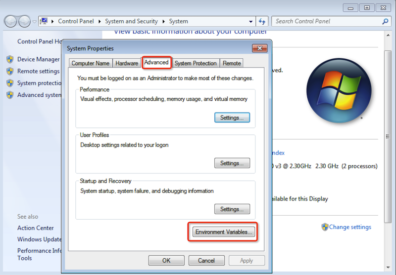
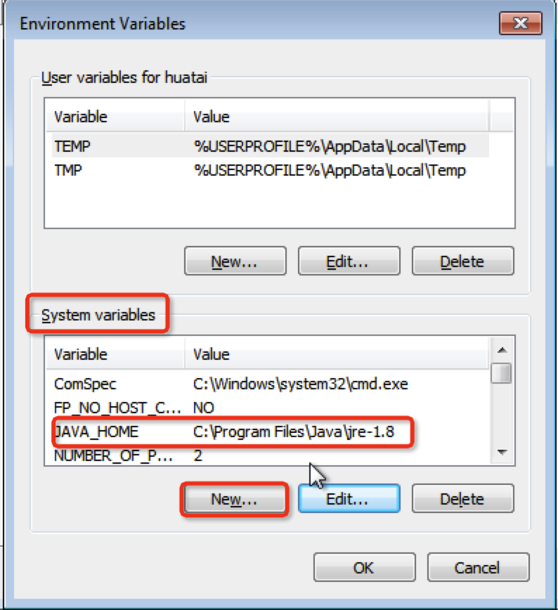
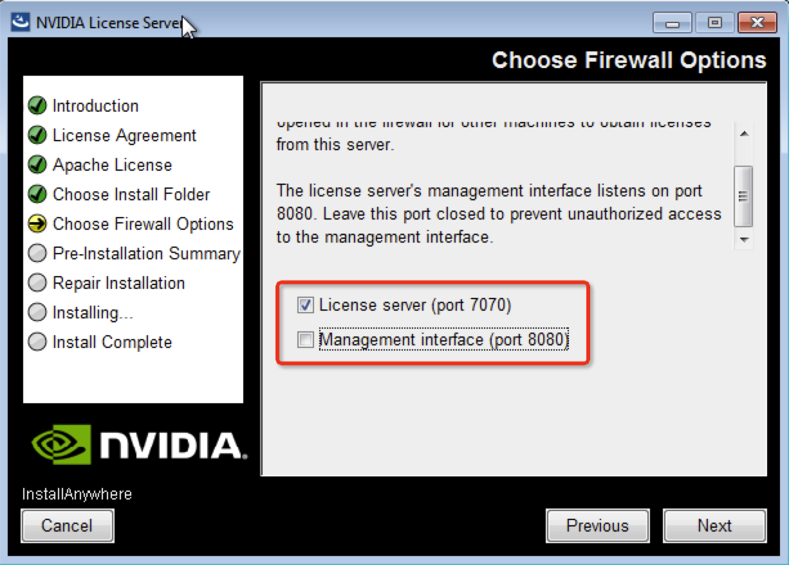

.. _install_vgpu_license_server:

==================================
安装NVIDIA license服务器
==================================

.. figure:: ../../_static/kvm/vgpu/grid-licensing-overview.png

   NVIDIA vGPU 软件licensing过程示意图

当虚拟机启动时会从NVIDIA vGPU软件license服务器(端口7070)获取license，并且每次启动会checkout。VM会维持license直到关机，然后释放掉license服务器上的license锁(回收的license可以被其他VM使用)

.. note::

   - 16GB内存的4个CPU的license服务器配置，适合处理多达15万个许可客户端
   - 主机必须运行在支持的Windows系统，且推荐安装英文版操作系统
   - license服务器的网卡MAC地址必须固定
   - license服务器的时钟必须准确

安装
======

- license server运行依赖 Java，安装 Java SE Development Kit 8 : 请从 www.java.com 下载最新JDK 8(低版本JDK8,至少我验证 JDK8 update 101不行，可能通不过 license server安装检查)

- 安装过程有提示::

   Checking for JAVA_HONE:

   The JAVA_HOME enviroment variable must be set in the System variables list for installing and executing the License Server.

这个设置需要提前完成，否则安装程序在提示上面内容后退出

我的安装版本是 JRE ``8u371`` ，检查可以直到 ``JAVA_HOME`` 环境变量应该是 ``C:\Program Files\Java\jre1.8``

- 永久性设置系统环境变量，可参考 `Environment Variables in Windows/macOS/Linux <https://www3.ntu.edu.sg/home/ehchua/programming/howto/Environment_Variables.html>`_ 简单来说，对于Windows :

  - ``Control Panel >> System and Security >> System`` （通过右键访问Computer图标可以进入)
  - 选择 ``Advanced`` 面板，然后点击 ``Environment Variables``

   设置Windows环境变量

   设置Windows 系统级环境变量(System variables) ``JAVA_HOME``

另外还需要确认 ``Path`` 系统变量已经包含了java.exe执行文件路径(我检查了JDK安装程序已经自动添加过了)

**基本上就是这个稍微麻烦一些，其他安装过程就是无脑 Next 了**

- 安装过程有一步设置服务器防火墙，默认只开放 ``Licenser server (port 7070)`` ，而管理端口 ``Management interface (port 8080)`` 不对外开放:

   License Server对外防火墙端口

.. note::

   License Server没有任何认证保护，所以不应对外提供8080端口访问

   如果安装程序没有正确配置系统防火墙开放端口，或者后续端口有所调整。可以参考 :ref:`win7_firewall_open_port` 调整

使用浏览器访问 http://localhost:8080/licserver 我发现实际上已经安装完成并运行

详细安装步骤以官方 `Virtual GPU Software License Server User Guide <https://docs.nvidia.com/grid/ls/latest/grid-license-server-user-guide/index.html>`_ 为准

加载License文件
==================

访问页面上导航 ``License Server`` >> ``License Management`` ，导入许可证

参考
======

- `NVIDIA vGPU License服务器详解 <https://cloud.tencent.com/developer/news/312774>`_
- `Virtual GPU Software License Server User Guide <https://docs.nvidia.com/grid/ls/latest/grid-license-server-user-guide/index.html>`_
