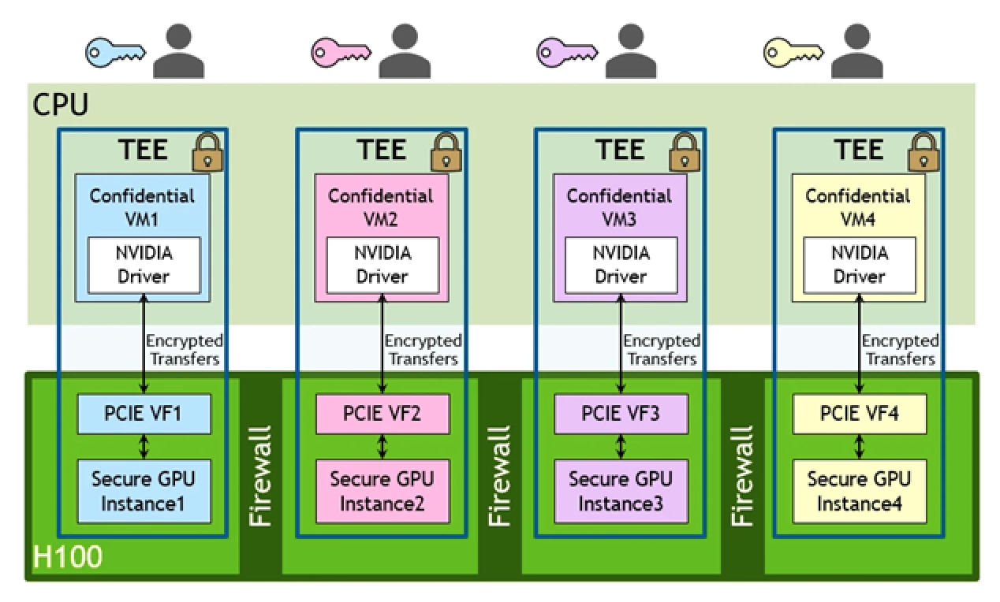
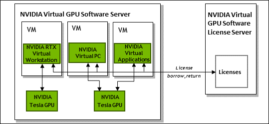

.. _intro_nvidia_vgpu:

=======================
Nvidia vGPU技术简介
=======================

Mediated pass-through
========================

Mediated pass-through(协调pass-through)是直通GPU技术的演进，提供了将GPU设备输出为完全功能的逻辑设备，提供给虚拟机使用。虚拟机可以使用任何API。主要的mediated pass-through软硬件结合解决方案有:

- VMware使用 Nvidia vGPU 或 AMD MxGPU 实现的虚拟化共享直通图形加速(Virtual Shared Pass-Through Graphics Acceleration)
- Citrix XenServer使用 Nvidia vGPU 或 AMD MxGPU实现的shared GPU
- Xen 和 KVM 使用 :ref:`intel_gvt` 实现
- Thincast Workstation - Virtual 3D功能(Direct X 12 & Vulkan 3D API)

mediated pass-through需要特定的硬件支持:

- Nvidia vGPU 需要 GRID/Tesla (服务器级) 或 Quadro (专业级)
- AMD MxGPU 需要 FirePro Server/Radeon Instinct (服务器级) 或 Randeon Pro (专业级)
- :ref:`intel_gvt` 没有特定要求(注意，Intel GVT-g技术已经被 :ref:`sr-iov` 取代，从Intel第10代处理器Ice Lake之后就不再支持)

NVIDIA ``vGPU`` 软件的 ``GPU Instance`` 支持
===============================================

NVIDIA新一代GPU，从Ampere架构(2020年)开始，提供了 :ref:`sr-iov` 和 :ref:`nvidia_mig` ( ``GPU Instance`` )功能:

- :ref:`nvidia_mig` 提供了硬件级别的分区: 物理GPU被硬件级分区分为多个隔离 ``GPU Instance`` ，CUDA应用能够使用完全隔离的内存带宽、缓存和计算核心
- :ref:`sr-iov` 提供了增强型vGPU能力: Ampere 及后续更新的架构， :ref:`sr-iov` 是激活vGPU功能的前提条件，允许将单个GPU划分为独立的Virtual Functions(VFs)，然后分配给不同的VM(为虚拟机提供完整的 :ref:`iommu` 保护)，提供了更为有效和安全的共享GPU资源的能力
- Ampere及更新的架构中，vGPU是构建在 :ref:`sr-iov` 之上，提供了更好的安全和管理性: :ref:`sr-iov` 创建 VFs，NVIDIA ``vGPU`` 软件则提供必要的驱动、虚拟机安全以及在虚拟化环境中有效利用虚拟GPU的管理功能

   MIG结合sr-iov实现虚拟机的vGPU隔离

vGPU license
=================

Nvidia的vGPU功能需要license才可以使用，请参考 `NVIDIA vGPU License服务器详解 <https://cloud.tencent.com/developer/news/312774>`_ ，试用license可以使用90天

NVidia的vGPU提供4个软件产品版本:

- NVIDIA 虚拟应用程序 (vApp)
- NVIDIA 虚拟 PC (vPC)
- NVIDIA RTX 虚拟工作站 (vWS)
- NVIDIA 虚拟计算服务器 (vCS)

必须随 NVIDIA 虚拟 GPU 软件许可证一起购买支持、更新和维护订阅 (SUMS)。

.. note::

   `NVIDIA vGPU License服务器详解 <https://cloud.tencent.com/developer/news/312774>`_ 介绍GRID授权分为:
  
   - vApps
   - vPC
   - 虚拟工作站vDWS

   其中 ``vDWS`` 现在可能再细分为 ``vWS`` 和 ``vCS`` 授权了

   ``vDWS`` 是功能最全面的授权，GPU卡可以在这个授权下加载专业Quodra卡驱动(vPC和vApps的License对应加载的是普通的显示驱动)

Tesla 系列 GPU 可同时支持通用计算和图形图像处理，例如：

- 安装免费的 Tesla Driver 和 CUDA SDK ，可用作深度学习、科学计算等通用计算场景。
- 安装 GRID Driver 并且配置相关的 License 服务器，可开启 GPU 的 OpenGL 或 DirectX 图形加速能力。

   NVIDIA vGPU 软件licensing过程示意图

当虚拟机启动时会从NVIDIA vGPU软件license服务器(端口7070)获取license，并且每次启动会checkout。VM会维持license直到关机，然后释放掉license服务器上的license锁(回收的license可以被其他VM使用)

.. note::

   - 16GB内存的4个CPU的license服务器配置，适合处理多达15万个许可客户端
   - 主机必须运行在支持的Windows系统，且推荐安装英文版操作系统
   - license服务器的网卡MAC地址必须固定
   - license服务器的时钟必须准确

P10/P40 vGPU数据
------------------

参考 `NVIDIA Tesla P40数据表 <https://www.nvidia.cn/content/dam/en-zz/Solutions/design-visualization/solutions/resources/documents1/nvidia-p40-datasheet.pdf>`_ 可以了解Tesla 系列 GP102 GPU所支持的vGPU规格:

- NVIDIA Tesla P10/P40 GPU运算卡使用NVIDIA Quadro vDWS软件，是第一个可用于模拟，HPC渲染和虚拟应用程序，桌面和工作站设计的企业级虚拟计算平台
- 提供24GB显存和24 NVENC编码会话，级支持以1GB规格分配24个虚拟桌面，或者以2GB规格分配12个工作站，以及更多的不同规格适用场景(1GB,2GB,3GB,4GB,6GB,8GB,12GB,24GB)

  - :strike:`可以为虚拟机分配4GB vGPU，实现6个实例` 规划将24G分配为2个8GB显存，分配给2个虚拟机,模拟集群方式运行GPU计算资源; 另外将剩余8GB再分配给2个或1个虚拟机实现虚拟PC，尝试桌面应用(我想尝试 ``模拟飞行`` )
  - 支持为每个vGPU配置独立CUDA和OpenCL工作负载

vgpu_unlock
---------------

NVIDIA不允许在消费级GPU上使用vGPU功能，但是实际上硬件是完全支持的。所以开源软件 :ref:`vgpu_unlock` 通过软件方式解锁了消费级NVidia vGPU功能。

.. note::

   参考 `NVIDIA Officially Enables GPU Passthrough On GeForce Graphics Cards For Added Functionality On Virtual Machines <https://wccftech.com/nvidia-enables-gpu-passthrough-on-geforce-graphics-cards-added-functionality-virtual-machines/>`_ 2021年3月新闻，NVIDIA现在已经支持在GeForce显卡上使用GPU passthrough，这样就可以实现在Linux上运行Windows虚拟机获得完整的图形加速性能，例如在游戏上可以得到流畅体验。

   不过，仅限于GeForce GPU passthrough到 ``一个`` 虚拟机，GeForce仍然不支持 :ref:`sr-iov` 。所以，如果需要在多个虚拟机中分配GPU虚拟化功能，依然需要使用NVIDIA Tesla， Quadro 或 RTX 企业版GPU。

vGPU软件
============

参考
=======

- `Wikipedia GPU virtualization <https://en.wikipedia.org/wiki/GPU_virtualization>`_
- `NVIDIA Virtual GPU Software User Guide <https://docs.nvidia.com/grid/latest/grid-vgpu-user-guide/index.html>`_ ( `Virtual GPU Software User Guide (pdf ) <https://docs.nvidia.com/grid/latest/pdf/grid-vgpu-user-guide.pdf>`_ )
- `Nvidia vGPU RESOURCES <https://www.nvidia.com/en-us/data-center/virtualization/resources/>`_ NVIDIA官方网站汇总vGPU技术资源
- `Virtual GPU Software User Guide <https://docs.nvidia.com/grid/latest/grid-vgpu-user-guide/index.html>`_ NVIDIA官方用户手册，主要参考
- `NVIDIA vGPU Tech Tips <https://www.youtube.com/playlist?list=PL5B692fm6--vfyGFgx9ZVrCG-lTpqENPZ>`_ YouTube上NVIDIA Developer频道提供的vGPU技术介绍视频，可以作为入门了解
- `腾讯云 - 安装 NVIDIA GRID 驱动.md <https://github.com/tencentyun/qcloud-documents/blob/master/product/%E8%AE%A1%E7%AE%97%E4%B8%8E%E7%BD%91%E7%BB%9C/GPU%20%E4%BA%91%E6%9C%8D%E5%8A%A1%E5%99%A8/GPU%20%E5%AE%9E%E4%BE%8B/GPU%20%E5%AE%9E%E4%BE%8B%E4%BD%BF%E7%94%A8%E6%8C%87%E5%8D%97/%E5%AE%89%E8%A3%85%20NVIDIA%20GRID%20%E9%A9%B1%E5%8A%A8.md>`_ 提供了如何申请NVIDIA试用license的方法
- `GPU虚拟化快速使用中文指南（非官方） <http://www.dgxnote.com/archives/199>`_ 非常详细的vGPU授权安装方法，后续可以参考实践
