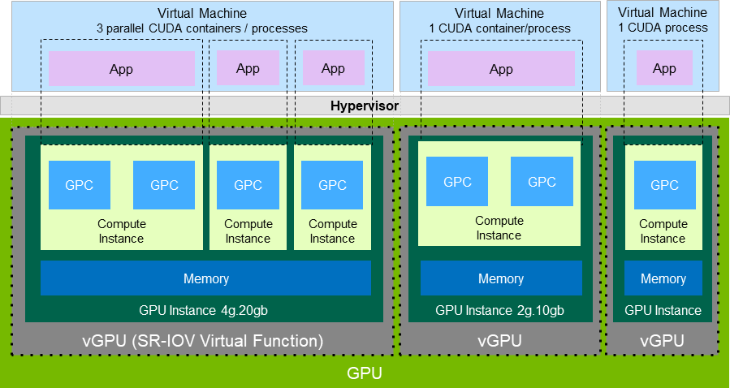
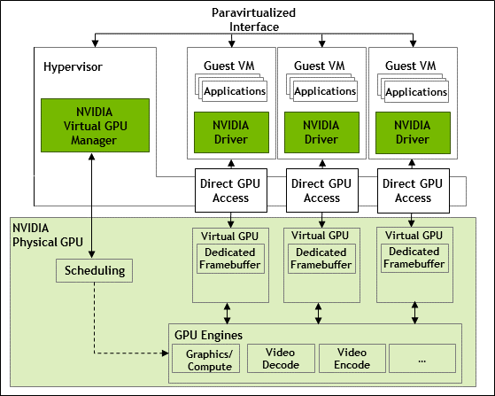
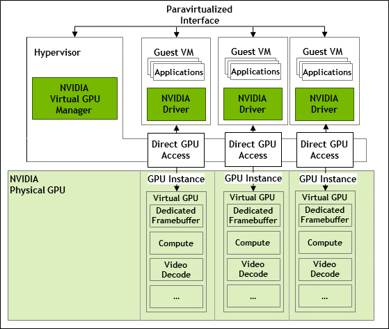

.. _vgpu_arch:

====================
vGPU架构
====================

.. note::

   本文实践在 NVIDIA vGPU 14.2 上完成，其他版本可能略有差异。后续我可能会尝试其他版本的实践

要设置NVIDIA vGPU设备，需要:

- 为GPU设备获取和安装对应的NVIDIA vGPU驱动
- 创建 mediated (协调) 设备
- 将mediated设备分配给虚拟机
- 在虚拟机中安装guest驱动

软件准备
==============================

- 从NVIDIA官方 `NVIDIA vGPU Software (Quadro vDWS, GRID vPC, GRID vApps) <https://www.nvidia.com/en-us/drivers/vgpu-software-driver/>`_  页面提供注册入口，可以注册一个试用账号获得90天试用licence(需要使用企业邮箱，并提供正确联系方式。实际上试用license应该是NVIDIA销售提供，详细注册、获取以及安装方式参考 `Virtual GPU Software Quick Start Guide <https://docs.nvidia.com/grid/15.0/grid-software-quick-start-guide/index.html>`_ ，不过我没有验证过)

- 从 `NVIDIA Driver Downloads <https://www.nvidia.com/Download/index.aspx?lang=en-us>`_ 下载驱动，需要注意 ``vGPU驱动`` 下载需要使用上述注册的试用账号登陆才能下载 

.. note::

   `NVIDIA® Virtual GPU (vGPU) Software Documentation <https://docs.nvidia.com/grid/index.html>`_  提供了NVIDIA发布的vGPU版本对照表:

   - NVIDIA每个vGPU软件系列都有配套的软件版本:

     - vGPU Manger
     - Linux Driver
     - Windows Driver

   例如vGPU软件12.2版本于2021年4月发布，包含(对应于 `Virtual Machine with vGPU Unlock for single GPU desktop <https://github.com/tuh8888/libvirt_win10_vm>`_ 提供的 NVIDIA-Linux-x86_64-460.73.01-grid-vgpu-kvm-v5.run ):

     - vGPU Manager 460.73.02
     - Linux Driver 460.73.01
     - Windows Driver 462.31
 
- 一些GPU支持 ``display-off`` 和 ``display-enabled`` 模式，但是对于NVIDIA vGPU，则必须部署在 ``display-off`` 模式，所以此时需要做模式切换(我理解就是不能有物理显示输出，必须切换成类似Tesla这样的无显示输出数据计算卡模式): Tesla M60 and M6 GPU 支持计算模式和显示模式，可以通过vGPU软件包中的 ``gpumodeswitch`` 工具进行切换(其他型号GPU卡没有这个功能和需求，例如我的 :ref:`tesla_p10` 就只有计算模式，没有图形模式，所以无需切换)

NVIDIA vGPU使用方式
======================

按照NVIDIA官方技术方案，是将 vGPU 使用方式分为3种:

- NVIDIA vGPU: 在vGPU模式下，多个虚拟机并发使用同一个物理GPU，在物理服务器上安装了NVIDIA显卡驱动(GRID驱动)，而虚拟机也使用物理服务器上相同的显卡驱动

- GPU Pass-Through: 实际上就是 :ref:`iommu` 的 :ref:`vfio` 技术，你甚至可以不 :ref:`install_vgpu_manager` 就能通过 :ref:`ovmf` 方式获得。不过NVIDIA官方的 vGPU Manager方便了GPU Pass-Through的管理(不需要类似 :ref:`ovmf_gpu_nvme` 通过内核参数来passthrough)

  - 限制: 需要将整块GPU卡直通给 **一个** 虚拟机，所以不能在多个VM间共享GPU

- Bare-Metal部署: 在裸金属部署模式，通过vWS和vApps licenses 来使用NVIDIA vGPU软件驱动，可以提供远程虚拟机桌面和应用。对于这种模式，可以直接使用Tesla卡而无需hypervisor配合，此时只需要NVIDIA vGPU软件图形驱动即可(其实就是在物理主机安装NVIDIA驱动)

补充(新技术及硬件结合):

- GPU for MIG-Backed vGPU: 采用MIG模式配置GPU可以实现 :ref:`sr-iov` 方式，但是需要采用 NVIDIA Ampere 以上架构(最新的 Ampere架构A100 / Hopper架构H100)，目前对个人来说遥不可及(实际上2022年中美摩擦已经对中国禁止了) 

  - 开源的 :ref:`open-iov` 社区实现了基于开源驱动的IOV，也包括支持 NVIDIA :ref:`mig` 硬件，不过目前还在开发中，可能无法用于生产环境(缺乏CUDA支持?)
  - NVIDIA私有解决方案提供了 ``Multi-Instance GPU (MIG)`` 在最新硬件上采用了业界标准IOV技术，我将在 :ref:`mig` 中尝试实践

.. note::

   作为物理主机的主显示输出的GPU卡不能使用NVIDIA vGPU部署或者GPU Pass-Through，否则会导致显示无输出。也就是说，实际上vGPU部署都是需要在第二块显示卡上才可以配置。

.. note::

   NVIDIA的vGPU是一种封闭的私有 **GPU虚拟化** 技术，实际上 NVIDIA GPU 也支持 :ref:`sr-iov` ，称为 :ref:`mig` ，但现定于目前最高端的Ampere为架构数据中心卡 A30, A100, H100 (中美冲突已禁售)

vGPU配置示例
==============

   NVIDIA vGPU配置示例

NVIDIA vGPU软件功能:

- vGPU软件支持的GPU实例: 支持 :ref:`mig` 功能
- 需要注意并非所有hypervisor都支持NVIDIA vGPU部署的GPU实例，请参考 `NVIDIA Virtual GPU Software Documentation最新版本文档 <https://docs.nvidia.com/grid/latest/>`_
- NVIDIA vGPU软件支持的GPU实例只支持NVIDIA Virtual Compute Server和Linux guest操作系统

NVIDIA vGPU支持多种主要的API:

- Open Computing Language (OpenCL™ software) 3.0
- OpenGL® 4.6
- Vulkan® 1.3
- DirectX 11
- DirectX 12 (Windows 10)
- Direct2D
- DirectX Video Acceleration (DXVA)
- NVIDIA® CUDA® 12.0
- NVIDIA vGPU software SDK (remote graphics acceleration)
- NVIDIA RTX (on GPUs based on the NVIDIA Volta graphic architecture and later architectures)

.. note::

   当使用NVIDIA vGPU软件的图形驱动时，一定要避免安装针对软件发行版的独立安装软件包，也就是不能同时 :ref:`install_nvidia_linux_driver`

NVIDIA的硬件对API和Debugger的支持是有特定型号要求，需要参考官方文档 `NVIDIA CUDA Toolkit and OpenCL Support on NVIDIA vGPU Software <https://docs.nvidia.com/grid/latest/grid-vgpu-user-guide/index.html#cuda-open-cl-support-vgpu>`_

vGPU架构
===========

.. figure:: ../../_static/kvm/vgpu/architecture-grid-vgpu-overview.png

   NVIDIA vGPU架构

- NVIDIA Virtual GPU Manager是运行在hypervisor中，物理GPU能够支持多个虚拟GPU设备(vGPUs)被直接分配给guest虚拟机
- 对于Guest虚拟机所使用的vGPU就像物理GPU一样被hypervisor直通进虚拟机，此时在虚拟机中加载NVIDIA驱动来访问GPU
- 对于NVIDIA Virtual GPU Manager的paravirtualized接口用于无需转换的管理操作

对于每个vGPU:

- 有一个固定的GPU缓存
- 有一个或多个虚拟的显示输出(heads)
- 当vGPU创建时也会从物理GPU分配对应的vGPU缓存，这个分配的缓存可以被vGPU一直使用直到vGPU被销毁

注意，对于不同的GPU硬件，vGPU有以下类型:

- 所有支持NVIDIA vGPU软件的GPU设备，可以创建分时(time-sliced) vGPU
- 对于支持 :ref:`mig` 功能的GPU，则创建 MIG-backed vGPU(需要GPU硬件是Ampere架构)

分时(Time-Sliced)NVIDIA vGPU内部架构
--------------------------------------

   分时(Time-Sliced)NVIDIA vGPU架构

- 分时(time-sliced) vGPU 其实是vGPU 共享相同的一块物理GPU，此时物理GPU并没有被分区成多个GPU实例
- 所有的分时 vGPU 共享相同的GPU引擎(图形，视频解码和编码引擎)
- 你可以将分时vGPU视为一个软件vGPU实现，也就是说实际只有一个物理GPU，只不过有一个NVIDIA Virtual GPU Manager帮助实现了GPU任务的调度，通过类似CPU时间片调度的技术不断在物理GPU引擎上切换

.. note::

   从上述架构图来看，软件实现的 分时(Time-Sliced) vGPU 应该是存储在一定的软件开销的，也就是说单块物理GPU通过软件分时切分成多个vGPU的总体性能是不如一块物理GPU的

   对于大模型的训练和推理，一般能够将整个物理GPU资源全部吃掉，所以切分vGPU可能收益不大。不过，对于云计算切分vGPU可能可以销售给较小规模的互联网用户，还是具有一定使用价值。

   我的目标是模拟多GPU的并发 :ref:`machine_learing` ，所以不追求性能，仅作为技术挑战。

.. note::

   对于GPU卡上具备多个物理GPU的设备，同一张卡上不同物理GPU可以托管具有不同framebuffer数量的vGPU，但是同一个物理GPU则必须是相同数量的framebuffer

MIG-Backed NVIDIA vGPU内部架构
---------------------------------

   :ref:`mig` NVIDIA vGPU架构

:ref:`mig` 后端的vGPU是真正的物理级别划分的vGPU技术:

- 每个MIG-Backed NVIDIA vGPU实例是物理GPU中完全独立的GPU引擎(图形，视频解码和编码引擎)
- vGPU之间是独立的并发运行，你可以将 MIG-Backed vGPU视为物理分割的GPU，此时不需要 Virtual GPU Manager 做GPU的任务调度，所以大大简化了软件堆栈，也极大降低了分时cGPU的软件开销
- 支持 :ref:`mig` 的GPU(Ampere微架构及更高) 的GPU在使用vGPU功能时，需要配置服务器BIOS和内核:

  - VT-D/ :ref:`iommu`
  - :ref:`sr-iov`

部署
================================

- :ref:`install_vgpu_manager`
- :ref:`install_vgpu_guest_driver`

参考
=========

- `Virtual GPU Software Quick Start Guide <https://docs.nvidia.com/grid/15.0/grid-software-quick-start-guide/index.html>`_ 官方快速起步文档，不过主要描述的还是如何获取license以及部署license，且有关Host/Guest vGPU安装仅涉及 VMware vSphere 和 Citrix Hypervisor，所以实际我是参考 `Virtual GPU Software User Guide <https://docs.nvidia.com/grid/14.0/grid-vgpu-user-guide/index.html>`_ 来部署
- `SETTING UP AN NVIDIA GPU FOR A VIRTUAL MACHINE IN RED HAT VIRTUALIZATION <https://access.redhat.com/documentation/en-us/red_hat_virtualization/4.4/html/setting_up_an_nvidia_gpu_for_a_virtual_machine_in_red_hat_virtualization/index>`_ 配置GPU的直通和vgpu，本文参考后半部分
- `Virtual Machine with vGPU Unlock for single GPU desktop <https://github.com/tuh8888/libvirt_win10_vm>`_ 提供了配置指南的参考，以及Kernel 5.12的
