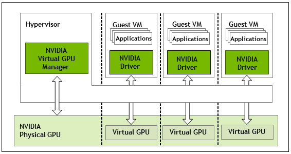

.. _vgpu_unlock:

==================
vgpu_unlock
==================

NVIDIA不允许在消费级GPU上使用vGPU功能，但是实际上硬件是完全支持的。所以开源软件 `DualCoder/vgpu_unlock <https://github.com/DualCoder/vgpu_unlock>`_ 通过软件方式解锁了消费级NVidia vGPU功能。

:ref:`vgpu` 是一种数据中心针对Tesla和Quadro卡的虚拟化技术，面向 VDI(Virtual Desktop Infrastructure)市场，让用户能够采用远程桌面解决方案进行工作。远程运行的应用包括CAD/CAM软件，游戏，建筑设计以及其他图形加速程序。

:ref:`vgpu` 为虚拟机带来了完全的图形加速，并且数据中心中运行的虚拟机可以轻易迁移并提供给用户。

   NVIDIA vGPU架构

对于在Windows或Linux虚拟机的图形加速， :ref:`vgpu` 是非常适合的技术。

vGPU unlock和license
=====================

:strike:`我最初没有理解 NVIDIA vGPU的licese，以为我购买的二手 Tesla P10 需要使用vGPU unlock才能启用vGPU功能。` 通过对比阅读文档，原来 `DualCoder/vgpu_unlock <https://github.com/DualCoder/vgpu_unlock>`_ 只是为消费级显卡解锁vGPU功能开发的。也就是说，消费级显卡的核心和数据中心的数据卡其实是一样的，但是被锁住了vGPU功能。vGPU unlock仅仅是解锁消费级显卡的vGPU功能。 **很不幸，我购买的二手 Tesla P10似乎是一块P40的降级卡，内部关闭了vGPU支持** ，所以我还是尝试通过本文 vGPU unlock 方法来尝试激活vGPU支持。

对于 Tesla 这样的数据中心高端运算卡，通常本身就支持vGPU功能就是具备的，所以一般不需要使用 `DualCoder/vgpu_unlock <https://github.com/DualCoder/vgpu_unlock>`_ (我购买的 :ref:`tesla_p10` 可能是特例)。

但是，NVIDIA Tesla 运算卡的vGPU功能依然需要通过NVIDIA licensing Server才能使用，这个licensing需要通过NVIDIA官方申请90天试用，非常麻烦。如果购买license，对于个人来说过于昂贵了。

.. note::

   :strike:`本文仅做整理记录，由于我使用 Tesla P10 运算卡，不是消费级显卡，所以没有必要 vGPU unlock` 

   在 :ref:`install_vgpu_manager` 过程中，我惊讶地发现 ``nvidia-vgpud`` 服务启动失败，并且提示 **GPU not supported by vGPU at PCI Id: 0:82:0:0 DevID: 0x10de / 0x1b39 / 0x10de / 0x1217** 。

   这让我非常沮丧，似乎这块隐形卡是阉割了vGPU功能，需要采用 `DualCoder/vgpu_unlock <https://github.com/DualCoder/vgpu_unlock>`_ 来解锁功能

vgpu_unlock支持的硬件和软件
============================

支持类型
--------------------

.. csv-table:: vgpu_unlock支持类型
   :file: vgpu_unlock/vgpu_unlock_types.csv
   :widths: 15, 15, 20, 10, 20, 20
   :header-rows: 1

支持硬件
------------

- CPU和主板:

运行 vGPU/vgpu_unlock 需要硬件支持虚拟化扩展。也就是Intel平台的VT-X或者AMD平台的AMD-V。这样才能获得较好的VM性能。请注意需要在主机BIOS激活虚拟化支持。

在一些系统上要使用vGPU需要激活 :ref:`iommu` ，例如 Ampere GPU。

- 图形卡:

.. csv-table:: vgpu_unlock支持图形卡
   :file: vgpu_unlock/vgpu_unlock_graphics_cards.csv
   :widths: 30, 30, 40
   :header-rows: 1

我在 :ref:`hpe_dl360_gen9` 上使用 :ref:`tesla_p10` 属于 ``gp102`` 图形芯片，等同于 ``Tesla P40`` 。 :strike:`这块P10运算法无需解锁就具备vGPU功能` 但 :ref:`tesla_p10` 实际 :ref:`install_vgpu_manager`  时发现不支持vGPU，所以也尝试采用 ``vgpu_unlock`` 来实现vGPU功能开启。

支持操作系统
---------------

- 物理主机:

  - Red Hat Enterprise Linux (certified by Nvidia for vGPU, tested kernel 4.18)
  - Proxmox VE (Tested kernel 5.4)
  - There may be more that we don’t explicitly list here.

对于 5.10-5.12 的内核，需要使用 `rupansh/vgpu_unlock_5.12 <https://github.com/rupansh/vgpu_unlock_5.12>`_ 补丁

更新: 对于任何内核版本高于 5.10 都需要使用补丁。但是需要注意内核5.13不能工作，建议不要使用5.13。对于内核版本较高的系统，可以自己使用 `DualCoder/vgpu_unlock <https://github.com/DualCoder/vgpu_unlock>`_ 提供的 ``Kernel module hooks: vgpu_unlock_hooks.c`` 做补丁，这样就能够解锁。( 参考  `Was the vfio_mdev module removed from the 5.15 kernel? <https://forum.proxmox.com/threads/was-the-vfio_mdev-module-removed-from-the-5-15-kernel.111335/>`_ 已经有人按照 `Proxmox 7 vGPU – v2 <https://wvthoog.nl/proxmox-7-vgpu-v2/>`_ 验证过 kernel 5.15是可行的)

`Rust-based vgpu_unlock <https://github.com/mbilker/vgpu_unlock-rs>`_ 提供了一个 :ref:`rust` 开发的 vgpu_unlock ，可以和使用 python 开发的解锁互相参看(都是user space工具，核心没有区别)

- Guest虚拟机:

  - Enterprise Linux distributions (RHEL, CentOS, Fedora)
  - Debian/Ubuntu (20.04 LTS)
  - Windows 10, 8.1, Server 2019 and 2016

.. note::

   不建议在不受支持/未经认证的硬件上使用 vGPU，但是 ``vgpu_unlock`` 脚本依然可能会让某些N卡能够运行 ``vGPU`` 技术，不过采用开源技术需要自担风险。该 ``vgpu_unlock`` 项目是MIT授权，不提供任何保证。

.. note::

   总之，尽可能使用NVIDIA官方提供的最新版本 vGPU 驱动，实在不行再使用 `Virtual Machine with vGPU Unlock for single GPU desktop <https://github.com/tuh8888/libvirt_win10_vm>`_ 提供的2021年4月版本驱动 ( :ref:`vgpu_arch` )

准备工作
===========

之前我在服务器上 :ref:`install_nvidia_linux_driver` ，所以物理主机上已经安装了 `NVIDIA官方提供的 P40 驱动 <https://www.nvidia.com/download/index.aspx#>`_ 。但是，对于vGPU则需要安装 ``NVIDIA GRID vGPU driver`` ，所以首先卸载原先 :ref:`install_nvidia_linux_driver` 。

- (:strike:`我后来发现我的P10无需unlcok，所以实际都没有做` )卸载 :ref:`install_nvidia_linux_driver` :

.. literalinclude:: vgpu_unlock/uninstall_nvidia_linux_driver
   :language: bash
   :caption: 卸载之前已经安装的NVIDIA Linux驱动，准备安装NVIDIA GRID vGPU驱动

- 从NVIDIA官方 `NVIDIA vGPU Software (Quadro vDWS, GRID vPC, GRID vApps) <https://www.nvidia.com/en-us/drivers/vgpu-software-driver/>`_  页面提供注册入口，可以注册一个试用账号获得90天试用licence(需要使用企业邮箱，注册以后大约24小时~48小时会收到登陆NVIDIA Licensing Portal的账号，这样就可以找到针对系统的驱动、license服务器安装程序以及用于激活的licenses

在NVIDIA的licensing portal网站，下载最新的Linux KVM vGPU驱动，这个驱动需要在物理主机和虚拟机上都要安装。

.. warning::

   我仔细阅读了网上文档，并且我自己尝试注册申请。但是，很不幸，NVIDIA对于企业级运算卡提供vGPU license是需要对接销售的。也就是你必须留下真实的联系方式，由NVIDIA销售联系你审核通过之后才会发送试用90天的license。这对于个人来说非常麻烦，我最终放弃了这个方式。

- 下载 ``vgpu_unlock`` :

.. literalinclude:: vgpu_unlock/download_vgpu_unlock
   :language: bash
   :caption: 下载 vgpu_unlock

- 安装 ``dkms`` 等:

.. literalinclude:: vgpu_unlock/install_dkms_python3_pip
   :language: bash
   :caption: 安装dkms python3 python3-pip

安装
========

- NVIDIA GRID vGPU驱动需要以 :ref:`dkms` 模块方式安装(我重新安装了一遍):

.. literalinclude:: vgpu_unlock/nvidia_vgpu_driver_dkms
   :language: bash
   :caption: 使用DKMS方式安装NVIDIA vGPU驱动

- 按照 `DualCoder/vgpu_unlock <https://github.com/DualCoder/vgpu_unlock>`_ 提供对应文件修改以下4个NVIDIA文件:

.. literalinclude:: vgpu_unlock/nvidia_vgpu_unlock_files
   :caption: 修订4个NVIDIA文件

这里修订的4个文件按照 `DualCoder/vgpu_unlock <https://github.com/DualCoder/vgpu_unlock>`_ 提供的说明进行:

- 修改 ``/lib/systemd/system/nvidia-vgpud.service`` ，将::

   ExecStart=/usr/bin/nvidia-vgpud

修改为::

   #ExecStart=/usr/bin/nvidia-vgpud
   ExecStart=/opt/vgpu_unlock/vgpu_unlock /usr/bin/nvidia-vgpud

- 修改 ``/lib/systemd/system/nvidia-vgpu-mgr.service`` ，将::

   ExecStart=/usr/bin/nvidia-vgpu-mgr

修改成::

   #ExecStart=/usr/bin/nvidia-vgpu-mgr
   ExecStart=/opt/vgpu_unlock/vgpu_unlock /usr/bin/nvidia-vgpu-mgr

- 然后重新加载::

   systemctl daemon-reload

- 修改 ``/usr/src/nvidia-<version>/nvidia/os-interface.c`` ，将以下行添加到文件开头的 ``#include`` 行下面::

   #include "/opt/vgpu_unlock/vgpu_unlock_hooks.c"

- 修改 ``/usr/src/nvidia-<version>/nvidia/nvidia.Kbuild`` 在文件最后添加以下行::

   ldflags-y += -T /opt/vgpu_unlock/kern.ld

- 移除nvidia内核模块::

   dkms remove -m nvidia -v <version> --all

- 使用dkms重新build nvidia内核模块::

   dkms install -m nvidia -v <version>

- 重启系统

安装license服务器
===================

如上文所述，NVIDIA销售联系并通过你的申请，你获得licensing Portal账号就可以下载90天试用license，以及license server下载。此时你可以参考 `NVIDIA vGPU License服务器安装过程 <https://blog.csdn.net/Hum0rp/article/details/123326895>`_ 自己部署一个licensing server，这样就能够试用vGPU功能。

详细安装license服务器见: :ref:`install_vgpu_license_server`

物理服务器和虚拟都需要安装GRID驱动(也就是vGPU驱动)，这个安装过程可以参考阿里云的 `在GPU虚拟化型实例中安装GRID驱动（Linux） <https://help.aliyun.com/document_detail/163830.html>`_ ，其中配置 ``/etc/nvidia/gridd.conf`` 添加license服务器访问配置，就可以激活vGPU。(注意，这个 ``gridd.conf`` 是Guest虚拟机内部配置，用于访问License Server才能激活虚拟机内部的vGPU功能)

.. note::

   NVIDIA真是商业化非常强的公司，实际上消费级显卡和数据中心运算卡的GPU核心都是相同的，所谓GRID驱动其实应该就是CUDA驱动的"包装"，强制加上了vGPU检测。从网上文档来看，如果在虚拟机内部能够欺骗vGPU实例，就可以安装普通的GPU驱动。不过，确实非常折腾，仅仅为了获取一个企业级功能。

   这个vGPU的license其实是一种商业策略，从技术上并没有为用户增加价值。其实在早期Vmware esxi 6.7系统，直接就可以试用Grid K1/K2的vGPU功能而无需license。但是现在NVIDIA应该是要求购买license才能试用GRID功能。

   参考 `Cheapest vsphere grid gpu without licensing costs from Nvidia <https://forums.servethehome.com/index.php?threads/cheapest-vsphere-grid-gpu-without-licensing-costs-from-nvidia.25793/>`_ 可以看到 K1/K2 不需要license就可以试用vGPU功能。

   `KrutavShah/vGPU_LicenseBypass <https://github.com/KrutavShah/vGPU_LicenseBypass>`_ 介绍了在Windows虚拟机中绕过vGPU license的方法，但是vGPU版本必须是14.1以及只能用于Windows虚拟机，原理是通过修订注册表实现将unlincesed时间从20分钟调整到1440分钟(1天)，并且关闭了Nvidia驱动的license获得通知功能，并且每天凌晨3点重启一次Nvidia驱动。

参考
======

- `DualCoder/vgpu_unlock <https://github.com/DualCoder/vgpu_unlock>`_ 
- `vGPU_Unlock Wiki <https://docs.google.com/document/d/1pzrWJ9h-zANCtyqRgS7Vzla0Y8Ea2-5z2HEi4X75d2Q>`_ 详细的 ``vgpu_unlock`` 使用文档
- `Proxmox 7 vGPU – v2 <https://wvthoog.nl/proxmox-7-vgpu-v2/>`_ 提供了详细的Proxmox 7配置vGPU步骤，采用 NVIDIA GPU驱动460.73.01在消费级GPU上激活vGPU功能
- `NVIDIA License System (NLS) – General Availability <https://vdnieuwenhof.eu/nvidia-license-system-nls-general-availability/>`_ 解释了NVIDIA的license系统工作方式，实际上客户自己安装的license server是NVIDIA的云license Server的一个转发代理
