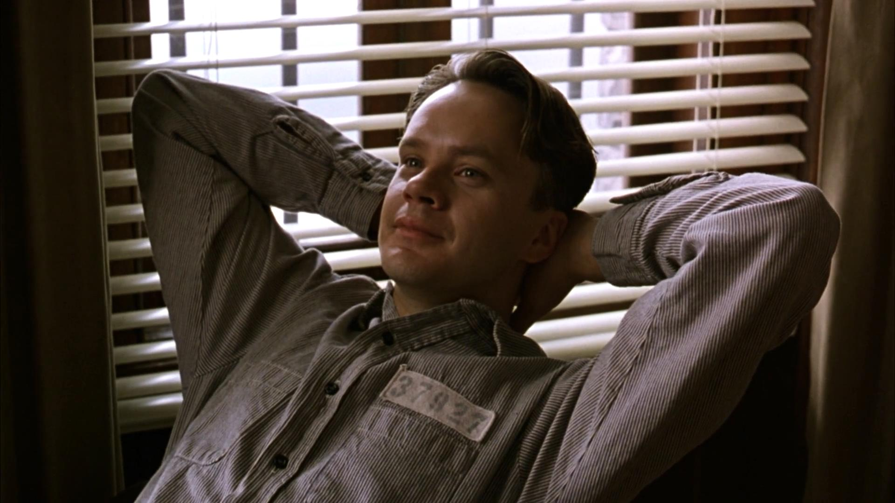

.. _music:

=================================
音乐
=================================

`肖生克的救赎 <https://movie.douban.com/subject/1292052/>`_ 中安迪在监狱的广播室里插上门，将歌剧《费加罗的婚礼》播放给全狱的人听，这一刻安迪的微笑的神态深深印在每个人的心中...

.. toctree::
   :maxdepth: 1

   classic_music_in_life.rst

.. only::  subproject and html

   Indices
   =======

   * :ref:`genindex`
