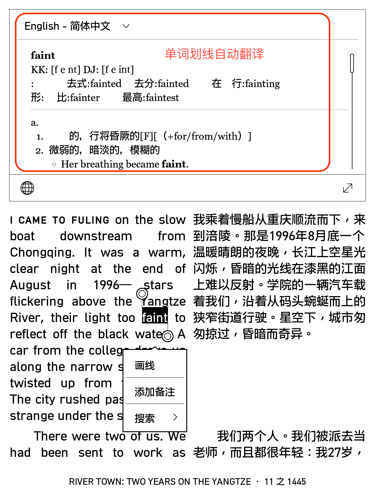

.. _ebook_translate:

========================
电子书翻译
========================

契机
=====

一直以来，受困于中国文化审查，大陆出版的书籍往往是阉割版，甚至是扭曲版。虽然我知晓这个隐情，但是并没有太在意，毕竟我是做计算机技术的，我们这个行业技术书籍汗牛充栋，想要看的书也有大量中文翻译(虽然落后几年，现在逐渐也追平了)。

不过，最近在重读何伟( `彼得·海斯勒 <https://zh.wikipedia.org/wiki/%E5%BD%BC%E5%BE%97%C2%B7%E6%B5%B7%E6%96%AF%E5%8B%92>`_ )的 `江城 <https://book.douban.com/subject/7060185/>`_ ，忽然注意到维基百科提到他写的 「中国三部曲」，我恰好很多年前看过第一部「江城」。然而维基百科提示三部曲简体中文版只有第一本「江城」和第三本「寻路中国」，但都是有所删节。此外，三部曲的第二部「甲骨文」甚至没有出简体中文版，而在豆瓣甚至连词条都没有。

我忽然感到有些难过，想到自己看过不少残缺的翻译中文书，甚至不知道缺少了哪些内容...

通过z-lib，我找到了 彼得.海斯勒 的「中国三部曲」，略微阅读了几页，英文原版对于我这样长期只看计算机英文资料的技术牛马来说，有些文化类的词语非常陌生，阅读吃力导致我很难沉下心继续。毕竟计算机技术的磨练占据了我大多数精力，我有搞不完的技术挑战。

我忽然想到很久以前曾经在 **阮一峰** `科技爱好者周刊（第 266 期）：自己做双语 EPUB <https://www.ruanyifeng.com/blog/2023/08/weekly-issue-266.html>`_ (2023年8月11日) 看到介绍过的 `沉浸式翻译 <https://immersivetranslate.com/>`_ 网站提供在线翻译双语电子书。不过，对于我这样技术人来说，依赖于平台而不搞懂背后的原理、自己复刻实现，总是心有不甘。

实践
======

简单问了google AI，原来有多种方式可以实现电子书翻译，其中平衡了方便和实用的方法是借助 :ref:`calibre_ebook_translator` ：

.. note::

   如果你感兴趣也想要自己掌握动手能力(借助工具翻译电子书)，请参考我整理的 :ref:`calibre_ebook_translator` ，有详细的步骤介绍(其实也不难)。

我去年购买了 :ref:`kobo_libra_h20` ，结合我现在找到的电子书翻译解决方案，感觉工具改进对于自己阅读原著有很大帮助:

- 通过 ``z-lib`` 能够找到很多中文简体世界无法提供的原著电子书
- :ref:`calibre_ebook_translator` 能够快速制作出 ``中英双语`` 电子书，我采用 ``英-中`` 双列方式，能够左右对比阅读，加快自己的理解，也锻炼英语的单词识别和语感。此外， ``kobo`` 电子阅读器内置 ``英汉字典`` 帮助我学习英语词汇:

   kobo电子阅读器内置了单词选取自动翻译功能，方便阅读外语书籍
