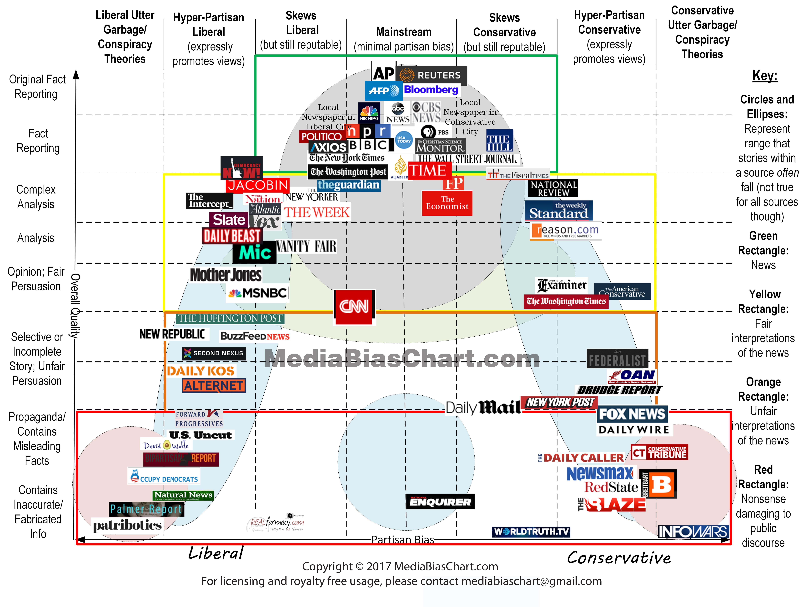

.. _english_news:

======================
英文媒体阅读(参考)
======================

.. note::

   这是我尝试订阅 :ref:`apple_one` 中Apple News+找到的一篇参考文章，或者可以在这个基础上结合自己的实践学习并 ``Open my mind``

   我现在还没有找到合适的方式，或者说如何持之以恒提高自己的英语水平，但依然需要努力...

通讯社
==========

世界三大通讯社:

- The Associated Press 美联社
- Reuters 路透社
- AFP 法新社

通讯社是采集新闻并为报纸、杂志、广播、电视等提供新闻资讯的机构。通讯社提供的新闻公认的是新闻，而非评论。几乎所有的主流意见也都认为三大通讯社的新闻总体上中立，没有特别偏向。

如果你希望获得准确的信息，而不是二手并且掺杂 ``立场`` 的新闻，可以关注三大新闻社的官网、Twitter以及应用，以便能印证从各方获得的资讯。

公共广播/电视
=================

比较中立并且高可信度的广播/电视有:

- BBC
- NPR (National Public Radio，美国国家公共广播) 播客等音频节目上做的很出色，我记得很久以前还是在互联网早期的蛮荒时代，刚刚有RealPlay流媒体的时候，曾经尝试过NPR的新闻广播，可以了解地球另一端的世界
- PBS Public Broadcasting Service 美国影响力较大的非盈利媒体机构

NPR 和 PBS 的新闻频道在美国的影响力与四大电视网相当，但公认会更加中立。

商业电视台
============

美国电视台:

- ABC
- NBC 
- CBS
- FOX NEWS

ABC，CBS 新闻更偏向于中立，也有认为中立偏左；NBC 新闻被认为更左一点，CNN 更左。FOX NEWS 被认为更保守。

可信度一般较高，比通讯社和公共媒体的可信度稍低。这里的可信度指的是新闻快讯，发表观点的新闻节目与脱口秀节目不在讨论范围内。

主流报纸杂志
===============

美国
-----

- The New York Times: 纽约时报 (NYT) 成立于 1851 年，至今已获得 127 个普利策奖，在美国乃至世界报纸品牌中，都是当之无愧的强者。
- The Washington Post
- National Review
- USA Today
- The New Yorker
- The Guardian: 立场倾向：中立偏左 可信度：较高
- Daily Mail
- The Telegraph
- The Atlantic
- The Economist

主流网站
==========

- Business insider
- HuffPost
- VOX
- BuzzFeed

建议(摘录)
============

- 你可以通过 RSS 订阅几个关注的媒体，建议订阅量不大，重在观点的媒体，不然容易信息过载。同时，你也可以使用 Apple News 或者 Google News 等新闻聚合类 APP。
- 对于绝大部分只是偶尔可能会看看 电视直播的人来说，推荐使用 PLUTO TV ， PLUTO TV 是 viacom 旗下的流媒体播放平台，免费版也可以看 NBC， CBS， SkyNews Bloomberg 等新闻台的 24 小时直播，共支持 100 多个台。可以下载客户端，也可以直接在 网页上 看。

媒体的立场、政治偏向、及可信度分析
====================================

所有立场倾向一般是指该媒体在该国的政治立场，一般分为偏左（自由派），中立，偏右（保守派）。这里不涉及讨论这些媒体对中国报道上的立场倾向。

媒体的客观性
-------------

- AP 美联社、PBS、NPR 等公共传媒服务最为中立。之后是传统的四大商业电视网、传统的几大报纸。
- MSNBC 、CNN 较为偏自由派
- Huffington 偏自由派，常被批判为假新闻
- The Daily Show 就深受自由派人士的青睐，但是中立和保守派都认为不值得信赖。
- FOX News 获得中立和保守派的认可。

哪些媒体提供的是新闻，哪些提供的是观点？
-------------------------------------------

上图是 `adfontesmedia.com从两个唯独分析各大媒体可行度图示 <https://www.adfontesmedia.com/the-chart-version-3-0-what-exactly-are-we-reading/>`_ :

- 左侧为偏自由派，右侧为偏保守派
- 从上到下是按照内容分类：从真实事实 – 事实 – 分析 – 合理的观点 – 不合理的观点 – 带有误导性质的政治宣传等

- 绿色区域媒体提供的是新闻
- 黄色区域媒体对新闻有合理的解读
- 橙色区域媒体对新闻解读较不合理
- 红色区域的媒体都是社会有害的胡说

你可以选择信任任何媒体，这是你的自由；但是同时需要知道各个媒体的立场，对自己获取的信息有一定的了解。如果最初没有什么特别的偏好，可以使用 Apple News 或者 Google News 这类聚合平台，针对同一新闻，不同立场的媒体的标题就有明显的倾向，对比观看，颇有益处。

虽然 Trump 说 CNN 都是假新闻有些过头，但 CNN 的报道的确饱受 争议，上述的各类调查都表明 CNN 是一个比较偏左的媒体，这也符合个人认知的美国主流社会的观点。

VOA 是美国政府联邦政府的外宣机构，是服务于美国政府的媒体，与其他盈利非营利的媒体都有着本质区别。

.. note::

   `英文缩写网 <http://www.enabbr.net>`_ 提供了英文缩写查询

参考
=====

- `数字移民: 英美主流媒体盘点 <https://blog.shuziyimin.org/587>`_
