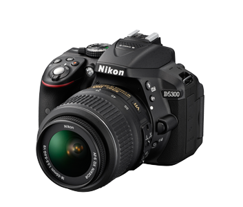
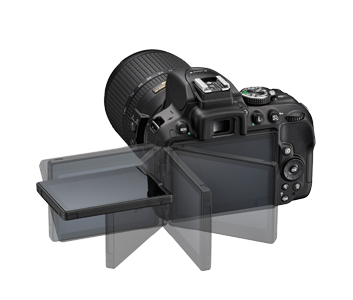

.. _nikon_d5300:

========================
Nikon D5300
========================

我手头有一台Nikon D5300，十年前的产品，然而我觉得能够用这台相机学习摄影，所以准备仔细研究一下。

硬件规格
=============

- 感光元件: 2416万像素APS-C，并采用无OLPF(光学低通滤波器 ）设计，充分发挥2,416万像素图像传感器的解像力

.. note::

   一个冷知识: 成像的质量并不是完全取决于感光元件的像素量

   举个例子，实际上手机摄影中比较均衡的 :ref:`iphone` ，其历代摄像头像素一直到iPhone14都维持在1200w（iPhone 14 Pro则跃升到4800w），但是历代iPhone都有摄影摄像能力的提升，是通过不断提升镜头结构、软硬件结合优化，使得一代代iPhone始终出于手机摄影的第一梯队。

   作为传统相机大厂的尼康、佳能，其相机镜头的口碑极好，一直是专业摄影的首选。

.. note::

   `百度百科: APS-C <https://baike.baidu.com/item/APS-C/9304201>`_

   基础对比: 35mm(36mm×24mm)电影胶片

   1996年由FujiFilm、Kodak、Canon、Minolta、Nikon五大公司联合开发的APS(Advance Photo System)胶片系统:

   - 在原135规格的基础上进行了彻底改进，包括相机、感光材料、冲印设备以及相关的配套产品上都全面创新，大幅度缩小了胶片尺寸，使用了新的智能暗盒设计，融入了当代的数字技术，成为了能记录光学信息、数码信息的智能型胶卷。
   - APS定位于业余消费市场，共设计了三种底片画幅(H、C、P)：

     - H型(HighDefinition)是满画幅(30.3×16.6mm)，长宽比为16:9
     - C型(Classic)是在满画幅的左右两头各挡去一端，长宽比为3:2(24.9x16.6)，其对角线长度为29.9mm，折合1.18英寸(aps-c长宽比与135底片同比例)
     - P型(Panoramic)是满幅的上下两边各挡去一条，使画面长宽比例为3:1(30.3×10.1mm)，被称为全景模式

   APS感光胶片与传统感光胶片最大的区别在于胶片上不仅涂有感光乳剂，还涂覆有一层透明的磁性介质，它除了具有传统胶片的所有功能外，还具有数码书写能力，利用胶片齿孔边和另一边的条形导轨面积，在拍摄过程中，可以随时将拍摄中的有关数据记录在胶片上，如：焦距、光圈、速度、色温、日期。有的APS相机还储存有十几种语言，100多种赠语、贺词或标题，可以通过机背上的按钮选择所需和对照片的制作要求等，并且将信息记录在胶片上，这些信息还可以修改。在冲洗时还可以印出一张“缩略图索引”的目录照片，在当时是很新颖超前的设计。

   但是，APS夹在了传统胶片摄影系统和当今数码摄影系统之间，是介于两者之间的过渡产品。所以，在数码相机技术的高速发展冲击下，APS系统未能得到展开应用就“出师未捷身先死”，早早就已经“夭折”。

   不过，现今数码单反相机中，很多低端微型相机和入门级单反，感光元件规格采用了是和APS-C型胶片一样的大小：长宽比为3:2，边长近似为24.9×16.6mm，为了便于形容，人们就把类似这种大小的感光器件称之为“APS-C规格”。

   对比全幅，APS-C在相同的焦距下视角更窄，因此传感器获得的图像对比全幅传感器获得的就会有种“图片被裁切后”的感觉。譬如，一枚28mm的镜头用在全幅相机上是作为广角镜头，而用在APS-C相机上时则成像区域变窄，变成一枚标准镜头。想知道一枚全幅镜头在APS-C上能获得相当于在全幅机器上的焦距是多少，就必须先知道换算率。例如换算率是1.6倍的话，28mm的广角镜头就会变成45mm，也就是标准镜头了。然而，这个数值只是描述视角相当于全幅镜头的焦距，至于透视关系则不会发生变化。例如拥有夸张畸变效果的鱼眼镜头并不会因此变成广角镜头。

   .. figure:: ../../_static/life/photography/aps_size.jpg
      :scale: 60

   APS-C机器可以兼容全幅镜头，然而反过来全幅机器如果安装了APS-C镜头的话可能会出现暗角，或者只能使用相当于APS-C大小的传感器面积。

   佳能在2003年随着300D的发布推出了EF-S系列镜头，这些镜头的位置更靠近相机的传感器。这些镜头有几个好处，包括更轻便的尺寸重量和更窄的视角。EF-S镜头只能用在佳能APS-C单反上，它们的物理规格是和全幅EF镜头不兼容的，不能安装在全幅单反上。

   尼康也有专用于APS-C数码单反的DX格式镜头。这镜头可以安装在全幅D3系列和D700数码单反上，但可用像素更少。这些镜头如果用在尼康胶片单反上可能会出现鬼影，但焦距伸长则可用。
   
   索尼拥有专用于APS-C机身的DT镜头。这些是用于a100到a700及早期柯美的数码单反上的。物理规格兼容于全幅镜头，但安装在全幅相机如A900和A850上则使用裁切模式，像素减半。

- EXPEED 4图像处理器和优化校准
- 快门: 30-1/4000，支持B门
- 感光度: ISO 100至12800，最高扩展到ISO 25600
- 39个对焦点
- 约5幅/秒连拍
- 摄影: 1920x1080@60fps，立体声录音，支持H.264，Mov格式
- 3.2英寸可翻转LCD显示屏
- EN-EL14a电池，可拍摄约600张照片

参考
=======

- `Nikon 尼康 D5300产品资料 <https://www.nikon.com.cn/sc_CN/product/digital-slr-cameras/d5300#overview>`_
- `Nikon 尼康 D5300产品说明书 <https://downloadcenter.nikonimglib.com/zh-cn/products/25/D5300.html>`_
- `Nikon D5300 評測 ：以下犯上的入門級單眼 <https://digiphoto.techbang.com/posts/5941-nikon-d5300-evaluation-the-following-make-entry-level-slr>`_

