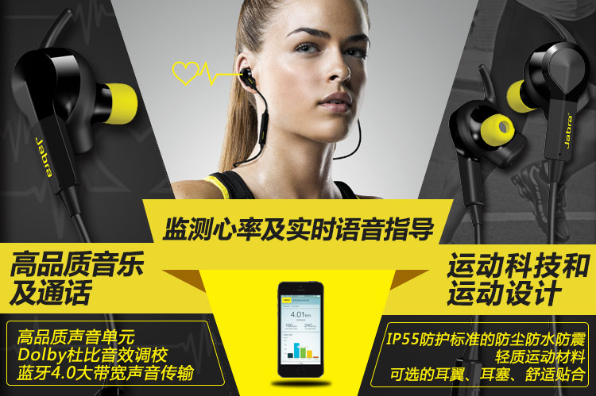
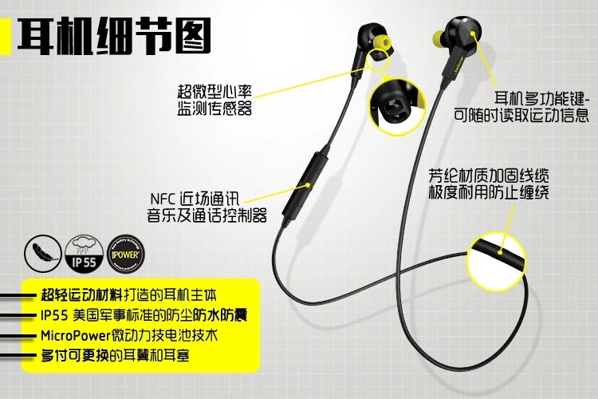

.. _jabra_sport_pulse:

==============================
Jabra Sport Pulse蓝牙运动耳机
==============================

由于苹果AirPods Pro二代可能还要等待一年，并且我现在暂时没有Apple Watch来帮助我运动记录心率，所以我入手 ``捷波朗搏驰`` 运动蓝牙耳机( ``Jabra Sport Pulse Special Edition Wirless Workout Headphones`` )作为过渡:

- 蓝牙无线，在运动中不羁绊
- 提供基本的心率监测功能，部分提供了Apple Watch运动功能

.. figure:: ../../_static/life/sport/jabra_sport_pulse.png
   :scale: 30

.. figure:: ../../_static/life/sport/jabra_sport_pulse_2.jpg
   :scale: 50

这款蓝牙运动耳机在国内没有销售，亚马逊美国网站上售价是60美金，淘宝上可以找到最低价位是 399 元。

``什么值得买`` 有简单评测文章，但是评论中有人提到这款耳机质量不佳(线控失灵无法开机)，并且音质不佳。不过考虑到发售时高达1600元售价，现在回归到正常水位，在这个400元性价比上，可以一试。

使用体验
============

硬件
------

- 电池续航: Jabra Sport pulse 的电池不是很耐用，我实际使用下来并没有达到标称的5小时，少量运动(半小时)加上视频、音乐，感觉只能支持3小时左右。
- 音量问题: Jabra Sport pulse 的音量控制非常"迷"，手机上直接操作音频音量，调整到最低也是有声音，只有耳机上硬件音量调整才能实际操作，有点麻烦。
- 音质: 第一次听觉得有点空，不像我之前使用SONY的监听耳机的音质干净，不太适应。
- ``听诊器效应``: 很久以前我购买过一个耳塞式耳机，但是发现长长的连线在行动时会引发 ``听诊器效应`` ，非常难受。我原本以为Jabra Sport pulse很短的连线能够消除这个问题，但是实际使用发现，挂在头颈上时依然会因为头颈转动而触发 ``噪音`` (使用随耳机的束带可以减轻到接近消除)，所以如果对这个问题敏感，还是建议使用 ``真无线`` 耳机

软件
------

Jabra Sport pulse提供了配套的厂商运动记录软件 ``Jabra Sport`` ，功能中规中矩。我主要使用跑步功能，能够记录运行配速、心率等，基本满足要求。

感受
------------

Jabra Sport pulse 集成了心率监测功能，确实是运动耳机的亮点。不过，这款耳机音质、续航(不佳)以及 ``听诊器效应`` ，使得这款耳机有些 ``鸡肋`` 。

经济能力允许的话，还是建议采用 :ref:`apple_watch` 结合 :ref:`airpods` 来实现完整的运动闭环。

参考
=======

- `Jabra Sport Pulse Special Edition Wirless Workout Headphones <https://www.jabra.com/sports-headphones/jabra-sport-pulse-wireless>`_
