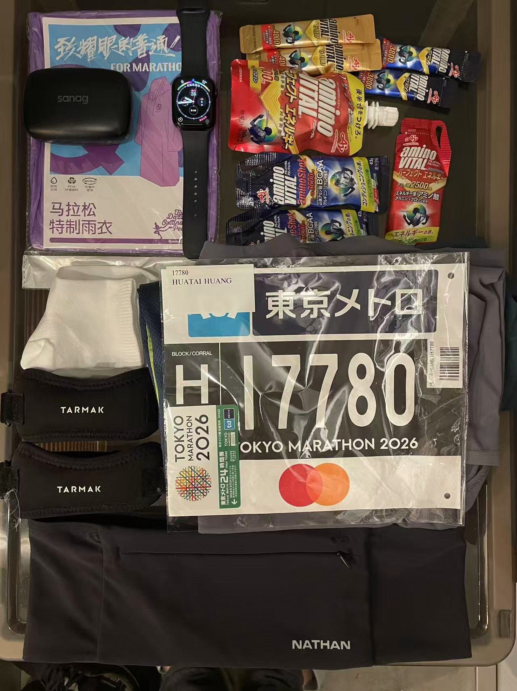
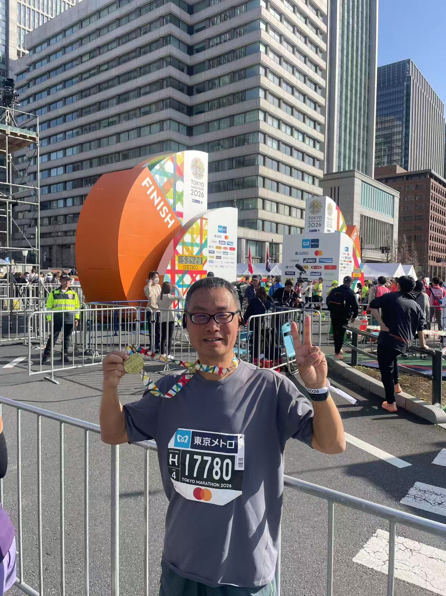
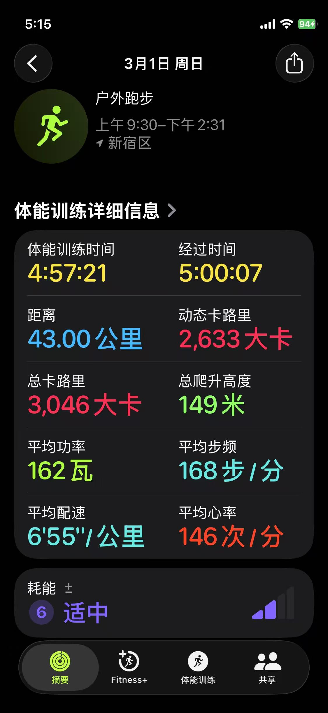
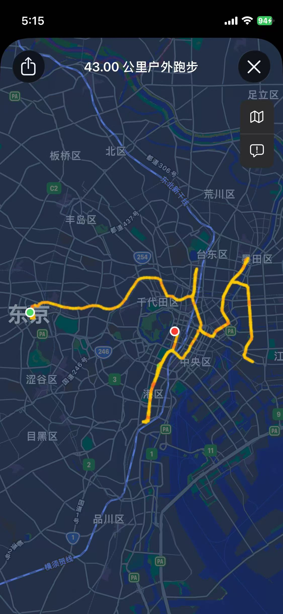
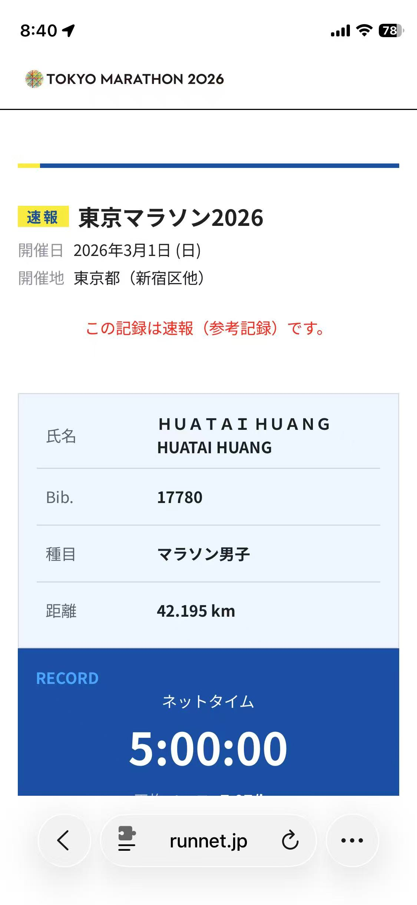

.. _tokyo_marathon_2026:

============================
东京马拉松2026
============================

运气(中签)
============

2025年，距离我第一次完成 :ref:`shanghai_marathon_2015` 整整过去了十年。

其实人的锻炼如同逆水行舟，即使十年前意气风发，较为轻松地完赛，即使日常觉得自己身体还行，似乎只要稍微锻炼一下就能够恢复往日的雄姿，但是现实是如果长时间不锻炼，身体机能并不如自己想像的那么好。一开始的跑步，似乎又回到了十年前的第一次，连短短的3公里也完成的非常吃力。这次重新开始训练，我大约花费了将近两个月，才恢复到能够较为轻松地跑完10公里。

这时，我突然想到在这十年后的自己，能否再次完成马拉松，为自己下一个阶段的人生开启一个有意义的开端？

命运(运气)和我开了一点点玩笑: 紧锣密鼓地投了上马、杭马和越马，然而国内三大马拉松赛事全部落空，连补抽都没有中。正当我非常沮丧的时候，一条gmail推送突然带来了"福音": 提醒我赶紧交参赛费，再晚就取消资格了!

WHAT?

我这才发现，原来没有注意到一周前，东马抽签结果已经出来了。完全不报希望的报名，我甚至忘记去查东马的抽签结果，还好Gmail推送了两次，还好第二次正好看到屏幕通知

训练
=======

原本佛系的跑步训练，因为这个命运的安排，有了明确的目标: 达到马拉松完赛的体能!!!

我参考了知乎上的一些跑步经验，以及gemini提供的建议，通过自己的摸索，采用 ``适合自己`` 的 :ref:`marathon_training` 方式: 虽然尝试自我鞭策最高达到每月200公里跑量，但是发现过度训练反而无法持续(会突然间极度疲劳无法继续)，最终探索出只要适度训练(100公里/月)，就能够以均速 ``7分钟`` 配速(不受伤)完成马拉松。

由于长时间跑步膝盖会承压疼痛，我购买了一瓶MoveFree软骨素，40天剂量，从参赛前一个月开始服用，一直到赛后恢复用完。

比赛准备
==========

- 比赛前一个月(2月)开始降低跑量，原本隔天10公里降低到隔1~2天8公里或5公里，避免受伤，但也同时维持一定的运动体能。
- 比赛前的第三周，我在2月10日，完成了一次 ``28公里`` 长跑:

  - 不追求速度，以心率 ``135`` 稳定配速(实测为 ``7分钟`` )，无伤痛完成
  - 按照gemini的建议，在这次演习中建议使用 ``补剂包`` 测试能量棒、盐丸是否适应，不过我偷懒没有购买补给，所以这次28公里全程是无补给完成的

    - 实际上跑到20公里时候，出现了一点脱力和疲劳，按照事后gemini的解释是，通常人只能持续运动2小时，如果没有能量补给，出现脱力是正常现象(所以在马拉松比赛中，必须每10公里补充一次能量棒)
    - 之所以我的长跑演习没有使用任何补给(我甚至没有喝水和运动饮料)，是为了测试极限情况下自己的体能极限，我至少试出了我能够无补给完成大约30公里的长跑，为后续东马完赛增强了信心

- 比赛前一周，只轻松完成了1~2次5公里慢跑，只是为了保持脚感
- 比赛前的两周，没有任何节食，尽量补充碳水，以积累能量能够在马拉松长跑中释放

赛前
==========

2月26日晚到达东京，2月27日去东京国际展览中心领取参赛包: 为了节约参赛成本，我只缴纳了参赛基础报名费，所以实际上只领到了一个号码布和一个(义乌水准)纪念硅胶饮水软杯，我甚至以为比赛组织人员搞错了，怎么就这么点东西...

在东京国际展览中心当天有参赛赞助商的售卖和展示，没有购买ASICS东马官方运动T桖(太贵了200+RMB)，我在现场只购买了 ``5小时完赛能量补充套装`` 和一个跑步腰包，作为这次东马的最后装备。

比赛前一天晚上，一定要整理好第二天所有参赛装备，并拍照:

   准备装备

比赛
=======

很不幸，我在去东京前，也就是赛前一周时感冒咳嗽，虽然没有发烧，但是其实一直都非常不舒服，甚至晚上干咳影响睡眠。这对我这样中断过很久训练，最近半年多才重新锻炼的中年人来说，其实心理影响和压力还是很大的，我甚至比十年前第一次参加 :ref:`shanghai_marathon_2015` 更为紧张，担心自己无法完赛，甚至担心比赛时出现意外。实际上，比赛前一天晚上，我几乎没有睡眠，即使躺在床上也无法入睡，仅朦朦胧胧眯了大约一个多小时。现在回想起来，我觉得还是因为自己锻炼不够充分以及时隔多年再次参赛信心不足导致的压力，对参加高强度比赛实际上非常不利。如果再次参加相同的比赛，我会放宽心，就当它是一个游戏，成败无所谓，仅仅是一个体验。

我在赛前停止了日常咖啡，仅在比赛当天早上早餐时喝了一杯7-11拿铁(gemini建议短时间中断日常咖啡比赛前饮用能提高兴奋作用)。另外，由于东马是上午9点开赛，加上东京交通极其方便，所以时间安排非常宽松，我在比赛前一天购买了日式超熟切片面包、香蕉和鲜奶，在比赛当天早餐吃了 ``三片面包、2根香蕉和一杯拿铁`` (以吃饱不过撑为准)，就乘坐轨道交通到达新宿，并随着参赛导引和人流进入比赛场地。

由于没有寄存(可以省100RMB)，我随身披了一次性雨衣保暖，大约提前45分钟到达新宿站，但是没想到新宿站出站以后，业余选手的起点非常远，足足走了半小时(就当暖身了)。

9点多广播表示开赛了(完全听不懂)，看到人流开始涌动，也就慢慢走起来。我是从4号起点开始，大家一边走一边自拍，走了20分钟才看到起点，感觉规模比当年参加上马更大不少。我也没有搞清楚哪边是东京都厅，反正看周围建筑挺有气派，头顶的直升机嗡嗡作响，为大家显示这是一场重大比赛(游戏)...

开跑了...作为业余中年选手，加上感冒还没有痊愈，我没有把握能够坚持到终点，所以采取的策略就是尽量压低配速，特别是开始起跑的前5公里，需要缓慢热身进入状态。我的方法是观察 :ref:`apple_watch` 显示的心率，但是忽略配速不求成绩。这个策略实践是可行的，周围都是和我一样的业务选手，大家都兴高采烈菜鸡互啄，所以也没有什么比赛的激烈感觉，就好像自己日常锻炼，只不过有人和你一起跑，赛道边上东京市民和游客热烈呐喊助威而已。

作为世界著名的马拉松大满贯赛事，东京马拉松的现场氛围极佳，不仅沿途经过的都是东京的著名地标景点，而且跑过学校、公园、自卫队时，有当地人的热舞和奏乐，就如同参加游戏嘉年华一般。

我按照既定方案，每十公里(或者一小时)就吞服一次能量棒(啫喱)，加上沿途提供的宝矿力运动饮料和水，自我感觉体力是充沛的。控制心率在145以下，实际的配速其实比平时训练时要慢半分钟到一分钟。我感觉是感冒没有痊愈导致的心率上升影响，至少同样的配速心率增加了5~10跳，所以也没有办法提速。好在东马对业余选手非常宽容，关门时间设置为7小时，我的配速虽慢，但是完赛还是有把握的。

.. note::

   希望下次马拉松运气好一些，不要有意外感冒，也不要有心理压力导致失眠

比赛前半程节奏控制不错，到达20公里的时候没有感觉到疲劳，但是膀胱受不了还是抓紧上了一次移动厕所。不得不吐槽，每次马拉松比赛厕所总是不够用，排队时给妻子打了电话报告平安和比赛情况，等上完洗手间，感觉至少花费了7、8分钟。

我为了能够挑战自己，马拉松全程除了喝饮料和补充能量胶、比赛提供的香蕉、糕点时采用走路，其他时间都是全程跑步，即使再慢也是坚持跑动完成比赛。这次比赛验证了，中年业余跑者是能够坚持完赛的，即使我的体能是普通平均水平。所以，请不要焦虑和紧张，你一定能行!

比赛的后半程确实比较痛苦，难度不是体力和心肺，而是肌肉酸痛和膝盖脚踝的疼痛。我没有体验到"撞墙"，但是最后10公里疼痛还是无法避免的，只能咬牙坚持，用路边的风景、耳机中的音乐以及一些思绪放飞来转移注意。可以看到和我一样的业余选手，大家都是慢慢跑动和走路，只要不放弃就行...

终于看到最后的一公里标志，引导我们进入东京站附近的一条狭长的石板路，两边的观众鼓励欢呼，我也报以微笑，以轻松的状态完成最后的冲刺(慢跑)...

拿到心心念念的完赛奖牌，这一刻还是非常热血的，感觉自己的努力没有白费，感觉自己还年轻还很有力量...

   拿到了完赛奖牌

   Apple Watch记录成绩

   Apple Watch记录轨迹

赛后
======

比赛如预想的一般完成，没有太多波折，量力而行的策略也起到了效果，除了膝盖有些疼痛，上下楼梯大腿有些酸痛，其他没有什么难受之处。按照既定方案，我在后续十二天中，游览了河津早樱、河口湖富士山、京都、奈良和大阪，也算为这次比赛画上完美的句号。

第二天查询成绩: 非常巧，完赛净成绩是 ``5小时`` ，居然一分不多一分不少

   完赛净成绩是5小时
