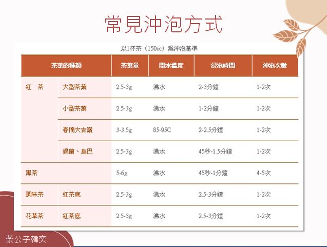

.. _black_tea:

============
红茶
============

.. note::

   「红茶」英文是 ``black tea``

红茶分类
============

红茶从外观和气味区分为三种类型:

- 条状红茶，也成为传统红茶、工夫红茶，外形完整
- 碎型红茶，西方称为BOP，也就是外形很细碎的红茶
- 熏香红茶，例如伯爵茶、水果风味调味茶、烟熏茶，主要是添加过风味的红茶

冲泡方法
==========

红茶冲泡方法:

- 冲泡时间: 不超过 ``6分钟`` ，且不回冲 (我在淘宝购买的阿萨姆红茶，网友建议是煮6分钟，原因是为了使得茶水浓且香)
- 使用茶量: 茶水比例 ``1g : 50ml`` (淘宝卖家建议制作奶茶的茶量比例是 ``1g : 50ml`` ，另外我看原文冲泡方法的表格是 3g 茶叶 150ml水，似乎也是 ``1g : 50ml`` )
- 冲泡温度: 推荐使用 ``90度`` 水温，不过高温比较香 (网购的阿萨姆红茶，店家和网友都建议是煮茶，看来是为了更多萃取茶香)

   红茶冲泡方法

碎型红茶
==========

现在主要的红茶饮用方式是制作奶茶，通过煮、过滤、加奶或炼乳，制作出英式鲜奶茶。

参考
========

- `紅茶怎麼泡？通用紅茶沖泡大法 <https://www.hanyitea.tw/single-post/blackteabrewingway/>`_
