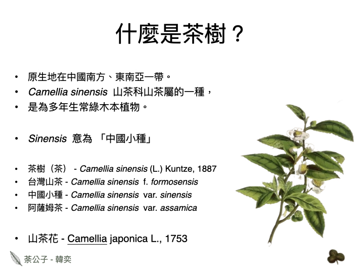
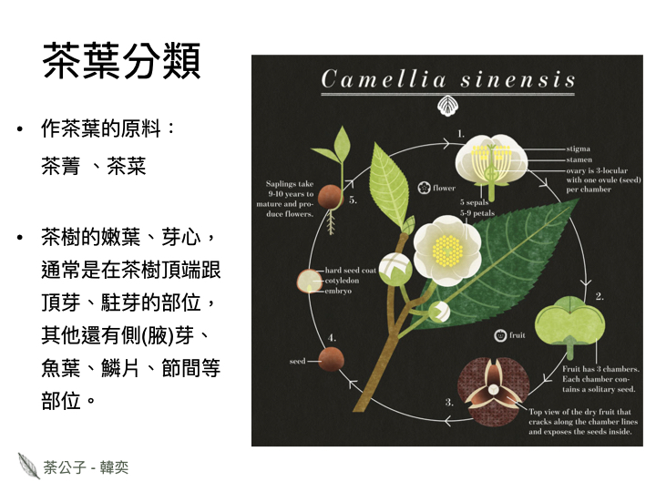
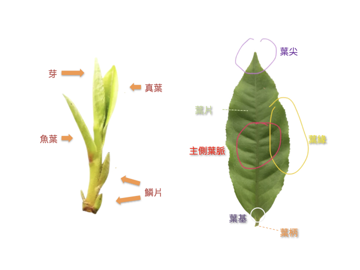
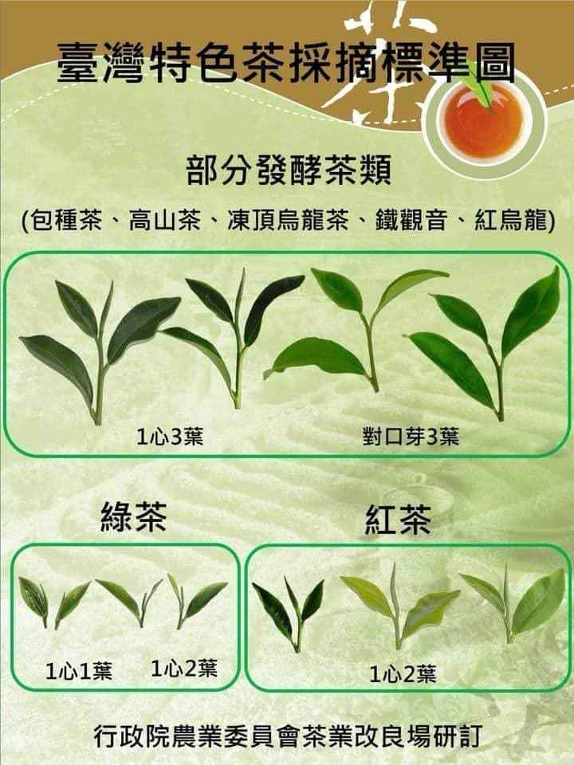
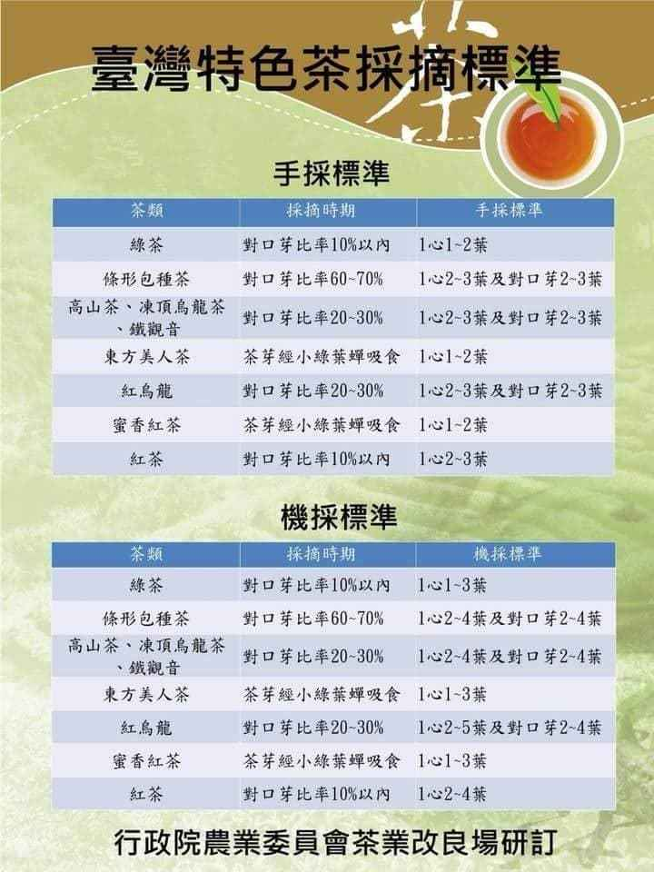
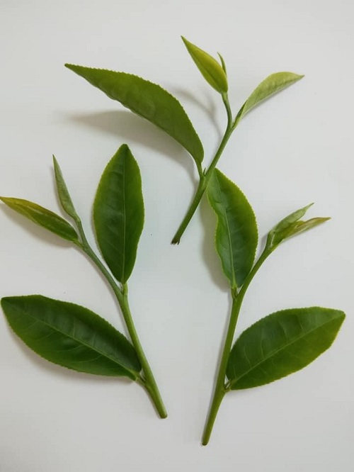

.. _tea_startup:

===============
茶的快速起步
===============

茶树的使用
============

茶树的茎、叶、花、种子都有用途，常用于茶叶的部分是叶片和茎梗:

- 芽、叶: 富含茶多酚、氨基酸、咖啡因、蛋白质、有机酸
- 叶片、老叶: 香气足、纤维化墨汁、奶泡，主要成分 纤维素、淀粉、可溶性躺、茶皂苷、果胶

分类
=======

茶树有乔木、灌木等不同常熟品种，以及按照叶片分类的 小叶、中叶、大叶

嫩采的茶叶多有芽尖，称为「毫芽香」；成熟老叶则有纤维感的「木质香」

   茶树

   茶叶分类

茶叶的叶片和采摘
==================

茶叶的叶芽受到品种、树龄、产地气候、土壤、海拔、降水等条件影响。其中影响品质的最明显原因是 **温度、水分** :

- 鳞片: 芽脱落后的一周，会有第一片小嫩叶出现
- 鱼叶、胎叶: 既第一片小嫩叶
- 真叶: 在芽旁，大约每4天多一片，通常会有5~10片长出
- 驻芽: 也就是休眠芽，当真叶完全生长，最顶上成熟的停止生长的那片芽头

   茶叶叶片

茶叶的采摘时期、成熟度变化影响最终的采摘品质: 当出现最后驻芽，就是采摘的最佳时期，传统上认为是制作乌龙茶，具备最多香气、耐泡的茶叶。

.. note::

   如果采摘的原料中 「包含鱼叶」 多，则成品的可溶出物质偏少，茶叶品质较低，且影响下一季的产量，长期会摧残茶树影响树龄，茶树叶比较容易染病。因此，采摘时会避免摘掉鱼叶，产地师傅称作： ``留鱼摘`` 。

采茶标准
----------

茶叶在嫩芽时采摘则成本较高，所以平衡成本通常会采用一心三叶。如果要追求品质最佳，则采用一心二叶。当叶片更多虽然成本低，但是精茶量比过低，且需要更多制作技术和设备支持，所以反而不如一心三叶采用机械采摘的成本低。

   台湾特色茶采摘标准图

   台湾特色茶采摘标准

   考虑成本普遍采用一心三叶采摘标准

.. figure:: ../../_static/life/tea/tea_leaf_pick_class_table.png

   台湾特色茶手采标准

.. note::

   实际上西式茶的分类更为精细，有不同分类，可参考 `茶葉採摘標準、茶葉採收、茶葉篩選、茶葉分級制度 <https://www.hanyitea.tw/single-post/sftgfop1/>`_ 我这里没有摘录

参考
=======

- `茶葉採摘標準、茶葉採收、茶葉篩選、茶葉分級制度 <https://www.hanyitea.tw/single-post/sftgfop1/>`_ 本文摘录自此文，台湾茶叶的科普文章写得较为清晰
