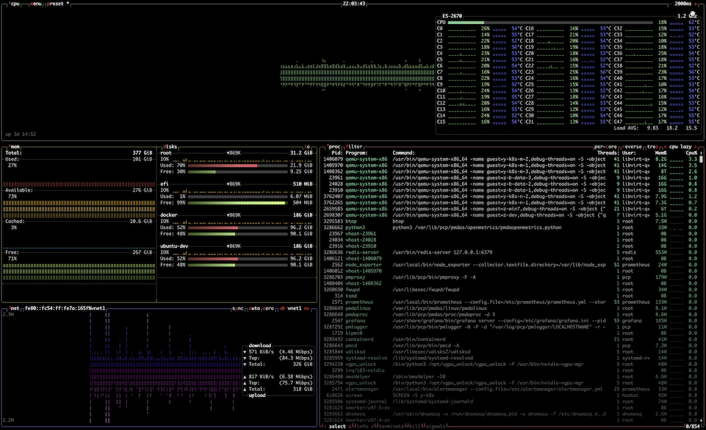
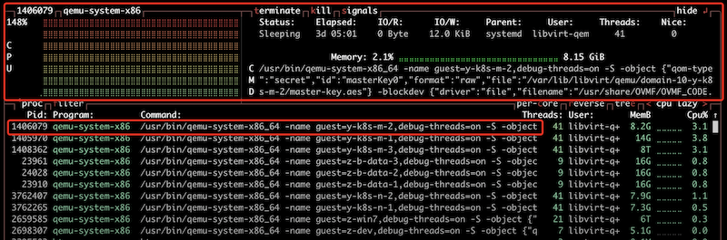

.. _btop:

============
btop
============

我用过 ``htop`` ，也用过 ``nmon`` ，都是不错的top改进工具，更为直观。不过，当我第一次看到 ``btop`` ，还是被这个终端性能工具给震撼了一下，真没想到终端工具能够做得这个美观形象。

放一张我的 ``zcloud`` ( :ref:`hpe_dl360_gen9` 二手服务器 )的初次使用默认截图:

   btop 将cpu，进程，内存，磁盘，网络集成在一个视图中

我的截图是默认视图，比较灰暗。在 `GitHub: btop <https://github.com/aristocratos/btop>`_ (14.2k star)项目页面有众多定制截图，可以看出这个工具的灵活性。

功能
========

- 支持多种平台(Linux/BSD/ :ref:`macos` )，甚至有移植到 :ref:`windows` 平台的 `GitHub: btop4win <https://github.com/aristocratos/btop4win>`_ ，官方提供了各种平台的编译安装博，而且得到了众多Linux发行版内置支持
- 使用C++编写，性能卓越
- 提供快捷键操作，定制展示

使用
=======

一些有用的快捷键:

.. literalinclude:: btop/shutcuts
   :caption: ``btop`` 快捷键

例如，用 ``上下键`` 选择某个进程，然后回车，就能在浮现的小窗中看到这个进程的更为详细的状态:

   btop 检查选定进程

参考
======

- `btop – the htop alternative <https://linuxblog.io/btop-the-htop-alternative/>`_
