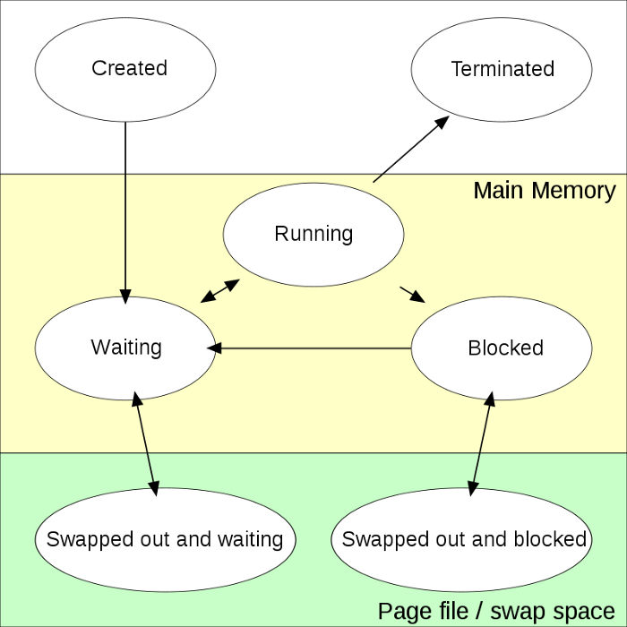

.. _linux_process_statuses:

=======================
Linux进程状态
=======================

在系统问题排查时，通常会使用 ``top`` 和 ``ps`` 来了解系统状态，进程活跃情况以及进程使用CPU的信息，这也是排查系统相关问题的常用开始步骤。

进程和进程生命周期
====================

在Linux系统中，一个运行的程序被称为进程 ``process`` ，也就是一个程序的执行实例。每一个进程在生命周期内会多个状态(stages/states):

- 当进程创建是，它会进程一个 ``new`` 或 ``created`` 状态并等待被提升到 ``ready`` 状态
- 当进程被加载到主内存中，这个进程就进入 ``ready`` 状态。通常进程会被放入一个队列或者进程等待在一个CPU上执行
- 当CPU选中一个进程为其提供服务，则这个进程当状态被更新成 ``running`` 。这个进程的指令被一个CPU所执行
- 当进程需要访问I/O或者网络资源或者等待用户输入，则进程会进入 ``blocked`` 状态，此时处理器会服务于另外一个进程，直到这个进程得到它所等待当资源(从阻塞状态恢复运行)
- 当进程完成执行或者异常被杀掉，进程就会终止。进程优雅终止之后就不会在进程表中

ps命令
=======

- ``ps`` 检查进程可以看到如下输出( 这里采用命令 ``ps aux`` )::

   USER         PID %CPU %MEM    VSZ   RSS TTY      STAT START   TIME COMMAND
   root           1  0.0  0.0 171768 15208 ?        Ss   Jun25   2:10 /sbin/init
   root           2  0.0  0.0      0     0 ?        S    Jun25   0:01 [kthreadd]
   root           3  0.0  0.0      0     0 ?        I<   Jun25   0:00 [rcu_gp]
   root           4  0.0  0.0      0     0 ?        I<   Jun25   0:00 [rcu_par_gp]
   ...
   root        1622  0.0  0.0      0     0 ?        I<   Jun25   0:01 [kworker/38:1H-kblockd]
   root        1632  0.0  0.0 241916 12164 ?        Ssl  Jun25   2:45 /usr/lib/accountsservice/accounts-daemon
   message+    1633  0.0  0.0   8168  5200 ?        Ss   Jun25   0:27 /usr/bin/dbus-daemon --system --address=systemd: --nofork --nopidfile --systemd-activation --syslog-only
   root        1634  0.0  0.0 263848 23152 ?        Ssl  Jun25   2:01 /usr/sbin/NetworkManager --no-daemon
   root        1642  0.0  0.0  82152  4004 ?        Ssl  Jun25  42:11 /usr/sbin/irqbalance --foreground
   ...

在这里输出字段:

.. csv-table:: ps字段说明
   :file: linux_process_statuses/ps_status.csv
   :widths: 20, 80
   :header-rows: 1

``STAT`` 状态码
==================

在 ``ps`` 命令输出的 ``STAT`` 字段所表示的状态码有如下多种状态:

.. csv-table:: STAT状态码
   :file: linux_process_statuses/status.csv
   :widths: 20, 80
   :header-rows: 1

对于BSD格式还有如下附加字符含义:

.. csv-table:: BSD风格的STAT状态码
   :file: linux_process_statuses/status_bsd.csv
   :widths: 20, 80
   :header-rows: 1

- **不可中断睡眠状态** ( ``D`` ): 进入D状态的进程不能通过一个信号杀死或中断。当一个进程进入 ``D`` 状态通常是等待 I/O 。由于进程在执行系统调用时被阻塞(D)，所以在系统调用完成并返回结果之前不能中断进程。也就是说，此时除了重新启动操作系统外，没有简单的方法可以杀死这个进程。

- **空闲状态** ( ``I`` ): 空闲状态主要是为了降低能耗。在Linux中，默认为每个处理器创建一个空闲任务并锁定到该处理器，当没有其他进程在CPU上运行时，就调度空闲任务到这个CPU

- **运行状态** ( ``R`` ): 正在运行的进程就是当前在CPU上执行的进程。而可运行进程在队列中等待并处于就绪状态，也就意味着Ready进程拥有它所拥有的一切资源，正在等待CPU内核执行它

- **可中断睡眠状态** ( ``S`` ): 当进程进入可中断的睡眠状态，意味着这个进程可以被唤醒来处理任何信号。进程通常在等待事件完成时进入这个状态，例如，用户输入。注意，这里等待的事件不是系统调用，因为系统调用的等待进程就会进入不可中断的睡眠状态(也就是上文说的 ``D`` 状态)

- **停止状态** ( ``T`` ): 进程在手工停止或挂起时进入停止状态

- **僵尸状态** ( ``Z`` ): 僵尸(Zombie)状态是指进程执行完毕，但是进程表中仍然有一个条目的进程。如果子进程已经完成执行并处于终止状态，但是父进程尚未通过等待系统调用读取退出状态，则子进程进入僵尸状态。此时子进程的条目依然存在于进程表中，以方便其父进程读取退出状态。一旦父进程读取了退出状态，进程就被收割(reaped)，这样子进程就不再是僵尸。

长时间保持僵尸状态的进程通常是一个错误，虽然理论上子进程已经结束但是进程表中有条目，这可能导致资源泄漏。而解决僵尸进程(子进程)的方法是找到其父进程，并将父进程结束(杀死)就会清理掉对应的僵尸子进程。

.. _find_process_d:

找出 ``D`` 进程
=================

当系统进程进入 ``D`` 状态时，会始终hold住这个进程所在的CPU，当D进程越来越多，会导致系统Load越来越高，甚至响应缓慢。

- 找到 ``D`` 进程的方法是使用如下命令::

   ps r -A

这个命令会显示所有 ``R`` 和 ``D`` 进程

- 对于 ``D`` 进程，通过::

   cat /proc/<pid>/stack

可以看到进程堆栈，如果D住进程就可以看到那个系统调用在等待，这样就能够顺藤摸瓜来排查问题

.. note::

   如果你要 :ref:`simulate_process_d` ^_^

参考
=======

- `Understanding the output of ps command <https://medium.com/100-days-of-linux/understanding-the-output-of-ps-commands-e9e270a418f9>`_ 这篇文档相对较新且完备
- `What do the STAT column values in ps mean? <http://askubuntu.com/questions/360252/what-do-the-stat-column-values-in-ps-mean>`_
- `Understanding Linux CPU stats <http://blog.scoutapp.com/articles/2015/02/24/understanding-linuxs-cpu-stats>`_
- `什么是僵尸进程，如何找到并杀掉僵尸进程？ <https://linux.cn/article-9143-1.html>`_
- `How to Understand Linux Process Statuses <https://www.liquidweb.com/kb/linux-process-statuses/>`_
