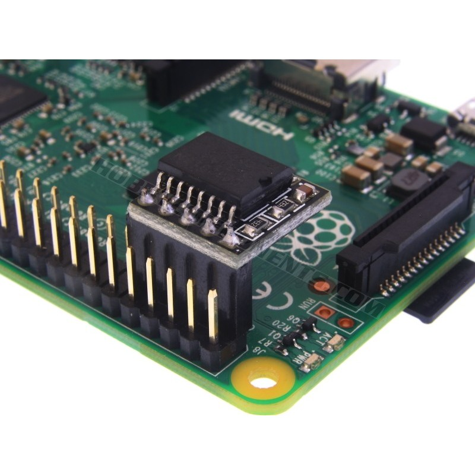

.. _alpine_pi_clock_skew:

==========================================
Alpine Linux在树莓派启动"clock skew"报错
==========================================

我在 :ref:`alpine_install_pi` 遇到一个问题，树莓派自身没有RTC时钟设备，重启系统的时钟不准确，导致启动时提示时钟扭曲(时钟比文件系统的时间戳要早很多)::

   Clock skew detected with `(null)'
   Adjusting mtime of '/run/openrc/deptree' to Mon Jan 10 21:44:22 2022
   WARNING: clock skew detected!
   ...
   Checking local filesystems ...
   Filesystems couldn't be fixed
   rc: Aborting!
   fsck: caught SIGTERM, aborting
   WARNING: clock skew detected!

这个问题导致启动后使用 ``date`` 检查时间显示的是上一次 ``date`` 启动时设置时间，这个时间和当前重启启动时间相去甚远，所以系统会显示时钟错误，无法读写挂载文件系统，也就导致后续一系列网卡无法启动，服务也无法
启动。问题是树莓派没有本地 ``rtc`` 设备，所以无法执行 ``hwclock -w --localtime`` 将手工修正的时间记录到BIOS。

这里有一个 ``悖论`` :

- Alpine Linux启动时会检查系统时间和文件系统时间戳，如果时钟不准确，就会拒绝以 ``读写模式`` 挂载文件系统(即使已经在 ``/etc/fstab`` 中配置根文件 ``rw`` 挂载)
- 由于文件系统只读挂载， 就会拒绝运行 ``/etc/init.d`` 目录下的自动配置启动服务，包括网卡配置IP服务，无线网卡启动配置，同时 ``chronyd`` 服务无法启动(需要写入磁盘)，这一系列不能启动网络和NTP客户端也就导致了系统无法自动校准时间
- 无法自动校准时间，也就不能以读写模式挂载根文件系统，所以一切就只是只读，只能让用户手工从终端登陆(因为sshd服务也无法启动，没有网络)

手工恢复网络和服务
====================

- 先手工修正以下时间::

   date -s "2022-01-10 22:36:04"

- 然后重启一次 ``chronyd`` 服务，让服务能够本地保留一份时钟矫正(注意，需要首先把文件系统改正为读写模式再启动)::

   mount -o remount,rw /
   /etc/init.d/chronyd restart

- 此时会提示检查文件系统(并挂载)以及启动网络::

   * Checking local filesystems ...
   * Remounting filesystems ...
   * Mounting local filesystems ...
   * Starting networking ...
   *   lo ...
   *   eth0 ...
   * Starting chronyd ...

- 然后启动 :ref:`alpine_wireless` 通过internet矫正时间

我以为一切都解决了，毕竟 ``chronyd`` 也生成了 ``/var/lib/chrony/chrony.drift`` ，但是没有想到，树莓派系统重启依然出现 ``clock skew`` 报错，同样的问题再次出现

为树莓派添加 ``rtc`` 设备(硬件方法，未实践)
============================================

我使用的树莓派是 :ref:`pi_3` ，这个设备没有提供RTC(Real Time Clock Module)，所以树莓派关闭后时钟无法保持。 `Alpine Linux on a Raspberry Pi 3 B+ with a RTC module <https://community.riocities.com/alpine_rpi_rtc.html>`_ 介绍了一种方法，是在 ``Raspberry Pi 3 B+`` 的 GPIO pins 1, 3, 5, 7 & 9 插上一个 RTC 模块:

然后编辑 ``usercfg.txt`` 添加::

   dtoverlay=i2c-rtc,ds3231

再重启就行(对于Alpine v3.13)。如果是早期版本，还需要执行以下步骤

- 安装 ``mkinitfs`` 软件包::

   apk add mkinitfs

- 在 ``/etc/mkinitfs/mkinitfs.conf`` 添加 ``rpirtc`` ，类似::

   features="ata base cdrom ext4 keymap kms mmc raid scsi usb virtio rpirtc"

然后重新制作 ``initramfs`` 来添加 ``ds3231`` 设备内核模块::

   # . /etc/lbu/lbu.conf
   # ln -s /media/$LBU_MEDIA/boot /boot
   # mount /media/$LBU_MEDIA -o remount,rw

   # . /etc/mkinitfs/mkinitfs.conf
   # mkinitfs -F "$features base squashfs"

   # mount /media/$LBU_MEDIA -o remount,ro

- 并激活 ``hwclock`` 服务::

   # rc-update del swclock boot
   # rc-update add hwclock boot
   # hwclock -w
   # lbu commit

没有 ``rtc`` 的软件解决方法
=============================

实际上树莓派硬件都没有包含硬件时钟设备，为何其他操作系统，例如 :ref:`ubuntu64bit_pi` 没有遇到类似问题？我检查了 :ref:`pi_4` 上运行的 Ubuntu 系统::

   dmesg -T | grep rtc

结果显示也没有硬件rtc，但是内核参数有一个 ``fixrtc`` 参数::

   [    0.000000 ] Kernel command line:  coherent_pool=1M 8250.nr_uarts=1 snd_bcm2835.enable_compat_alsa=0 snd_bcm2835.enable_hdmi=1 bcm2708_fb.fbwidth=656 bcm2708_fb.fbheight=416 bcm2708_fb.fbswap=1 vc_mem.mem_base=0x3ec00000 vc_mem.mem_size=0x40000000  net.ifnames=0 dwc_otg.lpm_enable=0 console=ttyS0,115200 console=tty1 root=LABEL=writable rootfstype=ext4 elevator=deadline rootwait fixrtc cgroup_enable=cpuset cgroup_enable=memory cgroup_memory=1 swapaccount=1 quiet splash

仔细看了

- 需要激活软件时钟关闭硬件时钟::

   rc-update add swclock boot    # enable the software clock
   rc-update del hwclock boot    # disable the hardware clock

但是我实际执行发现原本就是如此::

   # rc-update add swclock boot
    * rc-update: swclock already installed in runlevel `boot'; skipping
   # rc-update del hwclock boot
    * rc-update: service `hwclock' is not in the runlevel `boot'

我在 `Add hardware clock earlier Raspberry Pi <https://gitlab.alpinelinux.org/alpine/aports/-/issues/9032>`_ 有一个提示，检查 ``/run/openrc/*`` 文件时间戳::

   stat -c "%y %s %n" /run/openrc/*

我发现确实有一些文件时间差异很大::

   1970-01-01 08:00:06.972999997 +0800 7 /run/openrc/clock-skewed
   2022-01-11 06:05:33.950517700 +0800 120 /run/openrc/daemons
   1970-01-01 08:00:06.965999997 +0800 11 /run/openrc/depconfig
   2022-01-11 04:56:35.000000000 +0800 20183 /run/openrc/deptree
   2022-01-11 06:05:33.977517440 +0800 40 /run/openrc/exclusive
   1970-01-01 08:00:04.949999998 +0800 40 /run/openrc/failed
   1970-01-01 08:00:04.950999998 +0800 40 /run/openrc/hotplugged
   1970-01-01 08:00:04.949999998 +0800 40 /run/openrc/inactive
   2022-01-11 06:05:33.962517585 +0800 100 /run/openrc/options
   1970-01-01 08:00:04.950999998 +0800 40 /run/openrc/scheduled
   2022-01-11 05:46:27.000000000 +0800 0 /run/openrc/shutdowntime
   2022-01-11 05:46:27.594999999 +0800 7 /run/openrc/softlevel
   2022-01-11 06:05:33.976517450 +0800 360 /run/openrc/started
   2022-01-11 06:05:33.977517440 +0800 40 /run/openrc/starting
   2022-01-11 05:51:21.307224589 +0800 40 /run/openrc/stopping
   2022-01-11 05:51:01.161414046 +0800 0 /run/openrc/supervise-wpa_supplicant.ctl
   1970-01-01 08:00:04.950999998 +0800 40 /run/openrc/tmp
   1970-01-01 08:00:04.949999998 +0800 40 /run/openrc/wasinactive

其中最主要报错应该是 ``/run/openrc/deptree``

- 在 ``/media/mmcblk0p1`` 下有一个系统默认 ``config.txt`` ，参考 `Alpine boot process on the Raspberry Pi <https://pi3g.com/2019/01/10/alpine-boot-process-on-the-raspberry-pi/>`_ ，按照官方文档，添加一个 ``/media/mmcblk0p1/usercfg.txt`` 配置文档来自定义参数::

   enable_uart=1
   gpu_mem=32
   disable_overscan=1

但是并没有解决

还是参考 `fixrtc kernel option always sets system time <https://bugs.launchpad.net/ubuntu/+source/initramfs-tools/+bug/947988>`_ 添加内核参数 ``fixrtc`` ，也就是修订 ``/media/mmcblk0p1/cmdline`` 添加参数::

   ... fixrtc ...

但是还是没有解决，看来启动时候时间差异不大，但是这个时钟扭曲是因为操作系统关闭时修改了 ``/run/openrc/deptree`` 时间戳(启动时间)，然后再次启动时钟又返回文件系统最后一次挂载时间，就会比 ``/run/openrc/deptree`` 早，系统就会判断问题。

树莓派时钟
===========

:ref:`pi_clock` 使用 ``arch_sys_counter`` 作为时钟源，我对比了 :ref:`ubuntu64bit_pi` 、 能够启动的 和 不能启动的 Alipine Linux for Raspberry Pi ::

   cat /sys/devices/system/clocksource/clocksource0/current_clocksource

都显示::

   arch_sys_counter

但是我也发现了一些差异:

- 能够启动的 Alpine Linux for Raspberry Pi ，执行::

   cat /var/lib/chrony/chrony.drift

显示内容是::

               5.131288             0.029364

而显示 ``clock skew`` 的 Alpine Linux for Raspberry Pi ，执行::

   cat /var/lib/chrony/chrony.drift

显示内容::

   rtcsync
   cmdport 0

使用chrony同步时间(未解决)
===========================

:ref:`sync_time_by_chrony` 发起一次时钟同步::

   chronyd -q 'server pool.ntp.org iburst'

显示信息::

   2022-01-11T00:36:09Z chronyd version 4.1 starting (+CMDMON +NTP +REFCLOCK +RTC +PRIVDROP -SCFILTER +SIGND +ASYNCDNS +NTS +SECHASH +IPV6 -DEBUG)
   2022-01-11T00:36:15Z System clock wrong by 50630.833026 seconds (step)
   2022-01-11T14:40:06Z chronyd exiting

然后再次检查::

   cat /var/lib/chrony/chrony.drift

可以看到 ``drift`` 内容改为::

               9.145591             0.442804

- 将 ``chronyd`` 设置为启动时运行::

   rc-update add chronyd boot

提示::

   * service chronyd added to runlevel boot

但是，重启依然是 ``clock skew detected!`` ，看来不是这个原因。

文件系统修复(未解决)
========================

将SD卡取下来，通过USB读卡器安装另外一台Linux主机上检查::

   sudo tune2fs -l /dev/sdf2

显示:

.. literalinclude:: alpine_pi_clock_skew/tune2fs.txt
   :language: bash
   :caption: sudo tune2fs -l /dev/sdf2 输出

- 挂载文件系统::

   mkdir /media/sdf2
   mount /dev/sdf2 /media/sdf2

- 检查该文件系统中文件时间戳，是否存在特异之处::

   cd /media/sdf2
   find . -exec stat -c "%y %s %n" {} \; | sort -k 1 -k 2

输出显示::

   1970-01-01 08:00:05.000000000 +0800 8 ./etc/apk/arch
   1970-01-01 08:00:06.000000000 +0800 11 ./lib/rc/cache/depconfig
   2019-02-08 16:54:04.000000000 +0800 8226 ./usr/bin/lddtree
   2019-06-12 21:05:11.000000000 +0800 34488 ./usr/sbin/iwgetid
   2019-06-12 21:05:11.000000000 +0800 34488 ./usr/sbin/iwpriv
   ...
   2021-11-16 18:44:09.000000000 +0800 58073 ./var/cache/apk/openssh-sftp-server-8.8_p1-r1.f3b53726.apk
   2021-11-16 18:44:09.000000000 +0800 783374 ./var/cache/apk/openssh-client-common-8.8_p1-r1.2161786b.apk
   2021-11-17 16:12:24.000000000 +0800 42728 ./sbin/fatlabel
   2021-11-17 16:12:24.000000000 +0800 51432 ./sbin/mkfs.fat
   2021-11-17 16:12:24.000000000 +0800 71408 ./sbin/fsck.fat
   ...
   2022-01-11 23:13:50.000000000 +0800 0 ./lib/rc/cache/shutdowntime
   2022-01-11 23:13:50.000000000 +0800 8 ./lib/rc/cache/softlevel
   2022-01-11 23:13:51.242999652 +0800 4096 ./lib/rc/cache

比较奇特的是最早的2个文件是UNIX起始时间，其他看起来有比较早的2019年文件

- 修订一遍文件时间戳::

   find . -exec touch {} \;

显示有3个文件不能访问::

   touch: cannot touch './etc/localtime': No such file or directory
   touch: cannot touch './etc/init.d/functions.sh': No such file or directory
   touch: cannot touch './sbin/rc-sstat': No such file or directory

检查了一下，原来是软链接，由于挂载目录不是根目录，所以会无法直接访问到，可以忽略报错

但是，上述尝试并没有解决问题

临时的手工处理方法
======================

虽然启动挂载文件系统问题导致只读，但是可以通过以下步骤暂时恢复::

   mount -o remount,rw /
   /etc/init.d/wpa_supplicant start
   /etc/init.d/networking start
   /etc/init.d/sshd start
   chronyd -q 'server pool.ntp.org iburst'
   /etc/init.d/chronyd start

最终解决方法
=================

解决步骤一: OpenRC "clock skew" workaround
--------------------------------------------

我仔细检查了原先 ``diskless`` (没有使用sys方式安装到磁盘) 的Alpine Linux启动信息，发现也是同样出现 ``clock skew`` 报错。只不过，对于diskless，默认就是 ``ro`` 只读挂载 ``/dev/mmcblk0p1`` 。所以，diskless模式启动即使存在 ``clock skew`` 也不影响运行。

- 创建空文件:

.. literalinclude:: alpine_pi_clock_skew/use-swclock
   :language: bash
   :caption: 创建 /etc/init.d/.use-swclock 空文件

- 修改 ``/lib/rc/sh/init.sh`` ，在 ``mountproc`` 段落后添加:

.. literalinclude:: alpine_pi_clock_skew/init.sh
   :language: bash
   :caption: 在 mountproc 段落后面添加
   :emphasize-lines: 11-13

.. note::

   上述方法很巧妙，使得OpenRC使用系统时间设置 ``/etc/inid.d`` 的时间戳，这样就不会出现启动时候报错 ``Clock skew detected with '(null)'`` 。

解决步骤二: 关闭EXT4文件系统检查workaround
-----------------------------------------------

不过，虽然OpenRC不报错，但是在挂载文件系统时候依然出现异常::

   Checking local filesystems ...
   Filesystems couldn't be fixed
   rc: Aborting!
   fsck: caught SIGTERM, aborting

既然是文件系统检查错误，我们 ``可不可以放弃检查呢?``

- 修改 ``/etc/fstab`` ，将最后一列指示文件系统fsck的功能关闭:

.. literalinclude:: alpine_pi_clock_skew/fstab
   :language: bash
   :caption: 配置/etc/fstab关闭磁盘fsck绕过文件系统时间扭曲

然后重启系统，就不再出现文件系统不能挂载的问题了。不过，这个workaround是绕过了fsck，可能存在隐患

解决步骤三: 使用chrony同步时钟(我的环境需要，你不必)
------------------------------------------------------

上述两个步骤解决了alpine的启动问题，但是还是需要注意，一定要正确配置主机 ``chrony`` 进行时间同步，否则树莓派的时间不准确会导致各种部署问题。

我的局域网限制所以树莓派无法直接访问internet同步时间，这里设置了局域网内部NTP服务器作为时间同步源。如果你的树莓派能够直接访问internet上的NTP服务器，这步可以忽略

- 修订 ``/etc/chrony/chrony.conf`` :

.. literalinclude:: ../../infra_service/ntp/deploy_ntp/chrony-client.conf
   :language: bash
   :caption: chrony客户端配置 /etc/chrony/chrony.conf

参考
=======

- `Raspberry Pi: Clock skew messages on startup; simple fix <https://gitlab.alpinelinux.org/alpine/aports/-/issues/8093>`_ 最终采用这个hack方法解决OpenRC报错 ``Clock skew`` ，不过文件系统拒绝挂载的问题是我采用了workaroud方式fix的
- `Add hardware clock earlier Raspberry Pi <https://gitlab.alpinelinux.org/alpine/aports/-/issues/9032>`_
- `Alpine Linux on a Raspberry Pi 3 B+ with a RTC module <https://community.riocities.com/alpine_rpi_rtc.html>`_
- `Clock skew detected with '(null)' on Raspberry pi <https://www.reddit.com/r/AlpineLinux/comments/kprx4x/clock_skew_detected_with_null_on_raspberry_pi/>`_
- `fixrtc kernel option always sets system time <https://bugs.launchpad.net/ubuntu/+source/initramfs-tools/+bug/947988>`_
- `How accurately can the Raspberry Pi keep time? <https://blog.remibergsma.com/2013/05/12/how-accurately-can-the-raspberry-pi-keep-time/>`_
