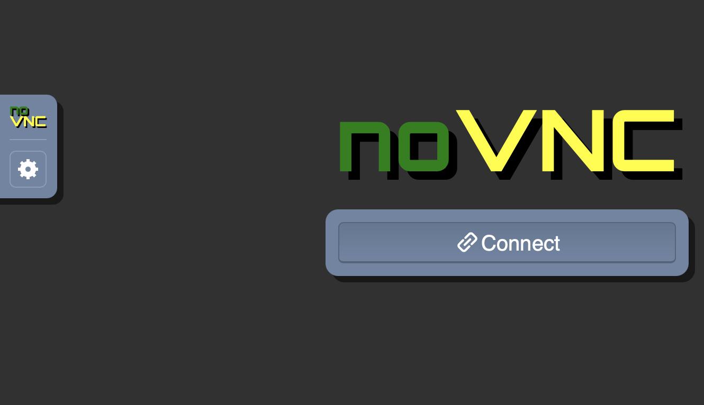
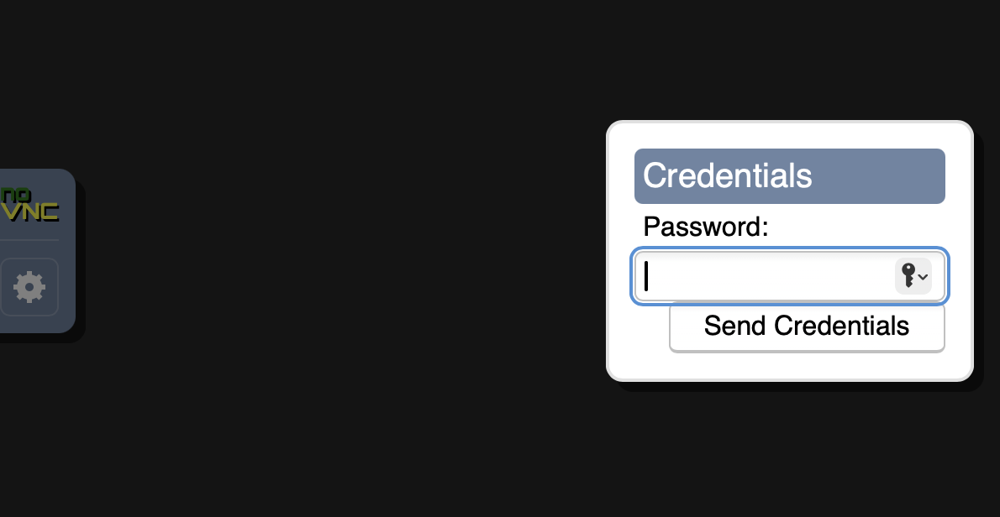

.. _archlinux_novnc:

================================
在浏览器中访问arch linux(noVNC)
================================

安装noVNC
===========

之前实践过 :ref:`kali_novnc` ，而在arch linux中安装稍微有点区别: 官方仓库没有提供 noVNC ，需要 :ref:`archlinux_aur` 方式安装，也就是先安装 ``yay`` :

.. literalinclude:: archlinux_aur/install_yay
   :caption: 编译安装yay

然后通过 yay 安装 noVNC:

.. literalinclude:: archlinux_novnc/yay_novnc
   :caption: 安装noVNC

.. note::

   实际使用请参考 :ref:`kali_novnc` ，不过需要注意 ``x11vnc`` 运行需要主机已经启动了X桌面。

使用
=====

服务器端需要先运行一个VNC服务器( ``x11vnc`` )，进而能够通过 ``noVNC`` 实现浏览器访问。以下为详细步骤

- 安装和启动vncserver:

.. literalinclude:: archlinux_novnc/x11vnc
   :caption: 在 :ref:`arch_linux` 上启动 X11vnc 服务

- 启动noVNC:

.. literalinclude:: archlinux_novnc/novnc
   :caption: 在 :ref:`arch_linux` 上启动noVNC

提示如下:

.. literalinclude:: archlinux_novnc/novnc_output
   :caption: 在 :ref:`arch_linux` 上启动noVNC的输出提示，注意访问URL提示
   :emphasize-lines: 15

根据提示，访问 http://localhost:8081/vnc.html?host=localhost&port=8081

.. note::

   这里服务器端的noVNC监听的是回环地址上的 ``8081`` 端口，所以外部不能直接访问，需要通过 :ref:`ssh_tunneling` 构建一个端口转发才能在客户端访问

此时就会看到noVNC访问界面:

   noVNC初始访问界面，点击 ``Connect`` 按钮就连接服务器上的 ``X11vnc`` 桌面

点击 ``Connect`` 按钮连接服务器上 ``X11vnc`` 桌面，此时会提示输入密码，这个密码就是之前在 启动vncserver 前通过 ``x11vnc -storepasswd`` 创建的:

   点击 ``Connect`` 按钮就连接服务器上的 ``X11vnc`` 桌面，输入之前 ``x11vnc -storepasswd`` 创建的密码

一切正常的话，就能看到一个非常简陋的桌面，显示出一个 ``xterm`` 的终端，这就是服务器上的桌面终端，可以在此基础上运行服务器端的图形程序

参考
======

- `novnc on AUR (Arch User Repository) <https://linux-packages.com/aur/package/novnc>`_
- `arch linux wiki: X11vnc <https://wiki.archlinux.org/title/X11vnc>`_
