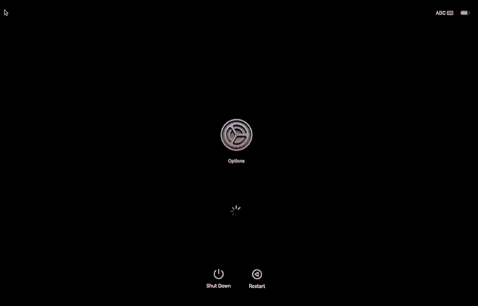
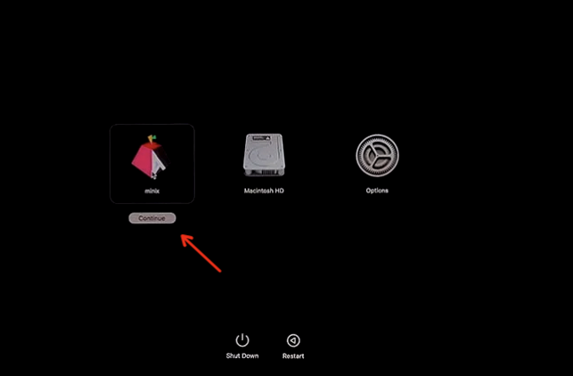
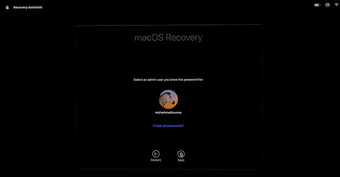

.. _install_asahi_linux:

========================
安装Asahi Linux
========================

系统要求
==============

- Apple Silicon Macs: M1, M1 Pro, 或者  M1 Max 主机 (2022年7月也支持了M2芯片的 Mac Studio)
- :ref:`macos` 升级到 12.3 或者更高，以admin用户登陆
- 至少 53GB 空间磁盘空间(Desktop安装)

  - Asahi Linux Desktop需要15GB空间，但是macOS自身需要很多空闲空间才能完成系统升级，所以Asahi Linux希望至少保留38GB空间给macOS以避免尴尬的故障

- 良好的互联网连接

  - Asahi Linux installer需要下载700MB到4GB数据(根据安装OS类型不同)

- 如果使用了苹果的Time Machine做数据备份，则系统可能没有足够空闲空间。这是因为本地Time Machine snapshot会占据大量的卷空闲空间。可能需要参考 `How to delete Time Machine local snapshots in macOS <https://appleinsider.com/articles/21/06/26/how-to-delete-time-machine-local-snapshots-in-macos>`_ 进行清理

安装
======

Asahi Linux提供了一个非常方便的安装脚本，可以自动进行磁盘分区调整和安装，只需要按照指引进行::

   curl https://alx.sh | sh

安装过程并不复杂，Asahi Linux的导引提示非常清晰，但是需要仔细阅读和选择(我基本采用了默认选项)，详细交互步骤可以参考 `How to Install Asahi Linux on Your M1 Mac <https://www.maketecheasier.com/install-asahi-linux-on-m1-mac/>`_ ，我这里做一些经验概述:

- 执行安装脚本的用户需要有admin身份，能够通过 ``su`` 执行root身份的指令，安装过程有部分步骤需要输入 ``su`` 的用户的账号密码
- 安装过程首先需要对macOS的磁盘进行分区调整，Asahi Linux提供了按照百分比和空闲GB的选择方法: 我的MacBook Pro是500G磁盘，划分了300G给Linux(macOS使用 40%)
- 磁盘分区完成后，选择 ``f: Install an OS into free space`` 开始安装时会提供安装选项，我选择 ``2: Asahi Linux Minimal (Arch Linux ARM)`` ，原因是我对 :ref:`arch_linux` 熟悉，希望通过定制化安装 :ref:`sway` 实现高性能 :ref:`wayland`
- 安装前还会提示是否完全占用前面调整过macOS磁盘分区后对空闲空间，当然选择 ``New OS size (max)`` 
- 整体安装非常简单，甚至比 :ref:`archlinux_on_mbp` 要简单很多，安装完成后需要先关机，然后按住电源键 **不放** 让Mac启动进入启动选项 ``Entering startup options`` ，也就是屏幕上会出现一个类似macOS ``System Perferences`` 中 ``Software Update`` 的齿轮图案:

.. note::

   苹果已经改变了启动时切换不同分区的方法，原先老版本的Mac是开机时按住 ``option`` 键来选择启动分区；新版本已经改成长按电源按钮方式

- 然后就可以看到启动选贤，选择 ``asahi linux`` 图标进入:

- 第一次启动会进入 macOS Recovery屏幕，在Recovery屏幕，选择你的名字，点击 ``Next`` 并输入macOS用户密码来打开一个终端窗口:

- 在开启的终端中继续，按照默认提示进行就可以，主要是修订安全等级，最后重启系统，此时默认就进入Asahi Linux

- 如果要切换回macOS，也是同样长按电源开关，进入启动选项 ``Entering startup options`` ，选择macOS分区即可。macOS和Linux是并列安装，相互不干扰。

参考
======

- `The first Asahi Linux Alpha Release is here! <https://asahilinux.org/2022/03/asahi-linux-alpha-release/>`_
- `How to Install Asahi Linux on Your M1 Mac <https://www.maketecheasier.com/install-asahi-linux-on-m1-mac/>`_ 这篇文章非常详尽记录了整个交互过程，如果你对安装过程想要有感性认识，可以参考这篇文章
