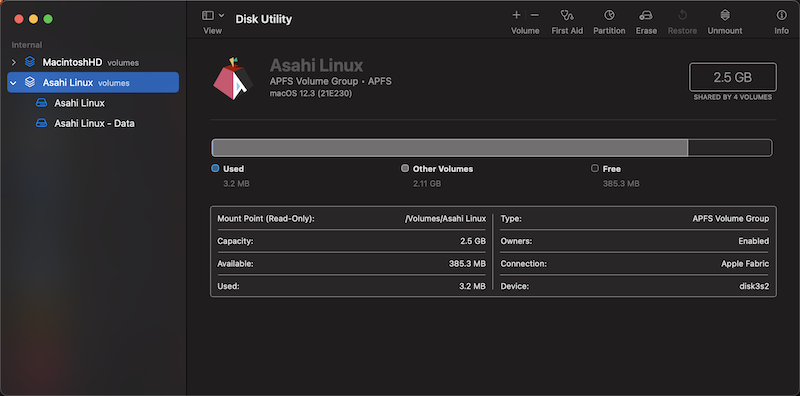
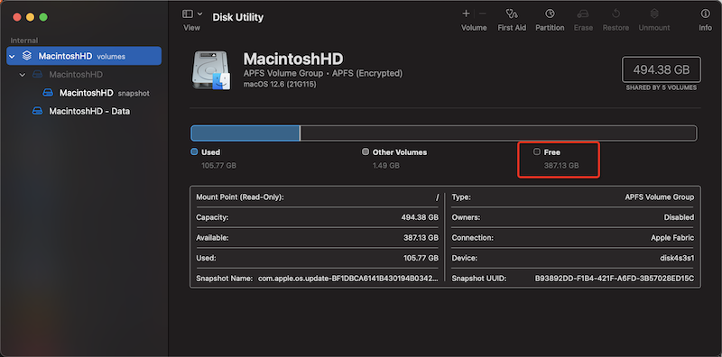
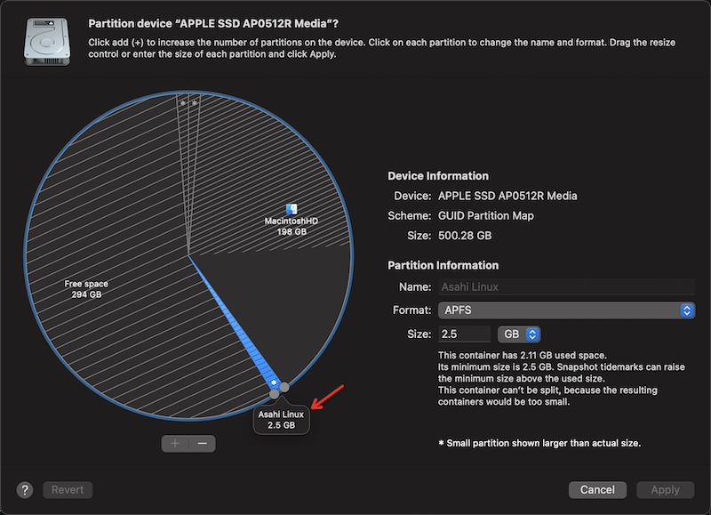

.. _resize_asahi_linux_rootfs:

================================
调整Asahi Linux根文件系统大小
================================

我在拿到公司分配的 :ref:`apple_silicon_m1_pro` 的MacBook Pro笔记本之后，终于有机会尝试在高性能ARM电脑上实践自己梦想已久的 :ref:`mobile_cloud` 。

Asahi Linux磁盘分区
======================

然而，第一次使用 Asahi Linux 系统，并不熟悉安装过程，仅仅跟随安装提示指引默认安装。确实 :ref:`install_asahi_linux` 非常简单，但是安装完我才意识到安装程序是收缩了 :ref:`macos` 的系统磁盘分区，然后把空出来的磁盘几乎全部空间都用于 Asahi Llinux的根目录:

.. literalinclude:: resize_asahi_linux_rootfs/asahi_linux_default_fdisk
   :language: bash
   :caption: Asahi Linux默认磁盘分区情况
   :emphasize-lines: 13-14

磁盘默认挂载如下:

.. literalinclude:: resize_asahi_linux_rootfs/asahi_linux_default_df
   :language: bash
   :caption: Asahi Linux默认磁盘分区挂载
   :emphasize-lines: 4,7

.. note::

   实际上Asahi Linux安装过程中是有一个选择磁盘分区大小的，当时我忽略了使用了MAX，即完全占用整个空闲磁盘。所以才带来本文的需要解决的问题

这里就存在一个困扰，我不希望将 :ref:`mobile_cloud` 构建在一个简陋的文件系统之上。在我的规划中:

- 采用 :ref:`zfs` 构建功能强大的卷管理: 不浪费任何磁盘空间(动态划分卷)，高性能和高稳定性，并且是企业级大规模存储的基础技术
- 在独立的卷管理上构建 :ref:`libvirt` 存储，具有清晰型和稳定性
- 虚拟机内部构建 :ref:`ceph` 存储，实现虚拟化的分布式文件系统

这一切的构想都需要重新划分Asahi Linux的根分区，空出足够的空间来构建 :ref:`zfs` 存储卷

规划
=======

由于EXT4文件系统 **不支持在线收缩** :ref:`resize_ext4_rootfs` ，所以对于上述根文件系统，我准备:

- 采用 :ref:`recover_system_by_tar` ，先对整个系统tar包备份并复制到其他主机上保存
- 采用外接U盘启动一个Linux系统，然后将Asahi Linux的根分区 ``/dev/nvme0n1p5`` 删除，再重新划分为3个分区(分别用于 恢复Asahi Linux系统分区 / :ref:`docker` / :ref:`libvirt` )
- 然后通过备份的tar包恢复Asahi Linux系统分区

备份
=====

- 默认情况下 ``/var/cache`` 目录会缓存大量的下载安装文件，这个可以清理掉降低备份占用空间( 参考 `The Recommended Way To Clean The Package Cache In Arch Linux <https://ostechnix.com/recommended-way-clean-package-cache-arch-linux/>`_ )::

   pacman -Scc

- 在根目录下对整个系统进行备份:

.. literalinclude:: ../ubuntu_linux/admin/recover_system_by_tar/tar_backup
   :language: bash

.. note::

   遇到一个困难，如何能够通过U盘启动运行一个能够识别nvme的Linux？ 

   我尝试了一下TF卡转USB读卡器，发现无法通过读卡器读取TF卡(不识别)，这让我有些困扰

在线调整ext4根分区(失败)
===========================

.. warning::

   我尝试参考 `How to resize ext4 root partition live without umount on Linux <https://linuxconfig.org/how-to-resize-ext4-root-partition-live-without-umount>`_ 实际失败 **请勿按照本段落操作**

.. warning::

   虽然EXT4文件系统不支持在线收缩，所以通常通过备份恢复方式来更改分区大小。但是，理论上只要数据写磁盘没有超过shrink后的磁盘分区，是可以直接修改分区结尾部分来调整分区大小的。

   高危操作，一定要确保数据备份。我的实践环境没有重要数据，所以这样操作

- 前面已经检查过根文件分区::

   /dev/nvme0n1p5  49139974 120827397 71687424 273.5G Linux filesystem

现在删除掉这个分区，然后重新创建分区，只要确保起始扇区不变，同时结束扇区有足够空间容纳现有数据就可以

- 磁盘操作::

   fdisk /dev/nvme0n1

完整过程::

   Welcome to fdisk (util-linux 2.38.1).
   Changes will remain in memory only, until you decide to write them.
   Be careful before using the write command.

   This disk is currently in use - repartitioning is probably a bad idea.
   It's recommended to umount all file systems, and swapoff all swap
   partitions on this disk.
                                                                                                                                                                                                                                                        

   Command (m for help): d
   Partition number (1-6, default 6): 5

   Partition 5 has been deleted.

   Command (m for help): p
   Disk /dev/nvme0n1: 465.92 GiB, 500277792768 bytes, 122138133 sectors
   Disk model: APPLE SSD AP0512R                       
   Units: sectors of 1 * 4096 = 4096 bytes
   Sector size (logical/physical): 4096 bytes / 4096 bytes
   I/O size (minimum/optimal): 4096 bytes / 4096 bytes
   Disklabel type: gpt
   Disk identifier: 57706D35-0379-476A-8451-0C7205AE3150

   Device             Start       End  Sectors   Size Type
   /dev/nvme0n1p1         6    128005   128000   500M Apple Silicon boot
   /dev/nvme0n1p2    128006  48407557 48279552 184.2G Apple APFS
   /dev/nvme0n1p3  48407558  49017861   610304   2.3G Apple APFS
   /dev/nvme0n1p4  49017862  49139973   122112   477M EFI System
   /dev/nvme0n1p6 120827419 122138127  1310709     5G Apple Silicon recovery

   Command (m for help): n
   Partition number (5,7-128, default 5): 
   First sector (49139974-120827418, default 49140224): 49139974
   Last sector, +/-sectors or +/-size{K,M,G,T,P} (49139974-120827418, default 120827418): +32G

   Created a new partition 5 of type 'Linux filesystem' and of size 32 GiB.
   Partition #5 contains a ext4 signature.

   Do you want to remove the signature? [Y]es/[N]o: N

   Command (m for help): p

   Disk /dev/nvme0n1: 465.92 GiB, 500277792768 bytes, 122138133 sectors
   Disk model: APPLE SSD AP0512R                       
   Units: sectors of 1 * 4096 = 4096 bytes
   Sector size (logical/physical): 4096 bytes / 4096 bytes
   I/O size (minimum/optimal): 4096 bytes / 4096 bytes
   Disklabel type: gpt
   Disk identifier: 57706D35-0379-476A-8451-0C7205AE3150

   Device             Start       End  Sectors   Size Type
   /dev/nvme0n1p1         6    128005   128000   500M Apple Silicon boot
   /dev/nvme0n1p2    128006  48407557 48279552 184.2G Apple APFS
   /dev/nvme0n1p3  48407558  49017861   610304   2.3G Apple APFS
   /dev/nvme0n1p4  49017862  49139973   122112   477M EFI System
   /dev/nvme0n1p5  49139974  57528575  8388602    32G Linux filesystem
   /dev/nvme0n1p6 120827419 122138127  1310709     5G Apple Silicon recovery

   Command (m for help): w
   The partition table has been altered.
   Syncing disks.

- 强制操作系统重启时进行fsck::

   touch /forcefsck

- 但是重启以后终端提示::

   Loading Linux linux-asahi ...
   error: attempt to read or write outside of partition.
   Loading initial ramdisk ...
   error: you need to load the kernel first.

   Press any key to continue...

我尝试按 ``e`` 修订grub启动内核参数添加 ``fsck.mode=force`` 但是依然失败

放弃，还是老老实实从备份恢复

从备份恢复Asahi Linux
========================

.. note::

   没有进行，原因是分区破坏后，没有找到通过外部U盘启动的方法。并且我最后安装了 :ref:`extfs` 不能在存在Asahi Linux的分区存在情况下加载内核模块，所以我最后删除了Asahi Linux分区，然后重新 :ref:`install_asahi_linux`

Asahi Linux分区删除
=====================

Asahi Linux提供了一个卸载脚本::

   curl -L https://alx.sh/wipe-linux | sh

从脚本中可以单独执行命令(我的实际操作方法)来删除Linux分区::

   diskutil list | grep Apple_APFS | grep '\b2\.5 GB' | sed 's/.* //g' | while read i; do
       echo "diskutil apfs deleteContainer $i"
   done
   diskutil list /dev/disk0 | grep -Ei 'asahi|linux|EFI' | sed 's/.* //g' | while read i; do
       echo "diskutil eraseVolume free free $i"
   done 

需要注意，删除掉2个Linux分区(p4和p5)::

   Device             Start       End  Sectors   Size Type
   ...
   /dev/nvme0n1p3  48407558  49017861   610304   2.3G Apple APFS
   /dev/nvme0n1p4  49017862  49139973   122112   477M EFI System
   /dev/nvme0n1p5  49139974 120827397 71687424 273.5G Linux filesystem
   ...

   在Disk Utility中可以看到Asahi Linux卷下有2个分区，分别对应p4和p4数据分区

- 删除 ``/dev/nvme0n1p4`` 和 ``/dev/nvme0n1p5`` 之后，内置 :ref:`nvme` 磁盘空出了 ``387.13GB`` 空间，从 ``Disk Utilites`` 可以看到:

   删除了Asahi Linux的2个分区之后空闲空间

但是删除以后，实际上长按电源键启动还会看到 Asahi Linux 启动选贤，这是因为 ``/dev/nvme0n1p3`` 分区还存在，这个分区实际上是 ``Asahi Linux`` 的启动分区。这点从 Disk Utilites 工具可以看到，Linux分区删后已经有空闲磁盘空间，但是还有一个标记为 ``Asahi Linux`` 的分区存在:

   删除Asahi Linux的2个分区后还有一个Asahi Linux启动分区

再删除掉 ``Asahi Linux启动分区`` 之后，才真正完全清理了Asahi Linux，然后才能配置 :ref:`extfs` 工具的内核加载(需要变更 :ref:`macos` 安全策略允许加载第三方内核模块)

参考
======

- `How should I remove Asahi? #76 <https://github.com/AsahiLinux/asahi-installer/issues/76>`_

