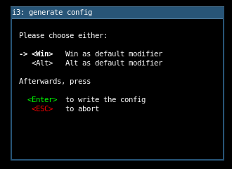

.. _i3:

==============
i3窗口管理器
==============

.. note::

   我最终会使用 i3 兼容的基于 :ref:`wayland` 的窗口管理器 :ref:`sway` ，我的目标是使用最少资源和最快捷的桌面系统(快速的显示管理器、精简的窗口管理器以及轻量级的应用软件)。在切换到wayland之前，我将使用基于Xorg的i3作为过渡并熟悉现代化的平铺窗口管理器。

安装
=======

在 :ref:`pi_400` 主机上，也就是Debian 10系统，通过以下命令安装i3::

   sudo apt install i3

安装完成后，如果是使用了LightDM这样的桌面显示管理器，则只要退出一次，然后在LightDM管理器的右上角，选择gear图标，下拉选择 ``i3`` 就可以登陆到i3桌面。

使用
======

第一次登陆，系统会提示没有个人配置文件，按照提示输入回车让系统为你创建个人配置文件，后续我们只要修订个人配置文件就可以定制i3.

i3这样的平铺式窗口管理器最大的特点是涉及简单高效，没有任何花哨的功能，是完全面向极简主义的用户。所有窗口默认自动 ``平铺`` ，以不重叠的方式定位窗口，类似于在墙上放置瓷砖。不需要担心窗口定位，i3 一般会更好地利用屏幕空间。

初次登陆i3界面，就只能看到空空如也的桌面以及屏幕底端的状态栏。

基本快捷键
------------

在初始化时候，默认选择 ``Win`` 键(也就是 ``Mod`` 键)作为快捷键，你也可以在之后修改配置，修改成 ``Alt`` 键。

- 打开终端(这是我们在Linux下最常用的程序)使用快捷键 ``Mod+ENTER`` 

默认每次按下 ``Mod+ENTER`` 会水平再添加一个终端窗口，你可以通过按下 ``Mod+v`` 然后再按下 ``Mod+ENTER`` 就会在当前窗口下方创建一个新终端窗口

- 启动应用程序是通过 ``dmenu`` (一个简单对文字应用菜单)启动，也就是按下 ``Mod + d`` 切换到一个屏幕上方的狭窄的命令行输入框，通过输入匹配命令，缩小选择范围，并且可以通过方向键选择需要启动的应用，之后按下回车键来启动选择的应用。

可以通过应用程序提供的退出方法（通常默认是 ``ctrl + q`` 来退出，不过如果应用程序没有提供退出方法，可以使用i3的 ``Mode + Shift + q`` 来关闭窗口，不过可能会丢失未保存工作内容。

- 退出i3会话，使用快捷键 ``Mod + Shift + e``

.. note::

   由于i3可以非常方便切换窗口 ``Mod + 数字`` ，所以我在 Desktop 分配工作：

   - Desktop 1: 开启一个全屏窗口，通过 :ref:`vim` 来做开发工作，
   - Desktop 2: 启动一个chromium窗口，作为WEB开发验证
   - Desktop 3: 启动4个窗口，分别去维护不同的服务器系统

工具
======

i3是一个完全可配置窗口管理器，可以通过修改配置文件来控制它

参考
======

- `i3 窗口管理器入门 <https://zhuanlan.zhihu.com/p/44783017>`_
- `i3 窗口管理器使 Linux 更美好 <https://linux.cn/article-10286-1.html>`_
- `i3 User’s Guide <https://i3wm.org/docs/userguide.html>`_
