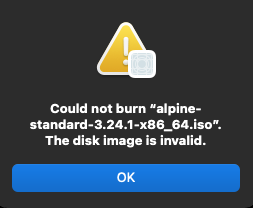

.. _linux_apple_usb_superdrive:

==============================
Linux中使用苹果USB吸入式光驱
==============================

我在尝试解决 :ref:`alpine_install_mba11_late_2010` 无法从U盘启动问题时，准备通过刻录CDROM来绕过古早Macbook系统不支持最新Linux ``iso-hybrid`` 格式镜像的问题。我最初想在macOS 15上使用我以前购买的苹果USB吸入式光驱来刻录光盘。但是我发现macOS不能读取Linux的 ``iso-hybrid`` 格式ISO，提示 

那么我想反过来在Linux上刻录这个ISO总可以吧

然而，我发现在Linux上，这个吸入式光驱不能自动吸入光盘:

gemini解释是: 

Apple SuperDrive 在插入非 Mac 设备时，默认处于“低功耗/休眠模式”，不会给内部的吸入式机械结构供电，因此光盘塞不进去，或者塞进去后不会自动吸入。

激活吸入式光驱
===============

Linux社区通过逆向工程解决了Apple SuperDrive的激活协议问题，只需要在Linux下向刻录机的USB原始设备发送特定的SCSI/USB初始化指令，就可以解锁供电，使其恢复正常的自动吸入和读写功能。

最轻量级、最直接的方式使使用开源工具 ``sg3_utils`` 发送激活指令。

- 安装工具包:

.. literalinclude:: linux_apple_usb_superdrive/install
   :caption: 安装sg3_utils

- 执行 ``lsblk`` 找到光驱节点(通常是 ``/dev/sr0`` 或 ``/dev/sgX`` )

.. literalinclude:: linux_apple_usb_superdrive/lsblk_output
   :caption: ``lsblk`` 可以看到光驱设备
   :emphasize-lines: 2

- 发送解锁指令:

.. literalinclude:: linux_apple_usb_superdrive/active_sr0
   :caption: 解锁苹果专有的SuperDrive供电

这里 ``EA 00 00 00 00 00 01`` 是苹果专有的 SuperDrive 供电激活魔数。

现在将光盘推入光驱就会听到光驱光驱发出机械响声，随后即可正常吸入光盘。

刻录ISO文件
=============

在Linux环境下有以下光盘刻录软件(gemini对比)

.. csv-table:: wodim, xorriso, growisofs
   :file: linux_apple_usb_superdrive/record.csv
   :widths: 10, 30, 30, 30
   :header-rows: 1

刻录
======

- 执行以下命令刻录 :ref:`alpine_linux` 安装启动光盘(对现代引导格式的兼容性最好)

.. literalinclude:: linux_apple_usb_superdrive/xorriso
   :caption: 刻录启动光盘

参考
=======

- gemini
