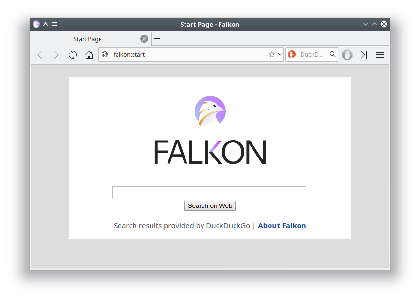
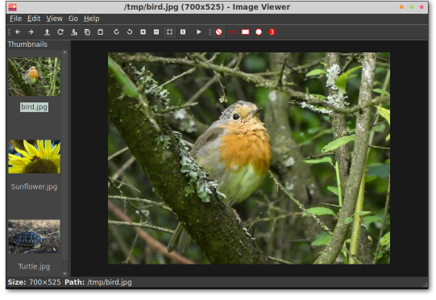

.. _lxqt_startup:

==================
LXQt快速起步
==================

选择LXQt
=========

很久以前，我曾经有一段时间非常痴迷轻量级Linux桌面(现在也是)，曾经使用过 `LXDE <http://www.lxde.org/>`_ ，在非常古老的硬件上，能够获得不错的性能。然而LXDE基于GTK2，已经很久没有重大发展了，社区也推荐转换成基于Qt的 ``LXQt`` 。不过，我后来转换到 :ref:`xfce` 就一直持续使用xfce了，原因是xfce确实也很快速资源占用较少，当时xfce还对很多外设支持良好(如蓝牙和无线)。

不过，随着GTK3的发展越来越复杂，融入了很多GNOME的特性，xfce也渐渐变得沉重起来。最近一次安装xfce，我发现启动桌面之后，内存也已经占据了700+MB以上，已经和KDE环境相差无几了。

所以，我为了能够充分发挥硬件性能，舍弃了完整的GUI桌面，选择 :ref:`sway` 这样比较激进的平铺窗口管理器(特别是原生支持现代化的图形系统 :ref:`wayland` )，能够获得非常快速的使用体验。

但是，有获得也有失去 :ref:`sway` 所采用的 :ref:`wayland` 还没有得到广泛的支持，有很多必要的程序支持不佳(例如chrome，输入法)，并且也不能使用 :ref:`synergy` 。最近，我又需要同时操纵两台主机(以便充分利用显示屏幕，并且最重要的是能够操作 :ref:`macos` 上的商业软件)，所以准备选择一个基于传统 xorg 的轻量级桌面。想到xfce和KDE相近的体量，我想尝试一下很久以前体验过的类似 ``LXDE`` 的后继者 ``LXQt`` :

- 能够使用 :ref:`synergy` 操作多台主机
- 已经验证过 ``qterminal`` 可以很好支持中文输入，且非常轻量(但是 ``qterminal`` 不能选择中文字体，导致显示中文不美观)

底层操作系统采用 :ref:`arch_linux` ，最小化安装，逐步递进部署桌面。

LXQt简介
==========

按照 `LXQt官网 <https://lxqt-project.org/>`_ 介绍，LXQt是一个轻量级的Qt桌面环境，专注于给传统桌面带来现代的使用体验:

- 模块化组件
- 强大的文件管理器
- 可定制外观
- 提供插件和设置的面板
- Window Manager agnostic(没理解，以后再说)

LXQt精选了一系列轻量级的应用:

- PcManFm-qt - 这是从LXDE继承的轻量级文件管理器，已经Qt化
- Lximage-qt - 也是从LXDE继承的图片观看程序
- QTerminal - 终端模拟器，非常快速而且对中文输入支持良好 (我改用 ``lxterminal`` ，也就是 ``LXDE`` 默认内置终端，基于GTK，优点是能够选择中文字体 ``文泉驿`` 所以编辑中文非常美观)
- Qps - 进程查看
- Screengrab - 截屏
- LXQt-archiver - 压缩包管理
- LXQt-runner - 应用程序加载器

安装
========

- 在 :ref:`arch_linux` 平台只需要安装 ``lxqt`` 就会一起安装必要桌面组件::

   pacman -S lxqt xorg-server xorg-xinit breeze-icons wqy-microhei

.. note::

   - ``xorg-xinit`` 提供 startx
   - 至少需要安装一种Sans字体，否则会导致LXQt菜单完全是空白: 由于 :ref:`linux_chinese_view` 需要，所以我安装了 **文泉驿微米黑** ``wqy-microhei`` ，安装以后LXQt就能显示菜单文字
   - ``breeze-icons`` 提供美观的KDE风格图标(避免LXQt无法显示图标)
   - 我本来还安装 ``xdg-utils`` 和 ``xsecurelock`` 想用来锁屏，但是后来阅读文档发现LXQt默认只通过 ``xdg-utils`` 来使用 ``XScreenSaver`` ，过于沉重。为了简单的锁屏功能有些浪费资源，所以我改为 :ref:`lxqt_slock` 方式。不过 ``xdg-utils`` 还是被 ``chromium`` ``qt5-base`` 依赖，所以不用单独安装。

- 配置 ``~/.xinitrc`` 添加::

   exec startlxqt

.. note::

   之前在 :ref;`sway` 中，启用支持 :ref:`wayland` 的QT程序，需要配置 ``/etc/environment`` 中 ``QT_QPA_PLATFORM=wayland`` ，该配置需要取消，否则无法运行 xorg 。 

图标
------

默认安装LXQt时只包含了简单的icon，似乎存在一些常规图标不能显示。根据arch linux LXQt文档，推荐安装 ``breeze-icons`` 可以显示非常简洁美观的图标。

平铺窗口
==============

LXQt使用 Openbox 实现窗口管理(Window Manager, WM)，所以要实现窗口平铺(tiling, snapping windows)也要从Openbox着手: 使用Openbox utilities 或者直接编辑config文件: :ref:`tile_window_in_lxqt`

共享键盘鼠标
===============

之前我尝试过不同的在Linux平台运行Windows程序( :ref:`archlinux_wine` )和Android程序( :ref:`anbox` )，甚至采用 :ref:`rdp` 通过远程桌面将Windows商用程序界面展示在Linux桌面中。但是所有这些方法都有各自的弊端，特别是很难实现中文化办公。

最终我还是决定采用 :ref:`synergy` 来共享鼠标键盘: 现在电脑设备实在太普及了，随便一个微型电脑(我采用旧笔记本)就能完整运行Windows或 :ref:`macos` ，公司的商用软件在这些平台都有提供。在办公室很容易获得第二块屏幕，也就能够非常无缝地日常在Linux上开发，同时兼顾一些商业应用软件(即时通讯、视频会议)。不再折腾桌面商业软件虚拟化运行，把精力集中到 :ref:`kubernetes`
这样的大型分布式系统以及继续专注软件开发。

在LXQt中使用标准的xorg，可以直接安装和使用 :ref:`synergy` 来控制Windows/ :ref:`macos` 系统，这样方便我工作中使用商业软件(无需使用远程桌面，充分发挥屏幕功效)::

   pacman -S synergy

软件仓库提供的 ``synergy`` 和官方提供版本一致，并且提供了图形配置功能，所以使用非常简便。

中文输入
==========

中文输入法我继续采用 :ref:`fcitx` ::

   pacman -S fcitx5 fcitx5-rime fcitx5-config-qt fcitx5-gtk

.. note::

   - 我没有像 :ref:`asahi_linux` 那样安装一个庞大的 ``fcitx5-chinese-addons`` (发行版没有提供ARM版本 ``fcitx5-rime`` ) ，而是采用小巧的 ``fcitx5-rime`` 
   - 只需要安装 ``fcitx5-config-qt`` 就可以图形化配置 ``fcitx5``
   - 添加 ``rime`` 输入法，默认输入是繁体中文，根据 `arch linux: Rime <https://wiki.archlinux.org/title/Rime_(%E7%AE%80%E4%BD%93%E4%B8%AD%E6%96%87)>`_ 介绍，在使用Rime时，按下 ``F4`` 或者 ctrl+` 可以调整基础设置，此时就可以选择简体字输入
   - firefox和chrimium都是GTK程序，所以必须安装 ``fcitx5-gtk`` 才能在这两个浏览器中输入中文(虽然我一直没有解决在 :ref:`sway` 中给chromium输入中文)

- 配置 ``/etc/environment`` :

.. literalinclude:: ../chinese/fcitx/environment
   :language: bash
   :caption: 启用fcitx5环境变量配置 /etc/environment

终端
============

作为运维和Linux服务器端开发，主要的工作都是在terminal终端中完成，所以选择轻量级的终端非常重要。我个人比较倾向于无KDE和无GNOME依赖的纯GTK/Qt类型终端:

- ``qterminal`` : 和 ``LXQt`` 最为契合，轻快且具有很多定制界面功能，对中文输入也友好(Qt5)，能够非常容易使用 :ref:`fcitx` 进行中文输入。但是这个程序能够使用的字体很少( 实际是因为强制过滤选择 ``monospace`` 所以无法选择中文字体: `How to use more fonts? #333 <https://github.com/lxqt/qterminal/issues/333>`_ )，导致无法选择文泉驿中文字体，在中文显示上会出现中文显示略大于英文无法对齐，正在输入的那一行中文头部显示不完整。
- ``lxterminal`` : 原生 ``LXDE`` 终端(LXQt前身)，只使用GTK所以非常轻量级。对中文字体支持极佳，可以选择文泉驿中文字体所以撰写中文文档非常方便。不过在LXQt中运行，使用 :ref:`tile_window_in_lxqt` 时无法完全平铺满屏幕，总是露出一条空白让强迫症非常难受。

浏览器
========

由于工作中有不少网站只兼容chrome，所以安装 ``chromium`` ::

   pacman -S chromium

安装必要插件:

- SwitchyOmega
- Copytables

Firefox(放弃)
---------------

对比Firefox和Chromium，各有利弊:

- Firefox内建了pdf阅读功能，对于网站提供pdf文档直接阅读非常方便
- Firefox内置的sync功能，在不同主机间切换能够同步tab(虽然不是自动同步)
- Firefox内置的视频解码器可能和一些视频网站不完全兼容，这点不如Chromium通吃(太多的网站只考虑适配chrome)，例如我在观看低端影视网站的 `高堡奇人 <https://ddys.tv/the-man-in-the-high-castle/>`_ 就发现Firefox无法正确还原视频色彩并且有残影，而chromium则完全正常(Falkon也正常)

  - Chromium内置的视频播放引擎显然最为先进，在全屏播放 `高堡奇人 <https://ddys.tv/the-man-in-the-high-castle/>`_ 对比可以看到 chromium 有2个不到40% CPU的进程就可以流畅播放，而Falkon则跑到 130% 以上CPU(导致明显卡顿)。chromium应该有GPU加速所以视频非常优秀。

Falkon(放弃)
-------------

我尝试过很多 :ref:`linux_light_browser` ，其中 Falkon 是 `Fedora SPINS: LXQt Desktop <https://spins.fedoraproject.org/eu/lxqt/>`_ 选择作为轻量级浏览器:

- 基于Qt Webkit引擎，契合LXQt桌面，并且也是KDE项目
- 纯Qt界面可以避免Firefox和Chromium基于GTK的资源消耗

我发现在LXQt环境Falkon确实有轻量级的优势，所以日常文档阅读及浏览都会采用这个浏览器，而chromium则作为一些特定操作补充(视频/proxy切换)

.. note::

   从浏览器角度来说，chromium确实最为全能，无论性能还是功能完整性，确实超越了Firefox和Falkon。后续可能还是会回归使用单一chromium。

截屏和标记
===========

由于我需要撰写技术文档，截图和简单标记是必要的需求。LXQt内置应用 LXImage-Qt 提供了图形浏览以及简单的标记功能，基本够用:

音乐
=========

`Fedora SPINS: LXQt Desktop <https://spins.fedoraproject.org/eu/lxqt/>`_ 选择Yarock作为音乐播放器:

- Qt5现代化交互界面，能够很好融入系统
- 后端有两种但是差别不大，实际上最终都依赖于VLC:

  - phonon-qt5-gstreamer
  - phonon-qt5-vlc

不过这个Yarock安装依赖极多，其中VLC需要占用114MB，其他相关依赖完整安装Yarock需要占用215~240MB空间。

如果要轻松使用，可以采用这个Qt音乐播放器

不过，我考虑到轻量级准备还是采用之前探索 :ref:`mpd` 字符界面结合客户端来实现音乐播放

视频
======

可选安装VLC，不过现在大多数视频可以在线观看(Flakon已经非常完美)，暂时没有强需求。

.. note::

   我考虑自己构建音乐和视频服务器，然后全部通过浏览器来实现播放

.. note::

   实际上现代桌面操作系统的音乐和视频播放器的后端都是VLC，功能极其强大，但是也比较沉重。即使是KDE环境推荐的轻量级多媒体播放器 `Dragon Player <https://apps.kde.org/dragonplayer/>`_ 其后端依然是VLC。 

下载
======

`arch linux: Transmission <https://wiki.archlinux.org/title/transmission>`_ 详细介绍了功能强大的下载工具Transmission，不仅有GUI操作，也有CLI甚至WEB界面。功能非常强大，并且安装也非常小巧。

不过我考虑采用:

- :ref:`axel` 大多数网站下载使用即可
- :ref:`aria2` 实现远程下载

``Falkon`` 浏览器可以使用外部下载管理器，或许可以结合 ``axel`` 或者 ``aria2`` 实现快速下载(我暂时没有找到解决方法)

密码管理
============

- keepassxc: 完美的基于Qt的密码管理程序::

   pacman -S keepassxc

阅读
=============

主要技术文档是pdf和epub，考虑到轻量级 :ref:`read_ebook_in_linux` :

- pdf文档采用 ``xpdf`` 最轻量级的专注pdf阅读器

- epub文档采用 ``fbreader`` (早期版本已经够用，几乎不需要太多依赖；2015年之后FBReader 2已经不再开源，但免费)

  - ``lector`` 和 ``yacreader`` 都是非常全面的电子书阅读器，但是需要安装很多依赖

- 全面支持pdf和epub的轻量级阅读器则可以选择 ``mupdf`` (在LXQt我还是分别采用了 ``xpdf`` 和 ``fbreader`` )

.. note::

   为了能能够跨平台同步电子书，可以采用 :ref:`google_play_book` 实现: Google Play Book提供了WEB页面方式阅读电子书，对于Linux平台只要能够自由访问网络，这种方式还是非常适合多设备同步阅读书籍的。

   不过，使用 :ref:`google_play` 可能会遇到国家区域限制...

Themes
=========

LXQt的风格非常简约，其实没有必要太多定制，不过我也比较喜欢:

- Icons Theme: Breeze
- LXQt Theme: Clearlooks
- Openbox Theme: Bear2

参考
=======

- `LXQt: About <https://lxqt-project.org/about/>`_
- `How To Customize The LXQt Desktop <https://www.addictivetips.com/ubuntu-linux-tips/customize-the-lxqt-desktop>`_
- `Manjaro: List of Qt Applications <https://wiki.manjaro.org/index.php?title=List_of_Qt_Applications>`_ Manjro相当于arch linux，Qt应用列表，可以选择合适的轻量级应用
- `Qt Desktop applications <https://wiki.gentoo.org/wiki/Qt_Desktop_applications>`_ Gentoo的Qt应用列表
