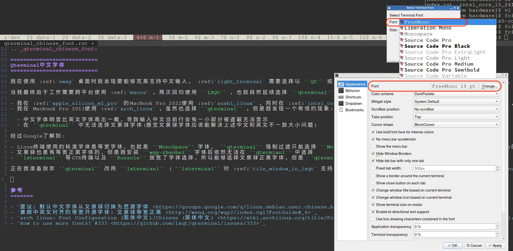

.. _qterminal_chinese_font:

===========================
Qterminal中文字体
===========================

我在使用 :ref:`sway` 桌面时就发现要能够完美支持中文输入， :ref:`light_terminal` 需要选择以 ``Qt`` 或者 ``GTK`` 为基础的终端应用: 当时选择了 ``qterminal`` 。

当我最终由于工作需要跨平台使用 :ref:`macos` ，再次回归使用 ``LXQt`` ，也就自然延续选择 ``qterminal`` 。然而，在使用中也遇到了一些波折:

- 我在 :ref:`apple_silicon_m1_pro` 的MacBook Pro 2022使用 :ref:`asahi_linux` ，同时在 :ref:`intel_core_i7_4850hq` 的Macbook Pro 2013使用 :ref:`arch_linux` ，两者操作系统虽然同源，但是使用中由于机缘巧合还是有一些差异，也就带来了本文的一些探索记录
- 我在 Macbook Pro 2013使用 :ref:`arch_linux` ，虽然也选择 ``qterminal`` ，但是我发现一个奇怪的现象:

  - 中文字体明显比英文字体高出一截，导致输入中文当前行会有一小部分被遮蔽无法显示
  - 在 ``qterminal`` 中无法选择文泉驿字体(感觉文泉驿字体应该能解决上述中文和英文不一致大小问题)

经过Google了解到:

- Linux终端使用的标准字体是等宽字体，也就是 ``MonoSpace`` 字体， ``qterminal`` 强制过滤只能选择 ``Mono`` 字体，这也就是为何只能看到少量字体(无法选择文泉驿)的原因
- 文泉驿也是有等宽正黑字体的，但是我安装 ``wqy-zhenhei`` 字体后依然无法在 ``qtermianl`` 中选择
- ``lxterminal`` 等GTK终端以及 ``Konsole`` 放宽了字体选择，所以能够选择文泉驿正黑字体，但是 ``qterminal`` 不行

正在我准备放弃 ``qterminal`` 改用 ``lxtermianl`` ( ``lxterminal`` 对 :ref:`tile_window_in_lxqt` 支持不佳)，我偶然发现在MacBook Pro 2022使用 :ref:`asahi_linux` 却能够完美显示中文字体: Why?

原来在 ``qterminal`` 中使用 ``FreeMono`` 字体就能够完美混合展示中文和英文!!! 

这个 ``FreeMono`` 字体由 ``gnu-free-fonts`` 软件包提供::

   sudo pacman -S gnu-free-fonts

终于能够兼顾 ``qterminal`` 的美观轻量以及中文字体兼容了，非常非常开心!!!

参考
=======

- `提议：默认中文字体从文泉驿切换为思源字体 <https://groups.google.com/g/linux.debian.user.chinese.big5/c/G35hfG_ne4M>`_
- `兼顾中英文对齐的等宽开源字体：文泉驿等宽正黑 <http://wenq.org/wqy2/index.cgi?FontGuide#_4>`_
- `arch linux: Font Configuration (简体中文)/Chinese (简体中文) <https://wiki.archlinux.org/title/Font_Configuration_(%E7%AE%80%E4%BD%93%E4%B8%AD%E6%96%87)/Chinese_(%E7%AE%80%E4%BD%93%E4%B8%AD%E6%96%87)>`_
- `How to use more fonts? #333 <https://github.com/lxqt/qterminal/issues/333>`_
