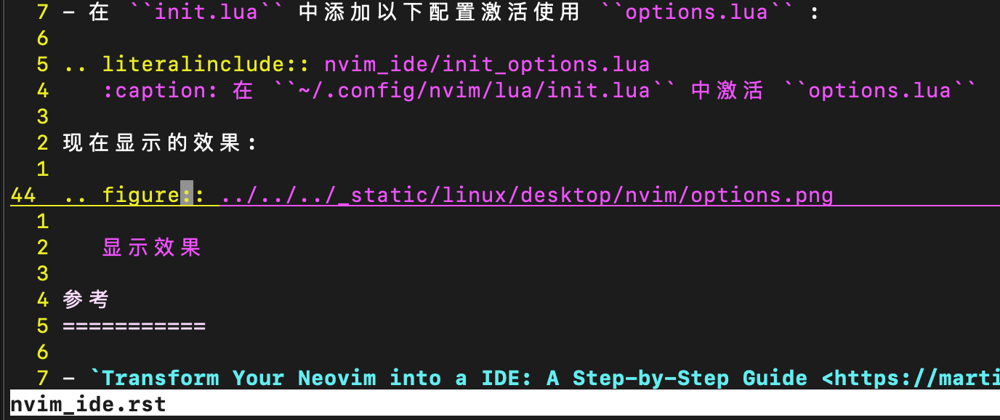
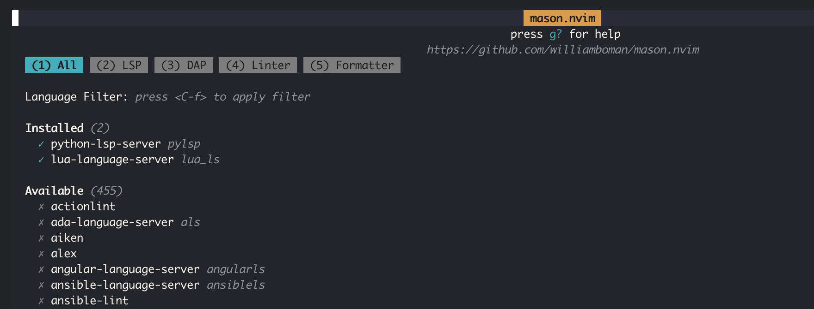

.. _nvim_ide:

============
NeoVim IDE
============

.. note::

   `从零开始配置 Neovim(Nvim) <https://martinlwx.github.io/zh-cn/config-neovim-from-scratch/>`_ 和 `Transform Your Neovim into a IDE: A Step-by-Step Guide <https://martinlwx.github.io/en/config-neovim-from-scratch/>`_ 是双语写作的博客，原文作者撰写清晰，推荐阅读。

   我参考该文的最新版本再次 :ref:`nvim_ide_fix`

`Transform Your Neovim into a IDE: A Step-by-Step Guide <https://martinlwx.github.io/en/config-neovim-from-scratch/>`_ 作者提供的指南(借鉴):

- 从0开始构建基于 :ref:`lua` 的 ``nvim`` 配置，努力理解每个配置选项
- 学习一些 :ref:`lua` 编程语言，可以参考一下 `Learn Lua in Y minutes <https://learnxinyminutes.com/docs/lua/>`_ (这个 `Learn X in Y minutes <https://learnxinyminutes.com/>`_ 比较有意思，通过案例让你快速入门一门语言)

配置文件路径
==============

- 先构建配置文件初始化

.. literalinclude:: nvim_ide/config_init
   :caption: 初始化 ``nvim`` 的配置路径
   :emphasize-lines: 3

上述创建了一个空的 ``~/.config/nvim/init.lua`` ，这样进入 ``nvim`` 之后执行 ``checkhealth`` 至少能够看到 ``Configuration`` 是OK状态；每次修改 ``init.lua`` 都需要重启 ``nvim`` 才能看到修改的变化

配置选项
===========

- 以下配置 ``~/.config/nvim/lua/options.lua`` 实现了功能:

  - 使用系统剪贴板
  - 在 ``nvim`` 中使用鼠标
  - Tab和空格键
  - UI配置
  - 灵活搜索

.. literalinclude:: nvim_ide/options.lua
   :language: lua
   :caption: ``~/.config/nvim/lua/options.lua``

- 在 ``init.lua`` 中添加以下配置激活使用 ``options.lua`` :

.. literalinclude:: nvim_ide/init.lua
   :language: lua
   :caption: 在 ``~/.config/nvim/init.lua`` 中激活 ``options.lua``
   :emphasize-lines: 1

现在显示的效果:

   显示效果

键盘映射配置
==============

- 以下配置 ``~/.config/nvim/lua/keymaps.lua`` 实现如下键盘映射:

  - 使用 ``<C-h/j/k/l>`` 在窗口间移动光标
  - 使用 ``Ctrl + 方向键`` 来调整窗口大小
  - 在select选择模式，可以使用 ``Tab`` 或者 ``Shift-Tab`` 来更改连续缩排(indentation repeatedly)

.. literalinclude:: nvim_ide/keymaps.lua
   :language: lua
   :caption: ``~/.config/nvim/lua/keymaps.lua``

- 同样在 ``init.lua`` 中添加以下配置激活使用 ``keymaps.lua`` :

.. literalinclude:: nvim_ide/init.lua
   :language: lua
   :caption: 在 ``~/.config/nvim/init.lua`` 中激活 ``keymaps.lua``
   :emphasize-lines: 2

安装包管理器
================

``nvim`` 通过第三方插件提供了强大的能力。有多种插件管理器，其中 :ref:`lazy.nvim` 非常受欢迎，提供了很多神奇功能:

  - 修正依赖顺序
  - 锁文件 ``lazy-lock.json`` 跟踪安装的插件
  - ...

- 创建 ``~/.config/nvim/lua/plugins.lua`` :

.. literalinclude:: nvim_ide/plugins.lua
   :language: lua
   :caption: ``~/.config/nvim/lua/plugins.lua`` 管理插件

- 同样在 ``init.lua`` 中添加以下配置激活使用 ``plugins.lua`` :

.. literalinclude:: nvim_ide/init.lua
   :language: lua
   :caption: 在 ``~/.config/nvim/init.lua`` 中激活 ``plugins.lua``
   :emphasize-lines: 3

这里我遇到一个报错:

.. literalinclude:: nvim_ide/nvim_ver_err
   :caption: ``nvim`` 版本低于 0.8.0 导致不能使用 lazy.nvim 报错

解决方法是 :ref:`compile_nvim_debian` ，安装自己编译的最新版本后，重新执行上述安装包管理器

如果一切正常，首次重新启动 ``nvim`` 会有短暂的黑屏(没有输出内容)，之后正常见到Dashboard。此时，输入 ``:Lazy`` 检查是否工作正常。

配色(Colorscheme)
====================

.. note::

   `Monokai Pro <https://monokai.pro>`_ 开发的 ``Monokai`` color scheme 是开发IDE中最流行的语法高亮配色，在 `THE HISTORY OF Monokai <https://monokai.pro/history>`_ 一文中有详细的介绍:

   - 2006年荷兰设计师兼开发者Wimer Hazenberg开发出最初的Monokai，主要是TextMate on macOS上暗黑背景的活泼色彩
   - 随后被各个主要IDE所接纳，并且用于终端色彩
   - 2017年发布了Monokai Pro，进一步采用了现代色彩系列，并且包含了用户接口设计和定制图标，提供了色彩过滤器，例如 ``Spectrum`` , ``Ristretto`` 和 ``Monokai Classic``
   - 2024年发布了Monokai Pro Light，采用了新的 ``Sun`` filter，适配了明亮环境，也就是说经过多年发展，Monokai已经完成了主流的 dark 和 light 两种环境适配

在完成了上文 :ref:`lazy.nvim` 配置之后，就可以安装配色插件，这里参考原文使用了 `monokai.nvim <https://github.com/tanvirtin/monokai.nvim>`_ 插件，并且选择了我对比之后认为较为美观的 ``monokai`` 风格:

- 修订 ``~/.config/nvim/lua/plugins.lua`` ，增加安装 ``monokai.nvim`` 的配置行:

.. literalinclude:: nvim_ide/plugins_colorscheme.lua
   :language: lua
   :caption: ``~/.config/nvim/lua/plugins.lua`` 增加 ``monokai.nvim`` 插件管理配色
   :emphasize-lines: 15

- 创建一个 ``~/.config/nvim/lua/colorscheme.lua`` 来定制 ``monokai.nvim`` 插件:

.. literalinclude:: nvim_ide/colorscheme.lua
   :language: lua
   :caption: ``~/.config/nvim/lua/colorscheme.lua`` 定制 ``monokai.nvim`` 插件
   :emphasize-lines: 2

- 最后在 ``~/.config/nvim/init.lua`` 激活配置

.. literalinclude:: nvim_ide/init.lua
   :language: lua
   :caption: 在 ``~/.config/nvim/lua/init.lua`` 中激活 ``colorscheme.lua``
   :emphasize-lines: 4

自动代码补全(Auto-completion)
================================

``nvim`` 可以配置成自动代码补全，通过一些极佳的插件可以轻易实现。

使用插件 `nvim-cmp <https://github.com/hrsh7th/nvim-cmp>`_ 可以管理多种自动代码补全功能，也提供了自定义补全菜单等功能。

- 创建 ``~/.config/nvim/lua/config/nvim-cmp.lua`` 为 ``nvim-cmp`` 准备配置:

.. literalinclude:: nvim_ide/nvim-cmp.lua
   :language: lua
   :caption: 在 ``~/.config/nvim/lua/config/nvim-cmp.lua`` 增加 ``nvim-cmp``

- 修订 ``~/.config/nvim/lua/plugins.lua`` 添加:

.. literalinclude:: nvim_ide/plugins_nvim-cmp.lua
   :language: lua
   :caption: ``~/.config/nvim/lua/plugins.lua`` 增加 ``nvim-cmp`` 设置

解析:

  - ``cmp.setup`` 功能接受一个Lua表，该表定义了一些定制选项。
  - ``LuaSnip`` 是一个代码片段引擎(code snippet engine)， ``nvim-cmp`` 可以从该引擎中获取一个代码片段，不过如果你不需要的话可以忽略
  - 在 ``lazy.nvim`` 中的 ``config = function() ... end`` 设置了该插件将要加载的代码，这部分保存在 ``nvim-cmp.lua`` 中
  - ``nvim-cmp`` 是主要的插件，其他以 ``cmp-`` 开头的插件是 ``nvim-cmp`` 所使用的自动补全源代码帮手。而 ``lspkind.nvim`` 将这些代码补全显示得更为美观

``nvim-cmp`` 的键盘映射
-------------------------

``mapping = ...`` 语法是 ``['<key-binding>'] = cmp.mapping.xxx,`` ，不同的 ``cmp.mapping.xxx`` 选项可以在手册中找到，如果需要修改键盘绑定，只需要修改 ``[...]`` ，这里采用:

  - ``<C-k/j>`` 或者 ``/`` 来在补全项之间移动
  - ``<C-b/f>`` 在补全项的文档中滚动
  - ``<CR>`` 确认补全

``nvim-cmp`` 补全菜单
------------------------

使用 ``formatting = ...`` :

  - ``fields`` 设置每个补全项目的显示
  - ``format = function(...)`` 设置每个补全源代码的文本，你可以在 ``sources = ...`` 设置补全代码的源。

.. note::

   到这里基本配置已经完成

LSP
======

要将 ``Nvim`` 作为IDE，需要依赖LSP实现。但是手动安装和配置LSP很麻烦，因为不同的LSP有不同的安装步骤，对后期的管理来说很不方便。所以就有了 `mason.nvim <https://github.com/williamboman/mason.nvim>`_ 和 `mason-ispconfig.nvim <https://github.com/williamboman/mason-lspconfig.nvim>`_ 来简化配置。

- 修改 ``plugins.lua`` 添加如下行:

.. literalinclude:: nvim_ide/plugins_lsp.lua
   :language: lua
   :caption: ``~/.config/nvim/lua/plugins.lua`` 增加 ``nason.nvim`` 相关设置

- 然后再创建一个 ``~/.config/nvim/lua/lsp.lua`` 管理 ``mason`` ，这里首先配置 ``mason`` 和 ``mason-ispconfig`` :

.. literalinclude:: nvim_ide/lsp.lua
   :language: lua
   :caption: ``~/.config/nvim/lua/lsp.lua`` 管理 ``mason`` 配置

.. note::

   所有需要添加的LSP都在 ``ensure_installed`` 中列出，完整列表见 `nvim-lspconfig/doc/server_configurations.md <https://github.com/neovim/nvim-lspconfig/blob/master/doc/server_configurations.md>`_ 

在上述 ``lsp.lua`` 中，不仅需要配置 ``mason-lspconfig`` ，之后还需要配置 ``nvim-lspconfig`` ，但是这个代码非常长， `Transform Your Neovim into a IDE: A Step-by-Step Guide <https://martinlwx.github.io/en/config-neovim-from-scratch/>`_ 原文作者给出了一个案例 `GitHub:MartinLwx dotfiles/nvim/lua/lsp.lua <https://github.com/MartinLwx/dotfiles/blob/main/nvim/lua/lsp.lua>`_ 来展示 ``pylsp`` ，其他配置需要自己根据 `nvim-lspconfig/doc/server_configurations.md <https://github.com/neovim/nvim-lspconfig/blob/master/doc/server_configurations.md>`_ 来完成。

.. note::

   每个LSP可能需要配置自己的选项，需要检查相应的GitHub仓库啊获得进一步信息，或者仅仅设置 ``on_attach = on_attach`` 

- 在 ``~/.config/nvim/lua/lsp.lua`` 文件中添加如下代码(这里我按照 原文作者给出了一个案例 `GitHub:MartinLwx dotfiles/nvim/lua/lsp.lua <https://github.com/MartinLwx/dotfiles/blob/main/nvim/lua/lsp.lua>`_ ):

.. literalinclude:: nvim_ide/lsp_complete.lua
   :language: lua
   :caption: ``~/.config/nvim/lua/lsp.lua`` 添加详细配置
   :emphasize-lines: 27-30

请注意上述配置中 ``vim.diagnostic`` 配置快捷键，这是一个非常有用的功能，当lsp检查出代码错误时会在错误行的开头添加一个 ``E`` ，只要将光标移动到错误行，通过快捷键就就能够查看诊断信息:

  - ``vim.diagnostic.open_float`` 表示浮动框显示错误信息，这里配置 ``<space>e`` 组合键显示错误诊断浮动框
  - ``vim.diagnostic.goto_prev`` 和 ``vim.diagnostic.goto_next`` 分别显示上一个和下一个错误诊断详情
  - ``vim.diagnostic.setloclist`` 则是在当前工作窗口切分出一个窗口单独显示错误诊断信息，适合一次性展示多个错误内容的诊断信息j

这里有一个疑惑需要后续解决，就是 ``<space>e`` 和 ``<space>q`` 这个组合键中的 ``<space>`` 在使用中会导致光标移动，需要有一个方法关闭掉交互模式下空格键移动光标的功能(待查)

- 最后，在 ``init.lua`` 中加入激活 ``lsp`` :

.. literalinclude:: nvim_ide/init.lua
   :language: lua
   :caption: 在 ``~/.config/nvim/lua/init.lua`` 中激活 ``lsp.lua``
   :emphasize-lines: 5

一旦完成上述配置，重启 ``Nvim`` ，可以看到 ``Mason`` 会安装指定LSP。要跟踪安装，在命令状态输入 ``:Mason`` ，此时会看到一个动态安装进度，安装完成后会看到类似如下显示:

   
   ``Mason`` 安装完成LSP的情况

继续探索
=========

参考 `Transform Your Neovim into a IDE: A Step-by-Step Guide <https://martinlwx.github.io/en/config-neovim-from-scratch/>`_ ，可以完成一个轻量级的IDE，但是这只是一个开始:

- 获得了一个代码高亮显示、代码自动补全、语法检查等功能，完全采用开源方式构建；但是这仅仅提供了一个案例学习配置，实际生产适配不同语言，需要再深入学习实践
- `mason.nvim <https://github.com/williamboman/mason.nvim>`_ 和 `mason-ispconfig.nvim <https://github.com/williamboman/mason-lspconfig.nvim>`_ 配置需要针对不同开发语言进行配置和打磨，这有待我后续实践: 我计划把自己学习和使用的语言配置上

这是一个开始，我将继续实践...

参考
===========

- `Transform Your Neovim into a IDE: A Step-by-Step Guide <https://martinlwx.github.io/en/config-neovim-from-scratch/>`_ 我当时没有注意，原来作者是中文/英文双语撰写博客，中文版 `从零开始配置 Neovim(Nvim) <https://martinlwx.github.io/zh-cn/config-neovim-from-scratch/>`_ 阅读更为方便，并且在2024/25年更新了文档，非常清晰易读，推荐阅读原文
- `Learn How To Use NeoVim As an IDE <https://programmingpercy.tech/blog/learn-how-to-use-neovim-as-ide/>`_
- `GitHub: ldelossa/nvim-ide <https://github.com/ldelossa/nvim-ide>`_
