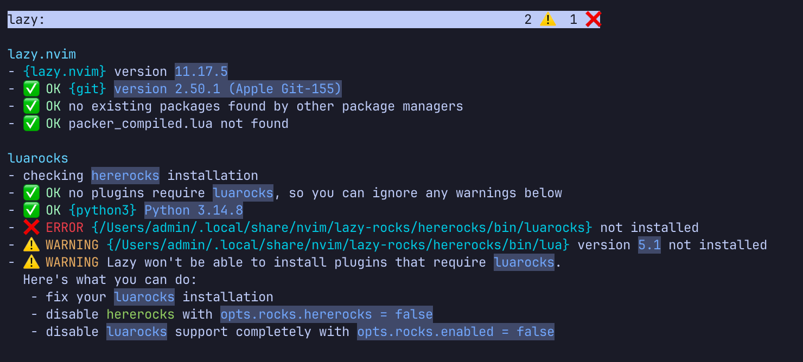

.. _nvim_lightweight_ide:

============================
NeoVim轻量级IDE(我的选择)
============================

.. note::

   我曾经花费了大量时间来参考网上文章配置vim和nvim，但是一则浪费时间，二则随着时间推移各种配置方法层出不穷且很容易过时。所以现在采用AI自动生成配置，避免浪费精力，集中注意力在真正的开发工作上。

   **这是我目前使用的最佳实践**

安装开发语言
=============

在 :ref:`macos` 中使用 :ref:`mise` 完成安装开发语言以及 ``nvim`` 和 ``tmux`` :

.. literalinclude:: ../../../rust/mise/install
   :caption: 安装开发语言

安装LSP
==========

.. note::

   这里安装LSP的步骤从 :ref:`alpine-dev_podman_image` 的Dockerfile中分离出来

- 当在 :ref:`macos` 中，完成安装 ``clangd`` (即安装 Xcode Command Line Tools 后系统会自带 ``clangd`` )

- 直接使用 :ref:`mise` 当前生效的 Ruby 版本安装 Gem 包 ``solargraph`` :

.. literalinclude:: nvim_lightweight_ide/solargraph
   :caption: 安装 ``solargraph``

- 直接使用 :ref:`mise` 当前生效的 Python 版本，通过 pip 安装 ``jedi-language-server`` 和 ``ruff`` 到当前 Python 的 ``site-packages/bin`` 中

.. literalinclude:: nvim_lightweight_ide/python_lsp
   :caption: 安装Python LSP

由于 :ref:`mise` 的 Python 已经在用户层面隔离好了环境，直接 ``pip install`` 即可

- :ref:`mise` 安装的 :ref:`rust` 会自动携带 ``rustup`` 工具，直接通过 rustup 添加官方的分析器:

.. literalinclude:: nvim_lightweight_ide/rust-analyzer
   :caption: 通过rustup安装 ``rust-analyzer``

- 使用 :ref:`mise` 的 Go 环境直接编译 ``gopls`` 安装到 ``$GOPATH/bin`` 中

.. literalinclude:: nvim_lightweight_ide/gopls
   :caption: 编译安装gopls

- ``marksman`` 是使用 :strike:`Rust` .net 编写的 Markdown LSP 分析器，建议直接从官网下载可执行程序，否则从源代码编译(虽然可以通过 ``brew install marksman`` 安装但是这个编译安装过程依赖llvm20，安装的依赖工具太多了)

.. literalinclude:: nvim_lightweight_ide/marksman
   :caption: 安装marksman

- 补齐辅助工具（Asciidoctor & Python 文档工具）

.. literalinclude:: nvim_lightweight_ide/tools
   :caption: 补齐工具

- 验证 Neovim 能否正确加载 LSP

检查可执行文件 PATH 路径:

.. literalinclude:: nvim_lightweight_ide/check_cmd
   :caption: 检查工具是否都已经安装到位

配置nvim
==========

我在构建 :ref:`mba11_late_2010` 上使用的 :ref:`alpine-dev_podman_image` ，采用了gemini提供的一个快速构建nvim的IDE的 ``init.lua`` 

- 只需要将该配置文件复制到 ``~/.config/nvim/init.lua`` 然后启动 ``nvim`` 就能够快速完成一个轻量级IDE:

.. literalinclude:: ../../../container/podman/images/alpine-dev_podman_image/alpine-dev/config/nvim/init.lua
   :language: lua
   :linenos:
   :caption: ~/.config/nvim/init.lua

这个独立的 ``~/.config/nvim/init.lua`` 采用单文件架构，涵盖了从插件管理、主题UI、代码高亮、侧边栏文件树到 LSP 自动补全的核心开发体验

- 执行以下无头命令安装好所有 ``nvim`` 插件:

.. literalinclude:: nvim_lightweight_ide/nvim_install_plugin
   :caption: 无头命令静默安装

- 进入 ``nvim`` 检查 ``:checkhealth lazy`` 输出信息

这里我遇到一个报错: 实际上这个报错在 :ref:`lazy.nvim_startup` 遇到过，也就是系统缺少 ``luarocks``

   系统缺少 ``luarocks`` 可以通过禁用避免错误

.. literalinclude:: nvim_lightweight_ide/disable_luarocks.lua
   :caption: rocks
   :language: lua

.. note::

   LuaRocks 是 Lua 编程语言的官方包管理器（类似于 Node.js 的 npm、Python 的 pip、Ruby 的 gem 或 Rust 的 cargo）

   简单来说，它的核心用途就是下载、安装、构建和管理第三方 Lua 模块与扩展库:

   - 绝大多数 Neovim 插件：都是纯 Lua 代码写的，lazy.nvim 直接通过 git clone 就能直接加载，完全不需要 LuaRocks
   - 极少数高性能插件：某些插件（比如需要做极其复杂的语法分析、图像渲染或数据计算的插件）底层依赖了需要编译的 C/Lua 扩展库（例如 magick 处理图片、或某些独立的底层解析器）。lazy.nvim v11+ 为了支持这些插件，才内置了对 LuaRocks 的集成支持。

   当前我的开发环境 ``init.lua`` 主要包含 tokyonight、neo-tree、treesitter、nvim-cmp、lualine，这些全都是标准的纯 Lua/Vimscript 插件，完全没有依赖任何需要通过 LuaRocks 安装的外部 C 扩展包。

   **所以可以简单地在 lazy.setup 中去掉**

配置说明
----------

- 基础体验与 UI 设定:

  - ``vim.g.mapleader = " "`` : 将空格键（Space）设为 Leader 键，符合现代 Neovim 快捷键习惯。
  - 开启行号、相对行号、24位真彩色（termguicolors）与默认 4 空格缩进。

- 插件管理器( ``lazy.nvim`` )自动初始化:

  - 启动时检查 ``lazy.nvim`` 是否存在，若不存在则阻塞执行 ``git clone`` 自动下载。
  - 加入了错误拦截与 ``pcall`` 异常包裹，确保即使网络抖动也不会导致 Neovim 启动崩溃。

- 精选插件组合:

  - ``tokyonight.nvim`` ：主题，提供深色视觉风格。
  - ``neo-tree.nvim`` ：IDE 风格的文件导航侧边栏，支持图标显示与自动追踪当前打开的文件。
  - ``nvim-treesitter`` : 基于语法树的高级语法高亮引擎，配置了 C、Ruby、Python、Rust、Markdown 等语言解析器。
  - ``nvim-cmp`` 体系: 自动补全前端 UI，融合了 LSP 接口、当前 Buffer 词汇、文件路径以及 ``LuaSnip`` 代码片段源。
  - ``lualine.nvim`` : 底部信息状态栏。

- 绑定 :ref:`alpine-dev_podman_image` 内置 LSP 服务:

  - 自动连接 Dockerfile 内置的 6 个系统级 LSP/Tools（clangd, solargraph, jedi_language_server, ruff, rust_analyzer, marksman）。
  - 适配 Neovim 0.11+ 的原生 ``vim.lsp.config`` API，同时兼容旧版 lspconfig 语法。

常用开发技巧与快捷键指南
==========================

所有快捷键均已在 ``init.lua`` 中配置完毕，开箱即用:

文件导航栏（Neo-tree）
-----------------------

.. csv-table:: 文件导航栏（Neo-tree）
   :file: nvim_lightweight_ide/neo-tree.csv
   :widths: 20,80
   :header-rows: 1

代码自动补全（nvim-cmp）
------------------------

在插入模式（Insert Mode）下编写代码时，补全菜单会自动弹出

.. csv-table:: 代码自动补全（nvim-cmp）
   :file: nvim_lightweight_ide/nvim-cmp.csv
   :widths: 20,80
   :header-rows: 1

LSP 跳转、查阅与代码重构
-------------------------

打开任意 C、Python、Ruby、Rust 或 Markdown 文件时，LSP 会自动在后台静默启动。把光标移动到目标变量、函数或类名上，在普通模式（Normal Mode）下操作:

.. csv-table:: LSP 跳转、查阅与代码重构
   :file: nvim_lightweight_ide/lsp.csv
   :widths: 10,30,60
   :header-rows: 1

界面与编辑器基础
------------------

- 折叠/展开：进入文件后，Treesitter 会自动识别代码块，在普通模式下按 ``zc`` 折叠代码块，按 ``zo`` 展开代码块。

- 分屏操作：

  - ``:vsplit`` ：垂直拆分窗口。
  - ``:split`` ：水平拆分窗口。
  - ``Ctrl + w`` 加上方向键（ ``h/j/k/l`` ）：在拆分出来的各个窗口间快速移动光标。

参考
=======

- gemini
