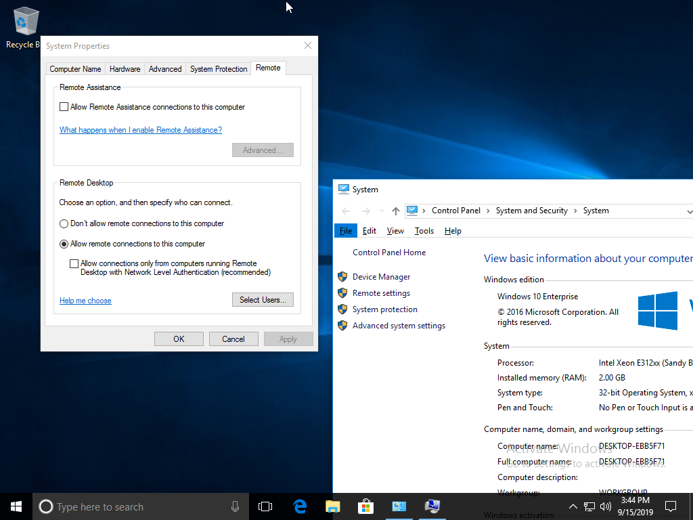

.. _seamless_rdp:

===========================
Seamless RDP使用Windows应用
===========================

.. note::

   虽然目前我还没有解决Windows 10 Pro的RemoteApp设置，即Seamless RDP，不过， `How to setup RemoteApp mode for some application in Windows 10 Professional <https://social.technet.microsoft.com/Forums/de-DE/84393b01-295e-4c4f-9477-b8b45a8e297b/how-to-setup-remoteapp-mode-for-some-application-in-windows-10-professional?forum=win10itprosetup>`_ 还是提供了方向，有待我在合适的时候继续探索。

安装rdp客户端
================

Linux平台远程RDP客户端是rdesktop或者freerdp。为了方便使用，可以结合Remmina(图形配置客户端)一起使用。

remmina结合rdesktop
------------------------

需要单独通过AUR安装 ``remmina-plugin-rdesktop`` ::

   pacman -S rdesktop remmina
   yay -S remmina-plugin-rdesktop

.. note::

   编译remmina-plugin-rdesktop 时候报错::

      mmina-plugin-to-build/remmina-plugin-rdesktop/src/remmina_plugin.c:23:
      /usr/include/pango-1.0/pango/pango-coverage.h:28:10: fatal error: hb.h: No such file or directory

   这个问题在 `remmina-plugin-rdesktop 1.2.3.0-1 <https://aur.archlinux.org/packages/remmina-plugin-rdesktop/>`_ 临时的解决方法是修改::

      /usr/include/pango-1.0/pango/pango-coverage.h 
      /usr/include/pango-1.0/pango/pango-font.h

   将::

      #include <hb.h>

   修改成::

      #include <harfbuzz/hb.h>
      
Windows系统Remote Desktop
============================

Windows 10操作系统需要开启远程桌面访问，设置方法：

- 鼠标右击启动按钮，选择 ``System`` ，然后点击 ``Remote Setting``

- 在 ``System Properties`` 设置的 ``Remote`` 面板，有一个 ``Remote Desktop`` 设置区域，选择 ``Allow remote connections to this computer`` 。注意：一定要去除 ``Allow connections only from computers running Remote Desktop with Network Level Authentication (recommended)`` ，否则Linux客户端的rdesktop无法访问。

MacBook Pro高分辨率显示
-------------------------

在MacBook Pro Retina高分辨率屏幕下使用Windows系统会发现自体非常小，这种现象不仅在Windows虚拟机的VNC终端如此，远程桌面如果是Retina屏幕下显示也几乎无法看清字体。解决的方法是调整Windows屏幕缩放比例：

- 启动菜单 ``Settings => System => Display => Advanced scaling settings`` ，在这个设置界面中，可以设置 ``Custom scaling`` ，设置范围可以从 ``100% - 500%`` 。对于MacBook Pro Retina屏幕，这个设置值修改成 ``150`` 较为合适。

修改以后，通过Remote Desktop访问的界面，字体也会相应方法，就能够舒适使用了。

.. note::

   修改Windows桌面的显示比例会导致 :ref:`xrdp_mouse` 问题，请参考 :ref:`xrdp_mouse` 解决方法。

SeamlessRDP
================

SeamlessRDP是一个RDP服务器扩展，允许将RDP服务器上运行的Windows应用程序推送到本地桌面，类似RAIL/RemoteApp。SeamlessRDP要求Windows Server 2008r2或更高版本。

.. note::

   进过一番折腾，我发现实际上这个 SeamlessRDP 只能在Windows Server服务器版本上正常工作，我居然没有注意到这点，反复在Windows 10 Pro上尝试，一直没有成功。这主要原因应该是只有Server版本才提供了Terminal Server功能。

通过使用Seamless RDP，远程的Windows程序

请访问 `seamlessrdp github仓库 <https://github.com/rdesktop/seamlessrdp>`_ 获取源代码编译(需要交叉平台编译)，不过官方网站没有提供Windoes的二进制执行程序，以下是我的编译过层。

.. note::

   在Linux平台编译运行在Windows的应用程序，需要预先安装cross-compiling environment for Windows，然后通过参数 ``--host`` 告诉 ``./configure`` 设置合适的交叉编译设置。

编译seamlessrdp::

   git clone https://github.com/rdesktop/seamlessrdp.git
   cd seamlessrdp/
   cd ServerExe/
   ./autogen.sh
   #./configure --host=i686-pc-mingw32
   ./configure --host=x86_64-w64-mingw32
   make

报错::

   main.c:27:10: fatal error: windows.h: No such file or directory
      27 | #include <windows.h>

上述报错是因为没有安装跨平台编译环境，例如对于fedora 26需要安装mingw32-gcc和mingw64-gcc。对于arch linux，参考 `MinGW package guidelines <https://wiki.archlinux.org/index.php/MinGW_package_guidelines>`_ 则需要通过 :ref:`archlinux_aur` 安装 ``mingw-w64-gcc`` ::

   yay -S mingw-w64-gcc-base
   yay -S mingw-w64-gcc

.. note::

   先安装 ``mingw-w64-gcc-base`` ，然后安装 ``mingw-w64-gcc`` ，但后者会提示和前者冲突，只要在安装后者同时卸载前者就可以了。

   注意，安装好 ``mingw-w64-gcc`` 之后，还要重新 ``./autogen.sh; ./configure --host=x86_64-w64-mingw32; make`` 。

- 安装

首先打包已经编译输出的Windows执行程序::

   zip -j seamlessrdp.zip .libs/seamlessrdpshell.exe .libs/seamlessrdp??.dll .libs/seamlessrdphook??.exe

将上述 ``seamlessrdp.zip`` 文件复制到Windows服务器的 ``C:\SeamlessRDP\`` 目录中并解压缩

- 使用

在Linux客户端执行以下命令，启动远程Windows平台的notepad应用，此时nodepad程序将显示在本地Linux桌面上，就好像是Linux原生的应用程序::

   rdesktop -A 'C:\SeamlessRDP\seamlessrdpshell.exe' -s 'notepad.exe'

.. note::

   我按照上述方法针对64位Windows环境编译的 :download:`seamlessrdp.zip <seamlessrdp.zip>` ，你可以下载使用。

Windows 10设置
---------------

注册表
~~~~~~~~

- 对于Windows 10 这样的现代操作系统，默认做了安全限制，不允许没有列出的应用程序远程运行，所以需要添加策略 - `How to setup RemoteApp mode for some application in Windows 10 Professional <https://social.technet.microsoft.com/Forums/de-DE/84393b01-295e-4c4f-9477-b8b45a8e297b/how-to-setup-remoteapp-mode-for-some-application-in-windows-10-professional?forum=win10itprosetup>`_

编辑一个 ``seamlessrdp.reg`` 文件内容如下::

   Windows Registry Editor Version 5.00
 
   [HKEY_LOCAL_MACHINE\SOFTWARE\Policies\Microsoft\Windows NT\Terminal Services]
   "fAllowUnlistedRemotePrograms"=dword:00000001

然后在文件管理器中双击该 ``seamlesssrdp.reg`` 文件导入注册表。参考 `How to setup RemoteApp mode for some application in Windows 10 Professional <https://social.technet.microsoft.com/Forums/de-DE/84393b01-295e-4c4f-9477-b8b45a8e297b/how-to-setup-remoteapp-mode-for-some-application-in-windows-10-professional?forum=win10itprosetup>`_

Terminal Server
~~~~~~~~~~~~~~~~

从目前探索来看，需要实现类似Windows Server一样的Terminal Server才有可能实现RemoteApp，也就是SeamlessRDP。

请参考 :ref:`win10_multi_rdp_sessions` 实践。不过，我还没有最终解决这个SeamlessRDP，虽然我感觉已经离目标很近了。只是现在时间精力有限，目前单个窗口RDP基本能够满足我使用Windows桌面的钉钉，所以暂时没有进一步探索的动力。

参考
=========

- `arch linux社区文档 - Remmina <https://wiki.archlinux.org/index.php/Remmina>`_
- `arch linux社区文档 - Redsktop <https://wiki.archlinux.org/index.php/Rdesktop>`_
- `Guide - Using Seamless RDP for native looking Windows applications <https://forums.macrumors.com/threads/guide-using-seamless-rdp-for-native-looking-windows-applications.1984261/>`_
- `Remmina Setting <http://www.muflone.com/remmina-plugin-rdesktop/english/settings.html>`_
- `How to fix corrupted system files in Windows 10 <https://www.thewindowsclub.com/how-to-fix-corrupted-system-files-in-windows-10>`_
