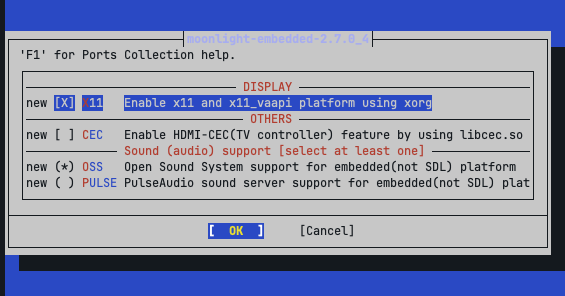

.. _moonlight-embedded_freebsd:

====================================
FreeBSD平台安装Moonlight-Embedded
====================================

环境
======

我的 :ref:`freebsd` 运行在 :ref:`thinkpad_x220` 的 :ref:`sway` 桌面，纯 :ref:`wayland` 环境，所以为了追求完全轻量化，采用 :ref:`moonlight-embedded` 。

安装
=======

FreeBSD的 ``pkg`` 中只有 ``moonlight-qt`` (依赖了QT库，过于复杂沉重)，所以需要通过 :ref:`freebsd_ports` 从源代码编译。

.. literalinclude:: moonlight-embedded_freebsd/make
   :caption: 编译moonlight-embedded

这时会弹出交互界面让你选择编译参数:

参考
=====

- gemini
