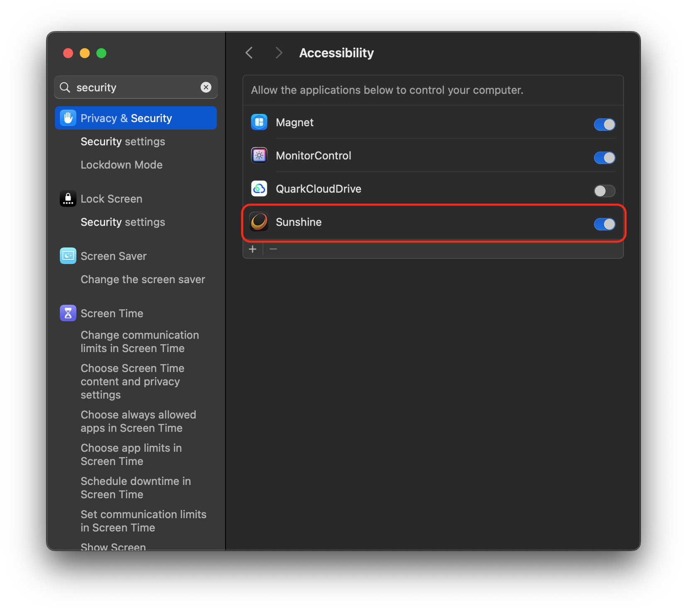

.. _moonlight_alpine:

===============================
Alpine Linux上使用Moonlight
===============================

我最初想在 :ref:`alpine_linux` 上使用轻量级的 :ref:`moonlight-embedded` ，但是我发现这个软件需要从源代码编译，而官方指导之包含了在 :ref:`arch_linux` 和 :ref:`debian` 上的实现。那么，对于我在 :ref:`mba11_late_2010` 这么孱弱的硬件上完成庞大的编译工作不现实。

.. note::

   我考虑后期在 :ref:`dell_t5820` 上部署CI/CD环境来尝试这方面的编译工作

安装
=======

那么在alpine linux该如何使用Moonlight呢？

官方community仓库提供了 ``moonlight-qt`` 软件包，安装非常方便:

.. literalinclude:: moonlight_alpine/install_moonlight-qt
   :caption: 安装 ``moonlight-qt``

使用
======

- 首先需要和服务器进行配对:

.. literalinclude:: moonlight_alpine/pair
   :caption: 服务器配对

当客户端发起配对后，服务器 :ref:`sunshine` 会提示有需要配对的连接，在 ``sunshine`` 中点击 ``pin`` 页面，在 ``PIN Pairing`` 中输入 ``pin`` 码以及为客户端设置的命名之后，点击 ``Send`` 按钮完成配对

- 配对完成后，在客户端执行list检查可以看到服务器上有哪些可以提供的连接:

.. literalinclude:: moonlight_alpine/list
   :caption: 检查服务器端提供的连接

输出类似:

.. literalinclude:: moonlight_alpine/list_output
   :caption: 服务器端提供的连接显示
   :emphasize-lines: 1

这里 ``Desktop`` 就是可以提供给客户端完整的页面

- 访问桌面:

.. literalinclude:: moonlight_alpine/connect
   :caption: 连接桌面

这里的案例采用了比较低端的连接参数:

- Moonlight提供了几种常用的分辨率:

  - ``--720`` 1280x720 分辨率
  - ``--1080`` 1920x1080 分辨率
  - ``--1440`` 2560x1440 分辨率
  - ``--4K`` 3840x2160 分辨率
  - ``--resolution <resolution>`` 定制的 ``<width>x<height>`` 分辨率

- 速率:

  - ``--bitrate <bitrate>`` 指定使用的bit率( ``Kbps`` )

- ``--display-mode <display-mode>`` 显示模式 ``borderless/fullscreen/windowed``

异常排查
==========

最初能够访问到macOS 的桌面，我发现鼠标光标能移动，但是点击没有反应，键盘也没有反应。这个问题是因为服务器端有安全限制，例如 :ref:`macos` 默认禁止 应用访问，所以需要调整 ``System Settings => Privacy & Security => Accessibility`` 将 ``Sunshine`` 设置为允许:

.. note::

   完成以上设置后，键盘能够使用，但是我发现鼠标贯标消失，还不确定原因，待续...

可能还需要设置 ``Input Monitoring`` 权限

如果画面黑屏或卡顿，可能还需要 ``Screen Recording`` 确认 Sunshine具有权限

.. warning::

   目前在忙其他，等后面再来填坑

参考
=====

- gemini
