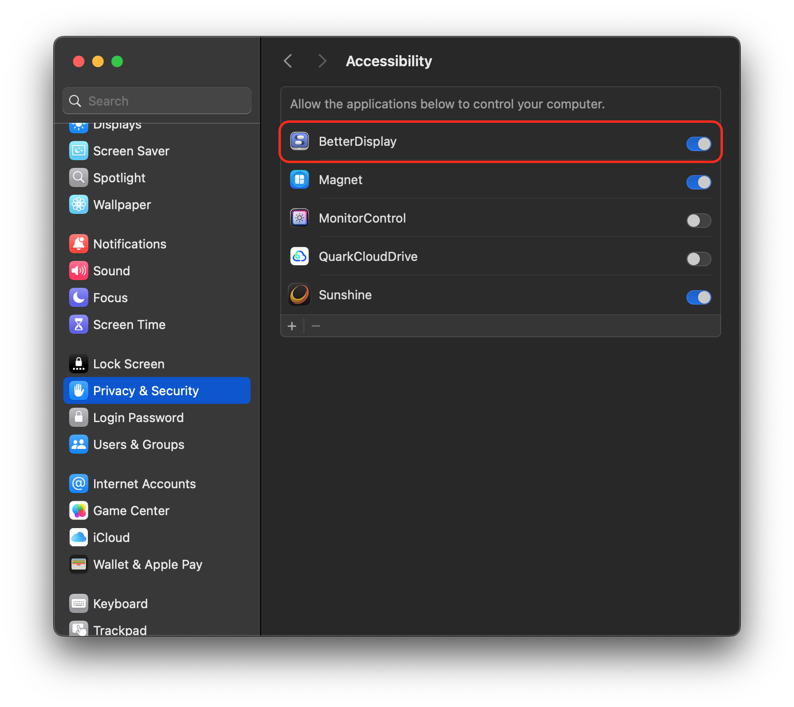
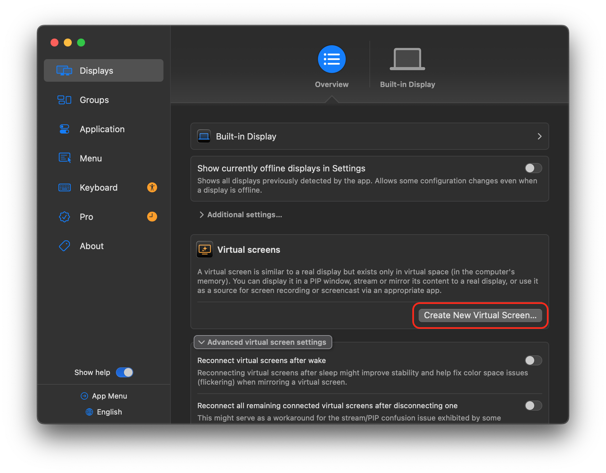
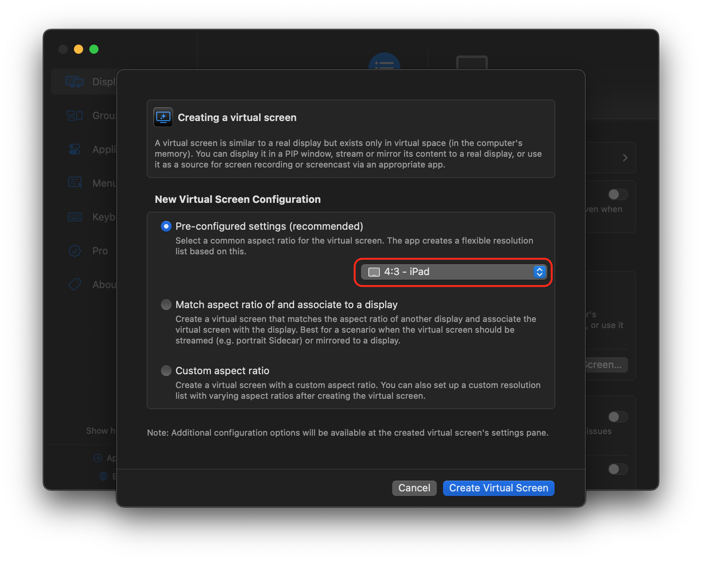
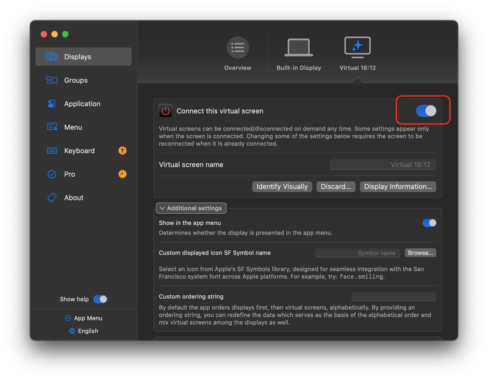
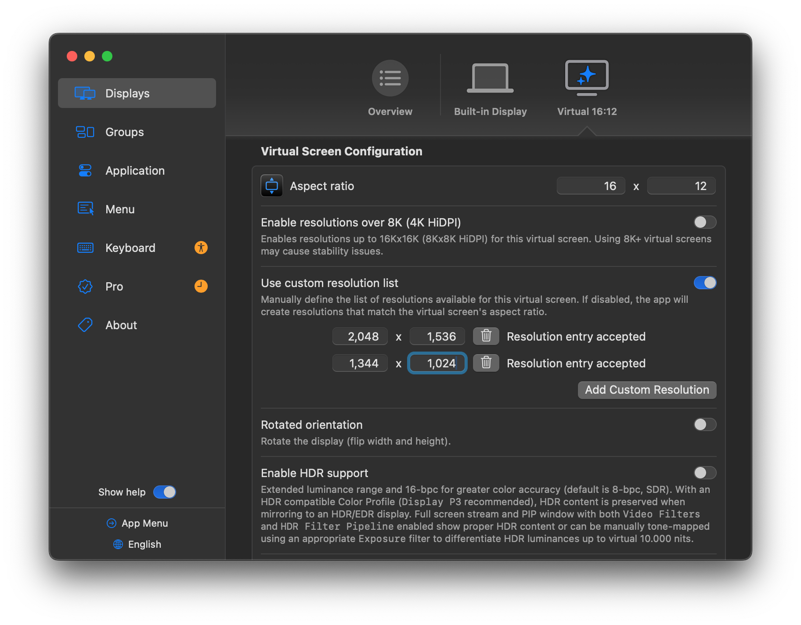
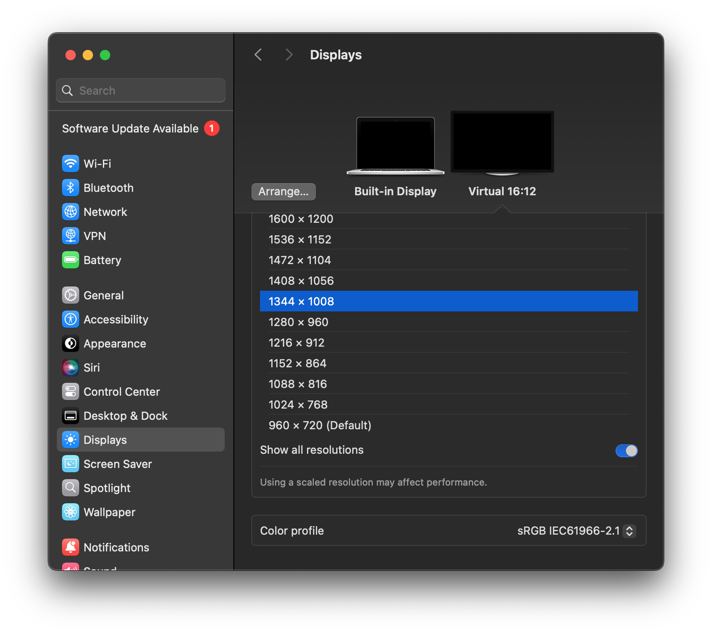

.. _moonlight_ipad_mini5:

============================
iPad mini 5运行Moonlight
============================

我在 :ref:`mba11_late_2010` 的 :ref:`moonlight_alpine` ，遇到一些问题不好解决:

- :ref:`mba11_late_2010` 的 ``NVIDIA GeForce 320M`` 是非常古老的NVIDIA Tesla架构(40nm工艺，48个CUDA核心，核心频率950MHz)
- ``NVIDIA GeForce 320M`` 硬件解码引擎较老，不支持H.265(HEVC)、AV1或VP9格式的硬解。由于现代WEB视频网站高码率视频无法硬解，所以会采用Core 2 Duo CPU软解导致CPU满载和卡顿
- Moonlight依赖客户端的视频硬件解码，但是看来 ``NVIDIA GeForce 320M`` NVIDIA Tesla架构太古老，客户端每次都提示无法硬解，导致使用时非常卡顿

运行Moonlight的iPad平板
========================

我忽然想到，其实我有2块iPad作为笔记本电脑的 ``sidecar`` 显示屏， :ref:`ipad_mini5` 和 :ref:`ipad_pro1` 通常对视频硬件加速有较好的支持。

咨询了gemini，果然两款iPad比目前 :ref:`mba11_late_2010` 强了很多，不过还是有技术代差，需要根据各自的特征去优化 :ref:`moonlight` 使用:

.. csv-table:: :ref:`ipad_mini5` vs. :ref:`ipad_pro1`
   :file: moonlight_ipad_mini5/ipad_mini5_vs_pro1.csv
   :widths: 30,35,35
   :header-rows: 1

运行 Moonlight 的适合度分析
----------------------------

- :ref:`ipad_mini5` : **首选 Moonlight 客户端**

  - 硬解与延迟: A12 Bionic 芯片内置强大的 Video Decoder，支持 H.265 (HEVC) 硬件解码。在 Moonlight 中开启 H.265 格式下，解码延迟通常可控制在 1 ~ 3ms 级，画面极其流畅。
  - 网络稳定性: 配备更现代的 Wi-Fi 模块，在 5GHz Wi-Fi 下能维持极低且稳定的传输抖动（Jitter）。
  - 便携度与屏幕: 7.9 英寸 2048x1536 (4:3) 屏幕，像素密度高 (326 ppi)，非常适合作为便携式无线副屏或远程游戏/桌面终端。

- :ref:`ipad_pro1` : **限制较多的Moonlight 客户端**

  - 硬解与延迟: A9X 芯片架构较老，对 H.265 的支持并不完整，且解码管线延迟偏高。在 Moonlight 中建议强制指定 H.264 编码。如果强制开启 H.265，解码延迟可能会飙升到 15 ~ 25ms 甚至出现丢帧。
  - 内存与系统压迫: 9.7" 版本仅有 2GB 内存，运行现代 iOS/iPadOS 时系统背景开销大；12.9" 版本虽有 4GB 内存且大屏视觉体验好，但由于无线芯片较老，局域网抗干扰能力弱于 Mini 5。
  - 适合场景: 作为固定在桌面的纯大屏展示使用，但不适合对按键/鼠标响应要求极高的实时交互。

:ref:`ipad_mini5` 优化配置
=============================

针对 iPad Mini 5 的 7.9 英寸屏幕与 2048x1536（4:3 宽高比、326 ppi）高分辨率，如果直接渲染原生 2048x1536，UI 字体会过于微小；如果降级到 1024x768，画面又会失去 HiDPI 视网膜清晰度。

最佳解决方案是：在 macOS 上利用 BetterDisplay 创建一个 2048x1536 的 HiDPI 虚拟显示器，将其逻辑缩放设为 1366x1024 (2x HiDPI)，再配合 Sunshine 串流给 iPad Mini 5。

.. _betterdisplay:

BetterDisplay
-------------------

BetterDisplay 能够直接通过菜单栏掌控 Mac 的显示器: 可以配置灵活的 HiDPI 缩放，调节亮度和色彩，在兼容的 XDR 和 HDR 显示器上解锁更高亮度，并管理显示器布局、配置覆盖设置以及虚拟屏幕。

从 `GitHub:waydabber/betterdisplay <https://github.com/waydabber/betterdisplay>`_ 可以下载到BetterDisplay的免费免费版本，虽然功能受限，但是对于我这里模拟显示器并配合 :ref:`sunshine` 已经足够。

- 安装BetterDisplay之后，首先需要在 ``fSystem Settings => Privacy & Security => Accessibility`` 中设置允许 ``BetterDisplay`` 控制计算机:

- 点击 ``Settings`` ，在 ``Displays`` 面板中， ``Virtual screens`` 栏目点击 ``Create New Virtual Screen...`` 按钮

按照设备选择模板，由于我的 :ref:`ipad_mini5` 是早期的 **传统的 7.9 英寸屏幕** 物理分辨率为 2048×1536，标准比例是 4:3（即 12:9 / 1.33:1），所以 **不能选择** iPad mini 2021（即 iPad Mini 6，全面屏设计）的屏幕，必须选择 4:3 (iPad) 或 4:3 (Legacy / Standard) 的模版

返回上一级设置菜单，点击 ``Connect this virtual screen`` 激活虚拟显示器连接

并且在这个Virtual Display的设置部分修订 ``Use custom resoultion List`` 将 :ref:`ipad_mini5` 的 **物理点阵** 分辨率 ``2048x1536`` 和希望缩放的分辨率 ``1344x1008`` 添加进去:

- 在macOS中的 ``System Settings => Displays`` 中选择这个 ``Virtual 16:12`` 屏幕，并选择显示分辨率为 ``1344x1008``

sunshine设置
--------------------

- 打开 Sunshine 管理后台（https://localhost:47990）
- 进入 ``Configuration -> Audio/Video`` 
- 将 ``Dispaly Id`` 从默认的 ``0`` 改为 ``1`` : **通常主屏是 0，虚拟屏是 1**
- 保存配置并重启 Sunshine

.. note::

   具体使用哪个 ``Display Id`` 请查询 Virtual Screen 的设置页面，有一个 ``Tag ID`` 有可能就是对应Sunshine的 ``Display Id``

   **但是我不能确定，我现在设置有点混乱，等下次再验证**
